<div align="center">


# **Universidad Peruana de Ciencias Aplicadas**
## **Ingeniería de Software**

**Periodo:** 2026-10  
**Curso:** 1ASI0732 – Diseño de Experimentos de Ingeniería de Software
**NRC:** 16879  
**Docente:** Sánchez Ponce, Alex Humberto

---

## **Informe del Trabajo Final**

**Startup:** MatchPoint
**Producto:** MatchPoint

---
### **Integrantes**

U20241A314 - Sebastian Ernesto Gutarra Velapatiño 

U202312391 - Miguel Angel Hallasi Saravia 

U202218531 - Andy Alejandro Mio Mejia  

U202311294 - Stephano Renan Valdivia Quispe

U202117342 - Ruben Genaro Velasquez Chambi 

**Mayo 2026**
</div>

<div style="page-break-after:always;"></div>

# Registro de Versiones del Informe

| Versión | Fecha | Autor | Descripción de modificación |
| :-------: | :---------: | :----------------: | :----------------------:|
|TB1|02/04/26| Sebastian, Miguel, Andy, Stephano, Ruben |Se añadieron los capítulos 1 al 5|
|TP1|08/05/26| Sebastian, Miguel, Andy, Stephano, Ruben |Se añadió el sprint 1 y se arreglaron diversos capítulos , Se agrego capitulo 6 y 7|
|TB2|01/06/26| Sebastian, Miguel, Andy, Stephano, Ruben ||
|TF1|15/07/26| Sebastian, Miguel, Andy, Stephano, Ruben ||

# Project Report Collaboration Insights

A lo largo del desarrollo del trabajo, se ha evidenciado una participación activa, coordinada y progresiva por parte de todos los integrantes del equipo. Cada fase fue abordada de manera estructurada, siguiendo las buenas prácticas de trabajo colaborativo con control de versiones en GitHub, planificación por entregables, y asignación clara de responsabilidades según las competencias de cada integrante.

El uso de repositorios específicos por subcomponente también contribuyó a mantener una mejor trazabilidad del trabajo colaborativo, integrando ramas por entregables y controlando versiones según el avance de cada sprint.

A continuación, se detallan los repositorios utilizados a lo largo del proyecto:

#### Link del repositorio del Reporte: 
https://github.com/upc-202601-16879-Diseno-de-Experimentos/Report-Trabajo-Final

#### Link del repositorio del frontEnd: 
https://github.com/upc-202601-16879-Diseno-de-Experimentos/Frontend

#### Link del repositorio del BackEnd: 
https://github.com/upc-202601-16879-Diseno-de-Experimentos/Backend

#### Link a la pagina FrontEnd: 
https://matchpoint-frontend-hkfqnuy5y-stephanos-projects-199e78ac.vercel.app

#### Link al BackEnd (Swagger):
https://matchpoint-backend-lj56.onrender.com/swagger-ui.html

<div style="page-break-after:always;"></div>

# Contenido

## Tabla de Contenidos

[Registro de versiones del informe](#registro-de-versiones-del-informe)

[Project Report Collaboration Insights](#project-report-collaboration-insights)

[Contenido](#contenido)

[Student Outcome](#student-outcome-1)

## Part I: As-Is Software Project

- [**Universidad Peruana de Ciencias Aplicadas**](#universidad-peruana-de-ciencias-aplicadas)
  - [**Ingeniería de Software**](#ingeniería-de-software)
  - [**Informe del Trabajo Final**](#informe-del-trabajo-final)
    - [**Integrantes**](#integrantes)
- [Registro de Versiones del Informe](#registro-de-versiones-del-informe)
- [Project Report Collaboration Insights](#project-report-collaboration-insights)
      - [Link del repositorio del Reporte:](#link-del-repositorio-del-reporte)
      - [Link del repositorio del frontEnd:](#link-del-repositorio-del-frontend)
      - [Link del repositorio del BackEnd:](#link-del-repositorio-del-backend)
      - [Link a la pagina FrontEnd:](#link-a-la-pagina-frontend)
      - [Link al BackEnd (Swagger):](#link-al-backend-swagger)
- [Contenido](#contenido)
  - [Tabla de Contenidos](#tabla-de-contenidos)
  - [Part I: As-Is Software Project](#part-i-as-is-software-project)
  - [Part II: Verification, Validation \& Pipeline](#part-ii-verification-validation--pipeline)
  - [Part III: Experiment-Driven Lifecycle](#part-iii-experiment-driven-lifecycle)
- [Student Outcome](#student-outcome)
- [Capitulo I: Introduccion](#capitulo-i-introduccion)
  - [1.1. StartUp Profile](#11-startup-profile)
    - [1.1.1. Description de la StartUp](#111-description-de-la-startup)
    - [1.1.2. Perfiles de integrantes del equipo](#112-perfiles-de-integrantes-del-equipo)
  - [1.2. Solution Profile](#12-solution-profile)
    - [1.2.1. Antecedentes y problemática](#121-antecedentes-y-problemática)
      - [Antecedentes y problemática](#antecedentes-y-problemática)
      - [What?](#what)
      - [Why?](#why)
      - [Where?](#where)
      - [When?](#when)
      - [Who?](#who)
      - [How?](#how)
    - [1.2.2. Lean UX Process](#122-lean-ux-process)
      - [1.2.2.1. Lean UX Problem Statements](#1221-lean-ux-problem-statements)
      - [PlayMatch - Solución a la Reserva Deportiva y Conexión con Entrenadores](#playmatch---solución-a-la-reserva-deportiva-y-conexión-con-entrenadores)
      - [1.2.2.2. Lean UX Assumptions](#1222-lean-ux-assumptions)
        - [PlayMatch - Información del Producto](#playmatch---información-del-producto)
        - [¿Dónde encaja nuestro producto, en su trabajo o en su vida?](#dónde-encaja-nuestro-producto-en-su-trabajo-o-en-su-vida)
        - [¿Qué problema resuelve nuestro producto?](#qué-problema-resuelve-nuestro-producto)
        - [¿Cuándo y cómo se utiliza nuestro producto?](#cuándo-y-cómo-se-utiliza-nuestro-producto)
        - [¿Qué características son importantes?](#qué-características-son-importantes)
        - [¿Cómo debe verse y comportarse nuestro producto?](#cómo-debe-verse-y-comportarse-nuestro-producto)
      - [1.2.2.3. Lean UX Hypothesis Statements](#1223-lean-ux-hypothesis-statements)
        - [Hipótesis 2:](#hipótesis-2)
        - [Hipótesis 3:](#hipótesis-3)
        - [Hipótesis 4:](#hipótesis-4)
      - [1.2.2.4. Lean UX Canvas](#1224-lean-ux-canvas)
  - [1.3. Segmentos Objetivo](#13-segmentos-objetivo)
    - [1. Deportistas Aficionados (usuarios en búsqueda de canchas y entrenadores)](#1-deportistas-aficionados-usuarios-en-búsqueda-de-canchas-y-entrenadores)
    - [2. Entrenadores Independientes (proveedores de servicios deportivos)](#2-entrenadores-independientes-proveedores-de-servicios-deportivos)
- [Capítulo II: Requirements Elicitation \& Analysis](#capítulo-ii-requirements-elicitation--analysis)
  - [2.1. Competidores](#21-competidores)
    - [2.1.1. Análisis competitivo.](#211-análisis-competitivo)
    - [2.1.2. Estrategias y tácticas frente a competidores](#212-estrategias-y-tácticas-frente-a-competidores)
      - [Estrategias](#estrategias)
    - [Tácticas](#tácticas)
  - [2.2. Entrevistas](#22-entrevistas)
    - [2.2.1 Diseño de entrevistas](#221-diseño-de-entrevistas)
    - [2.2.2 Registro de entrevistas.](#222-registro-de-entrevistas)
    - [2.2.3. Análisis de entrevistas.](#223-análisis-de-entrevistas)
  - [2.3. Needfinding](#23-needfinding)
    - [2.3.1. User Personas](#231-user-personas)
    - [Aficionado:](#aficionado)
    - [Entrenador:](#entrenador)
    - [2.3.2. User Task Matrix](#232-user-task-matrix)
    - [2.3.3. User Journey Mapping](#233-user-journey-mapping)
    - [2.3.4. Empathy Mapping](#234-empathy-mapping)
  - [2.3.5. As-is Scenario Mapping](#235-as-is-scenario-mapping)
  - [2.4. Ubiquitous Language](#24-ubiquitous-language)
- [Capítulo III: Requirements Specification](#capítulo-iii-requirements-specification)
  - [3.1. To-Be Scenario Mapping](#31-to-be-scenario-mapping)
  - [3.2 User Stories.](#32-user-stories)
  - [E01 - Gestión de Cuentas y Autenticación](#e01---gestión-de-cuentas-y-autenticación)
  - [E02 - Búsqueda y Reserva de Canchas](#e02---búsqueda-y-reserva-de-canchas)
  - [E03 - Gestión de Entrenadores y Servicios](#e03---gestión-de-entrenadores-y-servicios)
  - [E04 - Gestión de Vehículos](#e04---gestión-de-vehículos)
  - [E05 - Valoraciones y Reseñas](#e05---valoraciones-y-reseñas)
  - [E06 - Organización de Partidos y Torneos](#e06---organización-de-partidos-y-torneos)
  - [User Stories](#user-stories)
  - [Technical Stories](#technical-stories)
  - [3.3 Product Backlog.](#33-product-backlog)
  - [3.4 Impact Mapping.](#34-impact-mapping)
- [Capítulo IV: Product Design](#capítulo-iv-product-design)
  - [4.1. Style Guidelines](#41-style-guidelines)
    - [4.1.1. General Style Guidelines](#411-general-style-guidelines)
    - [4.1.2. Web Style Guidelines](#412-web-style-guidelines)
    - [4.1.3. Mobile Style Guidelines](#413-mobile-style-guidelines)
      - [4.1.3.1 IOS Mobile Style Guidelines](#4131-ios-mobile-style-guidelines)
      - [4.1.3.2 Android Mobile Style Guidelines](#4132-android-mobile-style-guidelines)
  - [4.2. Information Architecture](#42-information-architecture)
    - [4.2.1. Organization Systems](#421-organization-systems)
      - [Visual Hierarchy](#visual-hierarchy)
      - [Secuencial Organization](#secuencial-organization)
      - [Matricial Organization](#matricial-organization)
      - [Esquemas de Categorización](#esquemas-de-categorización)
    - [4.2.2. Labeling Systems](#422-labeling-systems)
      - [Principios de Etiquetado](#principios-de-etiquetado)
      - [Etiquetas principales propuestas](#etiquetas-principales-propuestas)
    - [4.2.3. SEO Tags and Meta Tags](#423-seo-tags-and-meta-tags)
    - [4.2.4. Searching Systems](#424-searching-systems)
      - [Tipos de búsqueda ofrecidos](#tipos-de-búsqueda-ofrecidos)
      - [Presentación de resultados](#presentación-de-resultados)
    - [4.2.5. Navigation Systems](#425-navigation-systems)
  - [4.3. Landing Page UI Design](#43-landing-page-ui-design)
    - [4.3.1. Landing Page Wireframe](#431-landing-page-wireframe)
      - [Home](#home)
      - [About Us](#about-us)
    - [Learn More](#learn-more)
    - [Suscribe](#suscribe)
    - [4.3.2. Landing Page Mock-up](#432-landing-page-mock-up)
      - [Home](#home-1)
      - [About Us](#about-us-1)
    - [Learn More](#learn-more-1)
    - [Suscribe](#suscribe-1)
  - [4.4 Mobile Applications UX/UI Design](#44-mobile-applications-uxui-design)
    - [4.4.1 Mobile Applications Wireframes](#441-mobile-applications-wireframes)
    - [4.4.2. Mobile Applications Wireflow Diagrams.](#442-mobile-applications-wireflow-diagrams)
    - [4.4.3. Mobile Applications Mock-ups.](#443-mobile-applications-mock-ups)
    - [4.4.4. Mobile Applications User Flow Diagrams.](#444-mobile-applications-user-flow-diagrams)
  - [4.5. Mobile Applications Prototyping.](#45-mobile-applications-prototyping)
    - [4.5.1. Android Mobile Applications Prototyping.](#451-android-mobile-applications-prototyping)
    - [4.5.2. iOS Mobile Applications Prototyping.](#452-ios-mobile-applications-prototyping)
  - [4.6. Web Applications UX/UI Design](#46-web-applications-uxui-design)
    - [4.6.1. Web Applications Wireframes](#461-web-applications-wireframes)
    - [4.6.2. Web Applications Wireflow Diagrams](#462-web-applications-wireflow-diagrams)
    - [4.6.3. Web Applications Mock-ups](#463-web-applications-mock-ups)
    - [4.6.4. Web Applications User Flow Diagrams](#464-web-applications-user-flow-diagrams)
  - [4.7. Web Applications Prototyping](#47-web-applications-prototyping)
  - [4.8. Domain-Driven Software Architecture](#48-domain-driven-software-architecture)
    - [4.8.1. Software Architecture Context Diagram](#481-software-architecture-context-diagram)
    - [4.8.2. Software Architecture Container Diagrams](#482-software-architecture-container-diagrams)
    - [4.8.3. Software Architecture Components Diagrams](#483-software-architecture-components-diagrams)
  - [4.9. Software Object-Oriented Design](#49-software-object-oriented-design)
    - [4.9.1. Class Diagrams](#491-class-diagrams)
    - [4.9.2. Class Dictionary](#492-class-dictionary)
      - [1. Clase: User](#1-clase-user)
      - [2. Clase: Pay](#2-clase-pay)
      - [3. Clase: Reserve](#3-clase-reserve)
      - [4. Clase: Rate](#4-clase-rate)
      - [5. Clase: Coach](#5-clase-coach)
      - [6. Clase: PlanSubscription](#6-clase-plansubscription)
      - [7. Clase: Sportsman](#7-clase-sportsman)
      - [8. Clase: Tournament](#8-clase-tournament)
  - [4.10. Database Design](#410-database-design)
    - [4.10.1. Relational/Non-Relational Database Diagram](#4101-relationalnon-relational-database-diagram)
- [Capítulo V: Product Implementatio](#capítulo-v-product-implementatio)
  - [5.1. Software Configuration Management.](#51-software-configuration-management)
    - [5.1.1. Software Development Enviroment Configuration](#511-software-development-enviroment-configuration)
      - [Requirements Management](#requirements-management)
      - [Software Devlopment](#software-devlopment)
      - [Software Deployment](#software-deployment)
      - [Software Documentation and Project Management](#software-documentation-and-project-management)
    - [5.1.2. Source Code Management](#512-source-code-management)
      - [Repositorio de GitHub:](#repositorio-de-github)
    - [5.1.3. Source Code Style Guide \& Conventions](#513-source-code-style-guide--conventions)
      - [**HTML5**](#html5)
      - [**CSS (Cascading Style Sheets)**](#css-cascading-style-sheets)
      - [**JavaScript**](#javascript)
      - [**Gherkin**](#gherkin)
    - [5.1.4. Software Deployment Configuration](#514-software-deployment-configuration)
    - [**Configuraciones de despliegue del proyecto**](#configuraciones-de-despliegue-del-proyecto)
  - [5.2. Product Implementation \& Deployment.](#52-product-implementation--deployment)
    - [5.2.1. Sprint Backlogs.](#521-sprint-backlogs)
      - [Sprint 1](#sprint-1)
      - [Sprint 2](#sprint-2)
      - [Sprint 3](#sprint-3)
      - [Resumen de Sprints](#resumen-de-sprints)
    - [5.2.2. Implemented Landing Page Evidence](#522-implemented-landing-page-evidence)
    - [5.2.3. Implemented Frontend-Web Application Evidence](#523-implemented-frontend-web-application-evidence)
      - [Dashboard](#dashboard)
      - [Perfil](#perfil)
      - [Servicios](#servicios)
      - [Horario](#horario)
      - [Reservas](#reservas)
      - [Clientes](#clientes)
      - [Ingresos](#ingresos)
      - [Ajustes](#ajustes)
    - [5.2.4. Acuerdo de Servicio - SaaS](#524-acuerdo-de-servicio---saas)
      - [5.2.4.1. Descripción del Servicio](#5241-descripción-del-servicio)
      - [5.2.4.2. Disponibilidad del Servicio](#5242-disponibilidad-del-servicio)
      - [5.2.4.3. Compromisos de Soporte Técnico](#5243-compromisos-de-soporte-técnico)
      - [5.2.4.4. Mantenimiento y Actualizaciones](#5244-mantenimiento-y-actualizaciones)
      - [5.2.4.5. Seguridad y Protección de Datos](#5245-seguridad-y-protección-de-datos)
      - [5.2.4.6. Responsabilidades del Proveedor (MatchPoint)](#5246-responsabilidades-del-proveedor-matchpoint)
      - [5.2.4.7. Responsabilidades del Usuario](#5247-responsabilidades-del-usuario)
      - [5.2.4.8. Limitaciones y Exclusiones](#5248-limitaciones-y-exclusiones)
      - [5.2.4.9. Terminación del Servicio](#5249-terminación-del-servicio)
      - [5.2.4.10. Métricas de Monitoreo](#52410-métricas-de-monitoreo)
    - [5.2.5. Implemented Native-Mobile Application Evidence](#525-implemented-native-mobile-application-evidence)
    - [5.2.6. Implemented RESTful API and/or Serverless Backend Evidence](#526-implemented-restful-api-andor-serverless-backend-evidence)
    - [5.2.7. RESTful API documentation](#527-restful-api-documentation)
      - [Bound context](#bound-context)
      - [API](#api)
    - [Documentacion IAM](#documentacion-iam)
    - [Documentacion Users](#documentacion-users)
    - [Documentacion Payments](#documentacion-payments)
    - [Documentacion Coaches](#documentacion-coaches)
    - [Documentacion Courts](#documentacion-courts)
    - [Documentacion Bookings](#documentacion-bookings)
    - [5.2.8. Team Collaboration Insights](#528-team-collaboration-insights)
  - [5.3. Video About-the-Product](#53-video-about-the-product)
- [Part II: Verification, Validation \& Pipeline](#part-ii-verification-validation--pipeline-1)
- [Capítulo VI: Product Verification \& Validation](#capítulo-vi-product-verification--validation)
  - [6.1. Testing Suites \& Validation](#61-testing-suites--validation)
    - [6.1.1. Core Entities Unit Tests.](#611-core-entities-unit-tests)
    - [Estrategia de Pruebas Unitarias - MatchPoint](#estrategia-de-pruebas-unitarias---matchpoint)
    - [Definición de Prueba Unitaria en MatchPoint](#definición-de-prueba-unitaria-en-matchpoint)
    - [Tecnologías Utilizadas](#tecnologías-utilizadas)
    - [Pruebas de IAM (Identity and Access Management)](#pruebas-de-iam-identity-and-access-management)
    - [Casos de Prueba en `UserCommandServiceImplTest`](#casos-de-prueba-en-usercommandserviceimpltest)
    - [Pruebas de Bookings (Reservas)](#pruebas-de-bookings-reservas)
    - [Casos de Prueba en `BookingCommandServiceImplTest`](#casos-de-prueba-en-bookingcommandserviceimpltest)
    - [Pruebas de Coaches (Entrenadores)](#pruebas-de-coaches-entrenadores)
    - [Casos de Prueba en `CoachCommandServiceImplTest`](#casos-de-prueba-en-coachcommandserviceimpltest)
    - [Pruebas de Courts (Canchas)](#pruebas-de-courts-canchas)
    - [Casos de Prueba en `CourtCommandServiceImplTest`](#casos-de-prueba-en-courtcommandserviceimpltest)
    - [Pruebas de Payments (Pagos)](#pruebas-de-payments-pagos)
    - [Casos de Prueba en `PaymentCommandServiceImplTest`](#casos-de-prueba-en-paymentcommandserviceimpltest)
    - [Pruebas de Users (Perfiles de Usuario)](#pruebas-de-users-perfiles-de-usuario)
    - [Casos de Prueba en `UserProfileCommandServiceImplTest`](#casos-de-prueba-en-userprofilecommandserviceimpltest)
      - [Pruebas de unit test](#pruebas-de-unit-test)
        - [IAM](#iam)
        - [Bookings](#bookings)
        - [Coach](#coach)
        - [Courts](#courts)
        - [Payment](#payment)
        - [User](#user)
    - [6.1.2. Core Integration Tests.](#612-core-integration-tests)
    - [Estrategia de Pruebas de Integración - MatchPoint](#estrategia-de-pruebas-de-integración---matchpoint)
    - [Definición de Prueba de Integración en MatchPoint](#definición-de-prueba-de-integración-en-matchpoint)
    - [Tecnologías Utilizadas](#tecnologías-utilizadas-1)
    - [Pruebas de Contexto y Carga](#pruebas-de-contexto-y-carga)
    - [Casos de Prueba en `MatchpointApplicationTests`](#casos-de-prueba-en-matchpointapplicationtests)
    - [Pruebas de Flujo de Negocio (End-to-End)](#pruebas-de-flujo-de-negocio-end-to-end)
    - [Casos de Prueba en `BookingIntegrationTest`](#casos-de-prueba-en-bookingintegrationtest)
    - [Casos de Prueba en `CoachBookingIntegrationTest`](#casos-de-prueba-en-coachbookingintegrationtest)
    - [Pruebas de Integration test](#pruebas-de-integration-test)
      - [Pruebas de Bookings](#pruebas-de-bookings)
      - [Pruebas de Coach Bookings](#pruebas-de-coach-bookings)
    - [6.1.3. Core Behavior-Driven Development](#613-core-behavior-driven-development)
- [Documentación de Pruebas BDD (Behavior-Driven Development)](#documentación-de-pruebas-bdd-behavior-driven-development)
      - [¿Qué es BDD en este proyecto?](#qué-es-bdd-en-este-proyecto)
      - [Herramientas utilizadas:](#herramientas-utilizadas)
      - [Escenarios.](#escenarios)
        - [Escenario 1:](#escenario-1)
        - [Escenario 2:](#escenario-2)
      - [Ejecución de Pruebas.](#ejecución-de-pruebas)
    - [6.1.4. Core System Tests.](#614-core-system-tests)
  - [6.2. Static testing \& Verification](#62-static-testing--verification)
    - [6.2.1. Static Code Analysis](#621-static-code-analysis)
      - [6.2.1.1. Coding standard \& Code conventions.](#6211-coding-standard--code-conventions)
      - [6.2.1.2. Code Quality \& Code Security.](#6212-code-quality--code-security)
    - [6.2.2. Reviews](#622-reviews)
  - [6.3. Validation Interviews.](#63-validation-interviews)
    - [6.3.1. Diseño de Entrevistas.](#631-diseño-de-entrevistas)
    - [6.3.2. Registro de Entrevistas.](#632-registro-de-entrevistas)
    - [6.3.3. Evaluaciones según heurísticas.](#633-evaluaciones-según-heurísticas)
  - [6.4. Auditoría de Experiencias de Usuario](#64-auditoría-de-experiencias-de-usuario)
    - [6.4.1. Auditoría realizada.](#641-auditoría-realizada)
      - [6.4.1.1. Información del grupo auditado.](#6411-información-del-grupo-auditado)
      - [6.4.1.2. Cronograma de auditoría realizada.](#6412-cronograma-de-auditoría-realizada)
      - [6.4.1.3. Contenido de auditoría realizada.](#6413-contenido-de-auditoría-realizada)
    - [6.4.2. Auditoría recibida.](#642-auditoría-recibida)
      - [6.4.2.1. Información del grupo auditor.](#6421-información-del-grupo-auditor)
      - [6.4.2.2. Cronograma de auditoría recibida.](#6422-cronograma-de-auditoría-recibida)
      - [6.4.2.3. Contenido de auditoría recibida.](#6423-contenido-de-auditoría-recibida)
      - [6.4.2.4. Resumen de modificaciones para subsanar hallazgos.](#6424-resumen-de-modificaciones-para-subsanar-hallazgos)
- [Capítulo VII: DevOps Practices](#capítulo-vii-devops-practices)
  - [7.1. Continuous Integration](#71-continuous-integration)
    - [7.1.1. Tools and Practices.](#711-tools-and-practices)
    - [7.1.2. Build \& Test Suite Pipeline Components.](#712-build--test-suite-pipeline-components)
  - [7.2. Continuous Delivery](#72-continuous-delivery)
    - [7.2.1. Tools and Practices.](#721-tools-and-practices)
    - [7.2.2. Stages Deployment Pipeline Components.](#722-stages-deployment-pipeline-components)
  - [7.3. Continuous deployment](#73-continuous-deployment)
    - [7.3.1. Tools and Practices.](#731-tools-and-practices)
    - [7.3.2. Production Deployment Pipeline Components.](#732-production-deployment-pipeline-components)
  - [Conclusiones](#conclusiones)
    - [Conclusiones y recomendaciones.](#conclusiones-y-recomendaciones)
    - [Video App Validation](#video-app-validation)
    - [Video About-the-Team.](#video-about-the-team)
- [Bibliografía](#bibliografía)
- [Anexos](#anexos)

## Part II: Verification, Validation & Pipeline

- [Capítulo VI: Product Verification & Validation](#capitulo-vi-product-verification--validation)
  - [6.1. Testing Suites & Validation](#61-testing-suites--validation)
    - [6.1.1. Core Entities Unit Tests](#611-core-entities-unit-tests)
    - [6.1.2. Core Integration Tests](#612-core-integration-tests)
    - [6.1.3. Core Behavior-Driven Development](#613-core-behavior-driven-development)
    - [6.1.4. Core System Tests](#614-core-system-tests)
  - [6.2. Static testing & Verification](#62-static-testing--verification)
    - [6.2.1. Static Code Analysis](#621-static-code-analysis)
      - [6.2.1.1. Coding standard & Code conventions](#6211-coding-standard--code-conventions)
      - [6.2.1.2. Code Quality & Code Security](#6212-code-quality--code-security)
    - [6.2.2. Reviews](#622-reviews)
  - [6.3. Validation Interviews](#63-validation-interviews)
    - [6.3.1. Diseño de Entrevistas](#631-diseño-de-entrevistas)
    - [6.3.2. Registro de Entrevistas](#632-registro-de-entrevistas)
    - [6.3.3. Evaluaciones según heurísticas](#633-evaluaciones-según-heurísticas)
  - [6.4. Auditoría de Experiencias de Usuario](#64-auditoría-de-experiencias-de-usuario)
    - [6.4.1. Auditoría realizada](#641-auditoría-realizada)
      - [6.4.1.1. Información del grupo auditado](#6411-información-del-grupo-auditado)
      - [6.4.1.2. Cronograma de auditoría realizada](#6412-cronograma-de-auditoría-realizada)
      - [6.4.1.3. Contenido de auditoría realizada](#6413-contenido-de-auditoría-realizada)
    - [6.4.2. Auditoría recibida](#642-auditoría-recibida)
      - [6.4.2.1. Información del grupo auditor](#6421-información-del-grupo-auditor)
      - [6.4.2.2. Cronograma de auditoría recibida](#6422-cronograma-de-auditoría-recibida)
      - [6.4.2.3. Contenido de auditoría recibida](#6423-contenido-de-auditoría-recibida)
      - [6.4.2.4. Resumen de modificaciones para subsanar hallazgos](#6424-resumen-de-modificaciones-para-subsanar-hallazgos)

- [Capítulo VII: DevOps Practices](#capitulo-vii-devops-practices)
  - [7.1. Continuous Integration](#71-continuous-integration)
    - [7.1.1. Tools and Practices](#711-tools-and-practices)
    - [7.1.2. Build & Test Suite Pipeline Components](#712-build--test-suite-pipeline-components)
  - [7.2. Continuous Delivery](#72-continuous-delivery)
    - [7.2.1. Tools and Practices](#721-tools-and-practices)
    - [7.2.2. Stages Deployment Pipeline Components](#722-stages-deployment-pipeline-components)
  - [7.3. Continuous deployment](#73-continuous-deployment)
    - [7.3.1. Tools and Practices](#731-tools-and-practices)
    - [7.3.2. Production Deployment Pipeline Components](#732-production-deployment-pipeline-components)
  - [7.4. Continuous Monitoring](#74-continuous-monitoring)
    - [7.4.1. Tools and Practices](#741-tools-and-practices)
    - [7.4.2. Monitoring Pipeline Components](#742-monitoring-pipeline-components)
    - [7.4.3. Alerting Pipeline Components](#743-alerting-pipeline-components)
    - [7.4.4. Notification Pipeline Components](#744-notification-pipeline-components)

## Part III: Experiment-Driven Lifecycle

- [Capítulo VIII: Experiment-Driven Development](#capitulo-viii-experiment-driven-development)
  - [8.1. Experiment Planning](#81-experiment-planning)
    - [8.1.1. As-Is Summary](#811-as-is-summary)
    - [8.1.2. Raw Material: Assumptions, Knowledge Gaps, Ideas, Claims](#812-raw-material-assumptions-knowledge-gaps-ideas-claims)
    - [8.1.3. Experiment-Ready Questions](#813-experiment-ready-questions)
    - [8.1.4. Question Backlog](#814-question-backlog)
    - [8.1.5. Experiment Cards](#815-experiment-cards)
  - [8.2. Experiment Design](#82-experiment-design)
    - [8.2.1. Hypotheses](#821-hypotheses)
    - [8.2.2. Domain Business Metrics](#822-domain-business-metrics)
    - [8.2.3. Measures](#823-measures)
    - [8.2.4. Conditions](#824-conditions)
    - [8.2.5. Scale Calculations and Decisions](#825-scale-calculations-and-decisions)
    - [8.2.6. Methods Selection](#826-methods-selection)
    - [8.2.7. Data Analytics: Goals, KPIs and Metrics Selection](#827-data-analytics-goals-kpis-and-metrics-selection)
    - [8.2.8. Web and Mobile Tracking Plan](#828-web-and-mobile-tracking-plan)
  - [8.3. Experimentation](#83-experimentation)
    - [8.3.1. To-Be User Stories](#831-to-be-user-stories)
    - [8.3.2. To-Be Product Backlog](#832-to-be-product-backlog)
    - [8.3.3. Pipeline-supported, Experiment-Driven To-Be Software Platform Lifecycle](#833-pipeline-supported-experiment-driven-to-be-software-platform-lifecycle)
      - [8.3.3.1. To-Be Sprint Backlogs](#8331-to-be-sprint-backlogs)
      - [8.3.3.2. Implemented To-Be Landing Page Evidence](#8332-implemented-to-be-landing-page-evidence)
      - [8.3.3.3. Implemented To-Be Frontend-Web Application Evidence](#8333-implemented-to-be-frontend-web-application-evidence)
      - [8.3.3.4. Implemented To-Be Native-Mobile Application Evidence](#8334-implemented-to-be-native-mobile-application-evidence)
      - [8.3.3.5. Implemented To-Be RESTful API and/or Serverless Backend Evidence](#8335-implemented-to-be-restful-api-andor-serverless-backend-evidence)
      - [8.3.3.6. Team Collaboration Insights](#8336-team-collaboration-insights)
    - [8.3.4. To-Be Validation Interviews](#834-to-be-validation-interviews)
      - [8.3.4.1. Diseño de Entrevistas](#8341-diseño-de-entrevistas)
      - [8.3.4.2. Registro de Entrevistas](#8342-registro-de-entrevistas)
  - [8.4. Experiment Aftermath & Analysis](#84-experiment-aftermath--analysis)
    - [8.4.1. Analysis and Interpretation of Results](#841-analysis-and-interpretation-of-results)
    - [8.4.2. Re-scored and Re-prioritized Question Backlog](#842-re-scored-and-re-prioritized-question-backlog)
  - [8.5. Continuous Learning](#85-continuous-learning)
    - [8.5.1. Shareback Session Artifacts: Learning Workflow](#851-shareback-session-artifacts-learning-workflow)
  - [8.6. To-Be Software Platform Pre-launch](#86-to-be-software-platform-pre-launch)
    - [8.6.1. About-the-Product Intro Video](#861-about-the-product-intro-video)

- [Conclusiones](#conclusiones)
  - [Conclusiones y recomendaciones](#conclusiones-y-recomendaciones)

- [Video App Validation](#video-app-validation)
- [Video About-the-Team](#video-about-the-team)

- [Bibliografía](#bibliografia)
- [Anexos](#anexos)

<div style="page-break-after: always;"></div>

# Student Outcome

ABET – EAC - Student Outcome 4
Criterio: La capacidad de reconocer responsabilidades éticas y profesionales en situaciones de ingeniería y hacer juicios informados, que deben considerar el impacto de las soluciones de ingeniería en contextos globales, económicos,ambientales y sociales.

En el siguiente cuadro se describe las accionesrealizadas y enunciados de conclusiones por parte del grupo, que permiten sustentar el haber alcanzado el logro del ABET –EAC - Student Outcome 4  


| **Criterio específico** | **Acciones realizadas** | **Conclusiones** |
|-------------------------|--------------------------|------------------|
| **Reconoce responsabilidad ética y profesional en situaciones de ingeniería de software** |Velasquez Chambi, Ruben Genaro <br>**TP**<br>Se desarrollaron pruebas unitarias y pruebas integrales para validar el correcto funcionamiento de los servicios y endpoints del backend de la aplicación PlayMatch. Asimismo, se realizó la documentación de la API para garantizar claridad, mantenibilidad y facilidad de integración entre los distintos componentes del sistema. Estas actividades contribuyen a reducir errores, asegurar la calidad del software y brindar una experiencia confiable para entrenadores y deportistas que utilizarán la plataforma. |La implementación de pruebas y documentación permitió fortalecer la confiabilidad y mantenibilidad del sistema, evidenciando la importancia de aplicar buenas prácticas profesionales y éticas en el desarrollo de software orientado a usuarios reales. |
|   **Emite juicios informados considerando el impacto de lassoluciones de ingeniería de software en contextos globales,económicos, ambientales y sociales**|Velasquez Chambi, Ruben Genaro <br>**TP**<br>Se desarrollaron pruebas automatizadas y documentación técnica considerando la necesidad de ofrecer una plataforma estable y accesible para deportistas y entrenadores independientes. La validación del backend permite minimizar fallos durante la reserva de canchas, gestión de entrenamientos y procesamiento de información, contribuyendo a mejorar la experiencia de los usuarios y optimizar procesos deportivos mediante herramientas digitales.|El trabajo realizado demuestra que la calidad y estabilidad del software tienen un impacto directo en la confianza de los usuarios y en la accesibilidad de servicios deportivos, favoreciendo la transformación digital y la optimización de recursos dentro de la comunidad deportiva. | 

<div style="page-break-after: always;"></div>

<div style="page-break-after: always;"></div>

# Capitulo I: Introduccion

## 1.1. StartUp Profile  

En un mundo donde el deporte y la actividad física son cada vez más valorados como pilares de bienestar y desarrollo personal, surge **MatchPoint**. Con una propuesta centrada en la accesibilidad y la innovación tecnológica, esta startup nace para transformar la manera en que deportistas aficionados y entrenadores independientes se conectan.  

A través de su primer producto, la **web app PlayMatch**, la compañía ofrece una solución integral que simplifica la reserva de canchas deportivas, optimiza la organización de partidos y entrenamientos, y brinda a los entrenadores las herramientas necesarias para gestionar su visibilidad, pagos y estadísticas de rendimiento.  

Más que una aplicación, **MatchPoint** busca convertirse en un aliado estratégico para quienes desean practicar deporte de forma fácil, confiable y eficiente, reduciendo barreras de acceso y generando nuevas oportunidades para la comunidad deportiva.  

### 1.1.1. Description de la StartUp  

MatchPoint es una empresa tecnológica dedicada a crear soluciones digitales para el ecosistema deportivo amateur.  
Su primer producto, PlayMatch, es una plataforma web que conecta a deportistas aficionados con canchas deportivas y entrenadores independientes.  

PlayMatch permite a los jugadores buscar y reservar espacios disponibles en tiempo real, organizar partidos y participar en torneos; mientras que los entrenadores pueden ofrecer sus servicios, gestionar reservas, recibir pagos de forma segura y acceder a estadísticas sobre su desempeño y clientes.  

De esta manera, PlayMatch se convierte en un ecosistema que integra oferta y demanda en el mundo deportivo amateur, mientras que MatchPoint se consolida como la empresa que impulsa la digitalización del deporte a nivel regional.  

### 1.1.2. Perfiles de integrantes del equipo

| Integrantes | Descripción | Conocimientos |
| :--- | :--- | :--- |
| <br>**Sebastian Ernesto Gutarra Velapatiño**<br>u20241A314 | Estudiante de 7mo ciclo de la carrera de Ingeniería de Software | Tengo conocimientos en frontend, UX/UI y backend, con intenciones de seguir adquiriendo habilidades en el campo del desarrollo web y de aplicaciones. |
| <br>**Miguel Angel Hallasi Saravia**<br>u202312391 | Estudiante de la carrera de Ingeniería de Software | Cuento con conocimientos en diversos frameworks de desarrollo tanto para Backend como para Frontend. |
| <br>**Andy Alejandro Mio Mejia**<br>u202022211 |  |  |
| <br>**Stephano Renan Valdivia Quispe**<br>u202311294 | Estudiante de 7mo ciclo de Ingeniería de Software con 19 años. | Desarrollador Fullstack con visión arquitectónica. Experto en backend (Java/Spring Boot, C#/.NET Core) y frontend (Vue.js, Angular, Next.js). Dominio en diseño de sistemas con DDD, arquitecturas de microservicios y bases de datos relacionales/NoSQL. Experiencia en metodologías ágiles para transformar requerimientos en soluciones tecnológicas robustas. |
| <br>**Ruben Genaro Velasquez Chambi**<br>u202022211 | Soy un estudiante de 8vo ciclo de la carrera de ingenieria de software, me gusta aprender nuevas tecnologias y aplicarlas en proyectos innovadores.  | Tengo conocimientos en multiples lengujaes python,c++,c#,java,kotlin,dart,javascript,typescript y frameworks como nodejs,django,flutter, spring boot y bases de datos sql y no sql. Tambien tengo conocimientos en metodologias agiles como scrum|


## 1.2. Solution Profile

### 1.2.1. Antecedentes y problemática

#### Antecedentes y problemática

En los últimos años, el interés por el deporte y la actividad física ha crecido de manera sostenida como parte esencial del bienestar y la vida saludable. Sin embargo, este crecimiento también ha evidenciado limitaciones en la forma en que los deportistas aficionados acceden a espacios deportivos y entrenadores confiables.  

Muchos jugadores se enfrentan a la dificultad de encontrar canchas libres en horarios adecuados, así como a la falta de entrenadores accesibles y verificados. A su vez, los entrenadores independientes carecen de herramientas digitales que les permitan gestionar reservas, pagos y visibilidad frente a los clubes o centros deportivos más grandes.  

En este contexto, surge la necesidad de una plataforma que simplifique y centralice la conexión entre deportistas y entrenadores, brindando confianza, organización y eficiencia en un solo lugar.  

#### What?

PlayMatch es una plataforma web desarrollada por MatchPoint, diseñada para facilitar y optimizar la conexión entre deportistas aficionados y entrenadores independientes, además de simplificar la reserva de canchas deportivas. La aplicación proporciona herramientas que permiten gestionar horarios, pagos y estadísticas, creando un entorno seguro, confiable y accesible para todos los usuarios.  

#### Why?

Porque actualmente existe una gran dificultad para acceder a canchas disponibles y a entrenadores confiables de forma rápida y organizada.  
Los jugadores pierden tiempo buscando opciones dispersas, mientras que muchos entrenadores independientes carecen de un espacio centralizado para ofrecer sus servicios, gestionar su agenda y recibir pagos de manera segura.  

#### Where?

Esta problemática se presenta en las principales ciudades de Perú y Latinoamérica, donde la demanda por espacios deportivos y entrenadores supera la capacidad de organización actual. Los afectados son tanto los usuarios recreativos que buscan jugar en su tiempo libre como los entrenadores independientes que necesitan visibilidad y oportunidades de crecimiento.  

#### When?

La necesidad se intensifica en la actualidad, en un contexto donde el deporte amateur se consolida como una práctica clave para la salud y la socialización. La digitalización y el uso de plataformas online han generado la demanda de soluciones inmediatas y confiables para acceder a espacios y servicios deportivos desde cualquier lugar.  

#### Who?

Las partes más afectadas son, por un lado, los entrenadores independientes y profesionales deportivos que desean ofrecer sus servicios de forma ordenada y profesional. Por otro lado, los usuarios, ya sean deportistas ocasionales, aficionados recurrentes o equipos amateurs, que necesitan espacios y asesoría puntual para organizar sus actividades deportivas.  

#### How?

PlayMatch resuelve esta problemática mediante una plataforma web todo-en-uno que permite a los usuarios buscar canchas y entrenadores según su necesidad, reservar con disponibilidad en tiempo real y realizar pagos seguros. Al mismo tiempo, los entrenadores pueden ofrecer sus servicios, gestionar sus horarios y construir una reputación basada en valoraciones reales de sus clientes.  

### 1.2.2. Lean UX Process

#### 1.2.2.1. Lean UX Problem Statements

#### PlayMatch - Solución a la Reserva Deportiva y Conexión con Entrenadores

El estado actual del acceso a canchas deportivas y entrenadores independientes se caracteriza por una oferta fragmentada, poco digitalizada y difícil de gestionar. Aunque existen opciones en línea o grupos informales para coordinar partidos, estas no logran cubrir completamente las necesidades de los deportistas aficionados que buscan disponibilidad inmediata, confianza y organización, ni las de los entrenadores que requieren visibilidad, gestión de pagos y herramientas profesionales para crecer.

Lo que los productos y servicios existentes no logran resolver es la falta de una plataforma centralizada y especializada que integre todo el proceso deportivo: desde la búsqueda de canchas libres y entrenadores confiables, hasta la reserva, pago y seguimiento de la experiencia. Actualmente, muchos jugadores dependen de llamadas telefónicas, redes sociales o recomendaciones informales, mientras que los entrenadores deben promocionarse de manera aislada y con recursos limitados, lo que genera ineficiencias y pérdida de oportunidades para ambos lados.

Nuestro producto, PlayMatch, abordará esta brecha creando un ecosistema confiable que conecte a deportistas con entrenadores y canchas deportivas en un solo lugar. Permitiremos a los usuarios encontrar y reservar fácilmente espacios disponibles, organizar partidos o torneos, realizar pagos seguros y valorar la experiencia. Al mismo tiempo, los entrenadores podrán ofrecer sus servicios de forma organizada, gestionar su agenda y construir una reputación digital sólida que les permita aumentar su alcance y clientes.

Sabremos que hemos tenido éxito cuando los deportistas utilicen la plataforma de manera recurrente para organizar sus partidos y entrenamientos, cuando los entrenadores logren incrementar sus reservas e ingresos a través de la app, y cuando observemos una comunidad activa con altos niveles de retención, valoraciones positivas y recomendaciones orgánicas que fortalezcan el crecimiento de la plataforma.

#### 1.2.2.2. Lean UX Assumptions

##### PlayMatch - Información del Producto

#####¿Quién es el usuario?

Los usuarios de PlayMatch son principalmente dos grupos:

1. Deportistas aficionados y equipos amateurs que buscan canchas disponibles y entrenadores confiables para organizar sus partidos y entrenamientos.  
2. Entrenadores independientes que desean ofrecer sus servicios, aumentar su visibilidad, gestionar reservas y pagos de manera digital y profesional.  

##### ¿Dónde encaja nuestro producto, en su trabajo o en su vida?

- Para los jugadores, PlayMatch se convierte en una herramienta central en su vida deportiva y social, al permitirles organizar partidos y entrenamientos de forma rápida y sin complicaciones.  
- Para los entrenadores, es parte clave de su vida profesional, ayudándoles a conseguir más alumnos, administrar sus horarios, asegurar sus ingresos y construir una reputación online sólida.  

##### ¿Qué problema resuelve nuestro producto?

PlayMatch resuelve la dificultad de encontrar canchas deportivas libres en horarios adecuados y entrenadores confiables.  
También soluciona la falta de herramientas digitales que permitan a los entrenadores gestionar reservas, pagos y relaciones con sus clientes desde un solo lugar.  

##### ¿Cuándo y cómo se utiliza nuestro producto?

El producto se utiliza cuando un jugador desea organizar un partido, reservar una cancha o encontrar un entrenador disponible.  
Los usuarios ingresan a la plataforma, buscan según ubicación, deporte o disponibilidad, reservan en tiempo real y realizan el pago en línea.  
Por su parte, los entrenadores utilizan la plataforma para mostrar sus servicios, recibir reservas confirmadas y pagos, y dar seguimiento a sus clientes con estadísticas e historial.  

##### ¿Qué características son importantes?

- Buscador de canchas y entrenadores con filtros por ubicación, deporte, disponibilidad y reputación.  
- Perfil detallado de cada entrenador, incluyendo experiencia, tarifas, horarios y valoraciones.  
- Sistema de reservas con calendario integrado y confirmaciones automáticas.  
- Pasarela de pagos segura y confiable.  
- Dashboard de gestión para los entrenadores con reportes de ingresos, reservas y clientes recurrentes.  
- Organización de partidos y torneos con inscripciones online.  

##### ¿Cómo debe verse y comportarse nuestro producto?

PlayMatch debe tener una interfaz clara, accesible y dinámica, transmitiendo energía y confianza.  
El diseño debe estar enfocado en la facilidad de uso, permitiendo que tanto jugadores como entrenadores encuentren lo que necesitan en pocos clics.  
La navegación debe ser sencilla, los tiempos de carga rápidos y cada interacción debe estar acompañada de mensajes claros que guíen al usuario sin fricción.  

#### 1.2.2.3. Lean UX Hypothesis Statements

####$ Hipótesis 1:
Creemos que al desarrollar una plataforma web que conecte a deportistas aficionados con canchas y entrenadores independientes, lograremos facilitar el acceso a espacios deportivos y servicios de entrenamiento de manera más rápida y organizada. Esto resultará en una mayor eficiencia en la organización de partidos y entrenamientos, así como en un aumento de la satisfacción de los usuarios.

**Business Outcome**: Aumento en el número de reservas confirmadas y pagos procesados en la plataforma.  
**Users**: Deportistas aficionados y equipos amateurs que buscan canchas disponibles y entrenadores de confianza.  
**User Outcome**: Mayor acceso a canchas libres y entrenadores disponibles, mejorando la experiencia deportiva.  
**Feature**: Buscador de canchas y entrenadores con filtros por ubicación y disponibilidad, sistema de reservas y pagos integrados.  

##### Hipótesis 2:
Consideramos que si proporcionamos a los entrenadores independientes una plataforma para ofrecer sus servicios con herramientas de gestión de agenda, pagos y visibilidad, aumentará su alcance, productividad y generación de ingresos.

**Business Outcome**: Mayor cantidad de entrenadores registrados y mayor recurrencia en el uso de la plataforma.  
**Users**: Entrenadores independientes de diversas disciplinas deportivas.  
**User Outcome**: Más oportunidades de captar alumnos y mejor gestión de sus servicios de entrenamiento.  
**Feature**: Panel de administración para entrenadores, perfiles detallados, integración con calendario y sistema de pago seguro.  


##### Hipótesis 3:
Suponemos que al permitir valoraciones y reseñas públicas de entrenadores y canchas, se generará un ecosistema de confianza que incentive a más deportistas a utilizar la plataforma y a los entrenadores a mantener altos estándares de calidad.

**Business Outcome**: Incremento en la tasa de conversión de reservas y en la retención de usuarios.  
**Users**: Deportistas que buscan canchas y entrenadores, y entrenadores que ofrecen sus servicios.  
**User Outcome**: Mayor confianza al elegir canchas y entrenadores, y mejor reputación para quienes brindan un servicio de calidad.  
**Feature**: Sistema de calificaciones, comentarios y reseñas públicas en los perfiles.  


##### Hipótesis 4:
Creemos que si incorporamos funciones de organización de torneos y comunicación entre jugadores y entrenadores, mejorará la experiencia deportiva y fortalecerá la comunidad alrededor de la plataforma.

**Business Outcome**: Aumento en la participación en torneos, mayor fidelización y mayor tiempo de uso en la plataforma.  
**Users**: Deportistas aficionados que buscan experiencias colectivas y entrenadores que desean ampliar su base de clientes.  
**User Outcome**: Más opciones para practicar deporte, construir comunidad y mejorar su rendimiento deportivo.  
**Feature**: Módulo de organización de torneos con inscripciones online, chat interno y herramientas de coordinación de partidos.  

#### 1.2.2.4. Lean UX Canvas


https://miro.com/welcomeonboard/MXdjbmptRWZsMStuTWpROTJsb2VDQS9yRlJ5bzV1YUo0S2J4dGp0eWxkMC83QzY4cnhzZXQzSTk4WmlOc2FORlZFS1VQbTN2VnNxdkNVUS8yN1ZBNmxHVVA4c09zU3YrV1dGaFlMMjVZbUpjRmpaNDV4NDU0YTUvbEFUWVk4UlJBS2NFMDFkcUNFSnM0d3FEN050ekl3PT0hdjE=?share_link_id=781097795663


## 1.3. Segmentos Objetivo

### 1. Deportistas Aficionados (usuarios en búsqueda de canchas y entrenadores)
- Jóvenes y adultos que practican deportes de forma recreativa o amateur.  
- Equipos de amigos o comunidades deportivas que necesitan reservar canchas para partidos regulares.  
- Personas que desean mejorar su rendimiento físico y técnico con apoyo de entrenadores.  
- Usuarios que buscan opciones accesibles y confiables para organizar entrenamientos o torneos.  

### 2. Entrenadores Independientes (proveedores de servicios deportivos)
- Profesionales deportivos y entrenadores personales que ofrecen clases en disciplinas como fútbol, tenis, pádel, básquet, vóley, etc.  
- Entrenadores independientes que desean aumentar su visibilidad y captar más alumnos.  
- Especialistas que buscan herramientas digitales para gestionar horarios, reservas y pagos de manera eficiente.  
- Entrenadores que ya trabajan de forma informal pero carecen de una plataforma centralizada y segura para organizar sus servicios.  

<div style="page-break-after:always;"></div>

# Capítulo II: Requirements Elicitation & Analysis

## 2.1. Competidores

### 2.1.1. Análisis competitivo.
Antes de empezar con nuestro startup vamos a realizar un análisis de nuestros competidores, para conocer a la competencia en el mercado y cómo distiguirnos de estos.

|  |  | Matchpoint | ATC | Serpar | BuscaEntrenador |
|--|--|------------|-----|--------|-----------------|
| Perfil | Ventaja Competitiva | Ofrece la capacidad de reservar espacios deportivos en tiempo real, por medio de una aplicación, además de contratar entrenadores independientes. | Permite alquilar canchas, además de organizar partidos donde otros se pueden unir. | Se trata de una plataforma en la cual se pueden alquilar canchas por horas en diversos centros deportivos del gobierno. | Es una plataforma donde se pueden buscar y contratar entrenadores de fútbol y basketball. |
|  | ¿Qué valor ofrece a los clientes? | - Cobro por tiempo. <br>- Pago rápido, seguro y online. <br>- El contrato de un entrenador se hace con este mismo. | <br>- Posee diversas canchas en múltiples complejos deportivos. <br>- Ofrece una garantía en caso de algún inconveniente. | - Alquiler de canchas por hora. <br>- Pago seguro, que además proporciona una factura. | - Contrato de entrenadores. <br>- Permite a los clubes buscar entrenadores con más experiencia. |
| Perfil de Marketing | Mercado objetivo | - Deportistas aficionados <br>- Entrenadores independientes | Aficionados del deporte en el continente de América | Deportistas de Lima | Aficionados y clubes de fútbol y baloncesto en Latinoamérica|
|  | Estrategias de marketing | - Plataforma todo en uno (alquiler, organización de torneos, etc.) <br>- Reseñas de los usuarios de los entrenadores. | - Ofrece servicios en diversos países de América. | - Ofrece un servicio de estacionamiento por 6 soles. <br>- Se provee de medidas de seguridad en los centros deportivos. | - Ofrece el servicio en diversos países de Latinoamérica. |
| Perfil de producto | Productos y servicios | - Alquiler de canchas deportivas. <br>- Solicitar los servicios de un entrenador independiente. | - Alquiler de canchas deportivas. | - Alquiler de canchas deportivas. | - Contrato de entrenadores independientes |
|  | Precios y costos | Planes: <br>- Free: gratis <br>- Normal: S/.20 <br>- Premium: S/50 | El precio varía según la cancha y el país. <br> promedio: S/. 180 | Por hora de lunes a viernes: S/. 165 <br> Por hora los sábados, domingos y feriados: S/. 215 | El precio depende varía según entrenador. |
|  | Canales de distribución | Web y Móvil | Web y Móvil | Web | Web |
| Análisis SWOT | Fortalezas | - Precios justos <br>- Fácilmente accesible | - Los precios son accesibles. <br>- Hay una gran variedad de canchas. | - Fácil de alquilar. <br>- Las canchas están en buenas condiciones y son seguras. | - Hay una gran cantidad de entrenadores. |
|  | Debilidades | - Requiere de una conexión estable a internet. <br>- Depende mucho de la cantidad de canchas disponibles. <br>- Posibilidad de vandalismo en las canchas. | -  Reservar puede llegar a ser complicado debido a la estructura de la página. | - Requiere que se ingresen los datos personales de los usuarios. <br>- Hay múltiples condiciones para reservar una cancha. | - Solamente existe la opción para encontrar entrenadores de fútbol y baloncesto. |
|  | Oportunidades | - Alianzas con más canchas deportivas. <br>- Incorporar una opción para que los usuarios puedan crear y hacer públicos campeonatos. | - Aliarse con más canchas aquí en el Perú. <br>- Mejorar la página web. | - Ofrecer descuentos para diversas festividades. | - Añadir más países de dónde se puede contratar un entrenador e incrementar la cantidad de deportes los cuáles estos pueden enseñar. |
|  | Amenazas | - Hackeos <br>- Competencia por parte de otros aplicativos. | - Problemas técnicos. <br>- Hackeos | - Robos <br>- Poca retención de usuarios. | - Estafas <br>- Problemas técnicos. |

### 2.1.2. Estrategias y tácticas frente a competidores

Posterior al análisis de los competidores, hemos determinado ciertas estrategias que podemos aplicar para destacar.

#### Estrategias

**Confianza a base de reseñas**

Para crear una mejor comunidad dentro de la aplicación, cada usuario puede dejar una reseña acerca del entrenador que contrató, dejando en claro cualquier inconveniente que pudo suceder o quejas que estos tuvieran. Esta opción también estará disponible para las canchas en caso de que se encuentren en mal estado o no posean las características que se encuentren en su descripción.

**Pago por suscripción**

Una de nuestras formas de generar ingresos es mediante un pago de suscripción. En caso de que los clientes quieran evitar ver anuncios, además de existir una versión gratis predeterminada para todos que contiene anuncios.

**Multiservicio**

A diferencia de otros negocios, desde nuestra aplicación se pueden alquilar y/o reservar canchas y contratar entrenadores. Ofreciendo múltiples servicios, podemos atraer a una mayor cantidad de clientes, incluyendo ahora también a entrenadores independientes.

**Fácil y simple de usar**

Nuestra aplicación será fácil de utilizar al momento de realizar el alquiler/reserva, además de ofrecer diversos métodos de pago e idiomas en los cuales estará disponible.

### Tácticas

**Mejor servicio digital**

Todo el proceso de reserva y pago se realiza 100% de manera digital, el cual estará documentado en una página web para uso más fácil. Posterior al alquiler de una cancha o entrenador, se le preguntará al cliente si desea dejar una reseña.

**Servicio continuo**

A medida que avance el tiempo, la aplicación irá incrementando en la cantidad de canchas disponibles, entrenadores y servicios que se ofrezcan por cancha. Además de continuar añadiendo más medios de pago, junto a posibles descuentos por eventos deportivos importantes.

## 2.2. Entrevistas

### 2.2.1 Diseño de entrevistas

Tomando en cuenta nuestro segmento objetivo, aficionados y entrenadores, vamos a crear diversas preguntas divididas en tres grupos: preguntas generales, preguntas para aficionados y preguntas para entrenadores.

**Preguntas generales:**

¿Cuál es tu nombre y apellidos?

¿Cuántos años tienes?

¿Cuál es tu lugar de nacimiento?

¿Haces deporte a menudo?

Si la respuesta anterior es sí, ¿dónde?

¿Tuviste que alquilar alguna vez una cancha? ¿Fue fácil?

**Aficionados:**

¿Cuáles son los principales problemas que se te presentan al reservar?

¿El precio te resulta cómodo?

¿Para entrenar usted ya tiene un entrenador?

¿Las reservas las realizas de manera virtual o presencial?

¿Te gustaría ser capaz de reservar todo desde una aplicación?

¿Qué medidas de seguridad le gustaría que implementaremos?

¿Qué no le gustaría ver en nuestro servicio?

**Entrenador:**

¿Cuáles son los principales problemas que se le presentan al momento de conseguir clientela?

¿Usted ya posee una buena cantidad de clientes “fieles”?

¿Usted intentó ya promocionarse desde el mundo digital?

¿Le gustaría ser capaz de promocionarse desde una aplicación fácil de utilizar?

¿Cuáles serían sus mayores preocupaciones al momento de ingresar en esta aplicación?

¿Qué funciones le gustaría que tenga la aplicación?

### 2.2.2 Registro de entrevistas.

| Número de registro | Registro |
|-------------------|-------------|
| Segmento Objetivo | Aficionados |
| 01 | **Nombre:** Alfonso Quispe <br> **Edad:** 48 <br> **Duración:**  5:40 <br> **Link:** https://drive.google.com/file/d/1KXG0jeOXsIQfr8ehZ-1ptjHL_UyvW_hV/view?usp=sharing |
|    | **Resumen:** Nos cuenta que suele salir a jugar fútbol con compañeros de trabajo y que el mayor problema es realizar la reserva, ya que suele requerir la gran mayoría de veces hablar en persona con el dueño porque no suelen responder al número de teléfono dado o incluso cuando se realiza la reserva, esta es ignorada. Posteriormente muestra mucho interés en la aplicación y sugiere que se implemente una especie de blog donde se puedan subir información acerca de cómo realizar ejercicios |
| 02 | **Nombre:** Sofia Choque<br> **Edad:**  27<br> **Duración:**  2:17<br> **Link:** https://drive.google.com/file/d/1Kh9jzrr5hBLig-cV9TNPLddxa9A6YjWs/view?usp=sharing |
| | **Resumen** Suele alquilar canchas para reuiniones de trabajo o amigos, sin embargo el mayor problema es la mala atención que se le da al momento de comunicarse por whatsapp. Muestra interés por nuestra aplicación y como preocupacion, quiere una mayor seguridad, debido a que no quiere se filtre su información personal |
| Segmento Objetivo | Entrenadores |
| 01 | **Nombre:** Adriano Navarro<br> **Edad:**  21<br> **Duración:**  4:37<br> **Link:** https://drive.google.com/file/d/1NrwsUnf8PeDbqF_alP5BZoxmAPTbDBoa/view?usp=sharing |
| | **Resumen:** La falta de confianza por parte de los padres es el mayor problema que se le presenta al tratar de conseguir más clientela. Intentó promocionarse por instagram, sin embargo esto no resultó satisfactorio y decidió dejarlo. Por ello le resulta interesante una aplicación dónde pueda promocionarse y sugiere que se implemente un apartado dónde este y otros puedan escribir su currículum cómo entrenador y en que se especializa. |
| 02 | **Nombre:** Stephano Landauri<br> **Edad:**  20<br> **Duración:**  4:32<br> **Link:** https://drive.google.com/file/d/1OfbhOS_P6aJUi7o590sLc7EZhDySlEjR/view?usp=sharing |
| | **Resumen:** Nos relata que posee problemas al momento de promocionarse debido a que tener visibilidad en este trabajo es difícil, además que coordinarse con padres de alumnos más jóvenes puede resultar ser un gran problema. Intentó promocionarse por parte de redes sociales, pero no puso mucho esfuerzo en ello. Le llamó la atención la propuesta y recomendó la inclusión de una especie de curriculum que pudiese incluir sus logros previos. |

### 2.2.3. Análisis de entrevistas.

Los entrevistados resultaron ser de una gran variedad de empleos y alquilar canchas por diversos motivos cómo trabajo, recreacion y entrenamiento. Un patrón recurrente en los aficionados fue su queja de mal servicio al momento de reservar, aunque esto se trata a diversas razones entre estas están: mala comunicación con el cliente, se ignoran las reservas y reservas exclusivamente presenciales. En el caso de los entrenadores los problemas se resumian con poca visibilidad en redes sociales para promocionarse y desconfianza por parte de clientes debido a pocas recomendaciones.
 
Todos mostraron un interés en nuestra propuesta cómo una fácil alternativa para realizar reservas, existe cierta desconfianza por razones entendibles, cómo un hackeo que podria filtrar los datos personales de los usuarios de nuestra aplicación, por lo que hay que implementar buenas practicas de desarrollo de software para evitar que esto suceda. Además de ello nos ofrecen varias ideas para implementar cómo un blog con recomendaciones de ejercicios, un sección para que entrenadores puedan implementar su curriculum, entre otros.
 
 Finalmente podemos concluir que hay una necesidad que podemos cubrir. Sin embargo tenemos que estar preparados por inconvenientes en el camino o el hecho que no tendremos
 muchos clientes al comienzo.

## 2.3. Needfinding

### 2.3.1. User Personas

### Aficionado:


### Entrenador:


### 2.3.2. User Task Matrix

| Actividades | Frecuencia (Aficionados) | Importancia (Aficionados) | Frecuencia (Entrenadores) | Importancia (Entrenadores) |
|-------------|--------------------------|---------------------------|---------------------------|----------------------------|
| Alquilar canchas de manera sencilla y rápida | Media | Alta | Baja | Baja |
| Encontrar la cancha más apta y cercana de su ubicación | Alta | Media | Baja | Media |
| Solicitar los servicios de un entrenador | Media | Alta | Media | Alta |
| Comunicarse con el entrenador | Media | Alta | Alta | Alta |
| Poseer una opinión previa a conocer al entrenador | Baja | Alta | Media | Alta |

### 2.3.3. User Journey Mapping

**Aficionado**


**Entrenador**


### 2.3.4. Empathy Mapping

**Aficionado**


**Entrenador**


## 2.3.5. As-is Scenario Mapping

**Aficionado**


**Entrenador**


<div style="page-break-after:always;"></div>

## 2.4. Ubiquitous Language

En esta sección se presenta el glosario de términos y conceptos del business domain de MatchPoint/PlayMatch, utilizados por todos los miembros del equipo y stakeholders del proyecto.

| **Término (EN)** | **Término (ES)** | **Definición** |
|------------------|------------------|----------------|
| **Court** | Cancha | Espacio deportivo alquilable donde se practican actividades físicas como fútbol, tenis, pádel, vóley o básquet. |
| **Sports Venue** | Centro Deportivo | Establecimiento que agrupa una o más canchas y ofrece servicios de alquiler. |
| **Field** | Campo | Término alternativo para referirse a una cancha, utilizado principalmente para deportes como fútbol. |
| **Pitch** | Campo de Juego | Término común en fútbol para referirse al campo de juego. |
| **Booking** | Reserva | Acción de apartar una cancha para un horario específico y fecha determinada. |
| **Reservation** | Reservación | Sinónimo de reserva; proceso de apartar un espacio deportivo con confirmación. |
| **Player** | Jugador | Usuario de la plataforma que busca canchas, reservas espacios y organiza actividades deportivas. |
| **Amateur** | Aficionado | Jugador no profesional que practica deporte de forma recreativa o competitiva amateur. |
| **Trainer** | Entrenador | Profesional deportivo independiente que ofrece servicios de enseñanza,指导和 entrenamiento en una o más disciplinas deportivas. |
| **Coach** | Entrenador | Término alternativo para entrenador, usado indistintamente en el documento. |
| **Independent Trainer** | Entrenador Independiente | Entrenador que trabaja por cuenta propia, sin vínculo con clubes o centros deportivos formales. |
| **Match** | Partido | Evento deportivo organizado entre jugadores o equipos, con fecha, hora y lugar definidos. |
| **Game** | Juego | Término alternativo para partido o evento deportivo informal. |
| **Tournament** | Torneo | Competencia formal con múltiples equipos o jugadores, reglas definidas y generalmente premios o reconocimientos. |
| **Championship** | Campeonato | Tipo de torneo de mayor envergadura o importancia. |
| **Availability** | Disponibilidad | Horarios o espacios abiertos que un proveedor tiene para ofrecer alquiler o servicios. |
| **Time Slot** | Franja Horaria | Período específico de tiempo (por ejemplo, una hora) para el cual una cancha o entrenador está disponible. |
| **Rating** | Calificación | Puntuación numérica (generalmente de 1 a 5 estrellas) que un usuario asigna a un entrenador o cancha. |
| **Review** | Reseña | Comentario escrito por un usuario describiendo su experiencia con un entrenador o cancha. |
| **Testimonial** | Testimonio | Reseña positiva o recomendación deixada por un cliente satisfecho. |
| **Fee** | Tarifa | Precio establecido por un entrenador por sus servicios de entrenamiento. |
| **Rate** | Tarifa | Sinónimo de tarifa; precio por hora o sesión de entrenamiento. |
| **Subscription Plan** | Plan de Suscripción | Tipo de membresía que ofrece acceso a funciones premium de la plataforma a cambio de un pago periódico. |
| **Free Plan** | Plan Gratis | Nivel de acceso básico sin costo que incluye funcionalidades limitadas de la plataforma. |
| **Premium Plan** | Plan Premium | Nivel de acceso de pago con beneficios adicionales como mayor visibilidad para entrenadores o reserva sin anuncios. |
| **Payment** | Pago | Transacción financiera realizada por el usuario para reservar una cancha o contratar servicios de un entrenador. |
| **Transaction** | Transacción | Operacion financiera completada a través de la plataforma. |
| **Digital Receipt** | Comprobante Digital | Documento electrónico que certifica la realización de un pago. |
| **Sports Discipline** | Disciplina Deportiva | Tipo de deporte o actividad física como fútbol, tenis, pádel, vóley, básquet, entre otros. |
| **Sport Type** | Tipo de Deporte | Sinónimo de disciplina deportiva. |
| **Session** | Sesión | Una clase o entrenamiento individual impartido por un entrenador a uno o más jugadores. |
| **Training Session** | Sesión de Entrenamiento | Sesión programada donde un entrenador trabaja con un cliente para mejorar sus habilidades deportivas. |
| **Client** | Cliente | Persona que contrata los servicios de un entrenador o el alquiler de una cancha. |
| **Service** | Servicio | Lo que ofrece un entrenador o la plataforma: alquiler de canchas, sesiones de entrenamiento, organización de torneos, etc. |
| **Schedule** | Agenda | Calendario que muestra los horarios disponibles y ocupados de un entrenador o cancha. |
| **Availability Calendar** | Calendario de Disponibilidad | Herramienta visual que muestra los horários abertos para reserva. |
| **Confirmation** | Confirmación | Notificación de que una reserva ha sido aceptada y está garantizada. |
| **Rejection** | Rechazo | Notificación de que una solicitud de reserva no fue aceptada. |
| **Cancellation** | Cancelación | Anulación de una reserva confirmada por parte del usuario o del proveedor. |
| **Cancellation Policy** | Política de Cancelación | Reglas que definen las condiciones y posibles penalizaciones al cancelar una reserva. |
| **Search** | Búsqueda | Acción de encontrar canchas o entrenadores mediante filtros y palabras clave. |
| **Filter** | Filtro | Criterio de búsqueda como ubicación, deporte, precio, disponibilidad o calificación. |
| **Location** | Ubicación | Dirección física o zona geográfica de una cancha o entrenador. |
| **Neighborhood** | Barrio/Distrito | Área específica dentro de una ciudad donde se encuentra la cancha. |
| **User Profile** | Perfil de Usuario | Información personal y configuración de cuenta de un jugador o entrenador. |
| **Professional Profile** | Perfil Profesional | Sección del perfil de un entrenador que incluye experiencia, especialidades, tarifas y reseñas. |
| **Curriculum** | Currículum | Documento que detalla la experiencia, logros y credenciales de un entrenador. |
| **Reputation** | Reputación | Imagen pública de un entrenador basada en reseñas y calificaciones acumuladas. |
| **Trust** | Confianza | Nivel de seguridad que un usuario tiene en la plataforma, entrenadores o canchas. |
| **Team** | Equipo | Grupo de jugadores que participan juntos en partidos o torneos. |
| **Community** | Comunidad | Grupo de usuarios activos en la plataforma que interactúan y comparten experiencias deportivas. |
| **Invitation** | Invitación | Acción de invitar a otros usuarios a unirse a un partido o torneo. |
| **Registration** | Inscripción | Proceso de registrarse para participar en un torneo o evento deportivo. |
| **Check-in** | Registro de Asistencia | Confirmación de presencia en una reserva o sesión confirmada. |
| **Referral** | Referencia | Recomendación de un usuario hacia otro para utilizar la plataforma o un servicio específico. |
| **Voucher** | Cupón | Beneficio o descuento aplicado a una reserva o pago. |
| **Dispute** | Reclamo | Situación donde un usuario reporta un problema con un servicio o transacción. |
| **Support** | Soporte | Asistencia proporcionada por el equipo de MatchPoint para resolver problemas de los usuarios. |
| **Visibility** | Visibilidad | Grado en que un entrenador o cancha aparece en los resultados de búsqueda de la plataforma. |
| **Lead** | Prospecto | Usuario potencial que muestra interés en los servicios de un entrenador. |
| **Conversion** | Conversión | Acción de un usuario de realizar una reserva o contratar un servicio después de explorar la plataforma. |
| **Retention** | Retención | Capacidad de mantener a los usuarios activos utilizando la plataforma de forma recurrente. |
| **Engagement** | Interacción | Nivel de actividad y participación de los usuarios en la plataforma (reseñas, partidos creados, etc.). |


# Capítulo III: Requirements Specification

## 3.1. To-Be Scenario Mapping

**Aficcionado**


**Entrenador**


## 3.2 User Stories.

This section provides a collection of user stories that describe the functionalities and features from the end-user perspective.

## E01 - Gestión de Cuentas y Autenticación
**Descripción:** Como usuario (jugador o entrenador), necesito un sistema completo de autenticación que me permita registrarme, iniciar sesión, mantener mi perfil actualizado y cerrar sesión de forma segura, para acceder de manera controlada a todas las funcionalidades de la plataforma.

**Objetivo:** Proporcionar un sistema seguro y confiable de gestión de cuentas de usuario para la comunidad deportiva.

**Criterios de Aceptación:**
- Registro con validación de datos únicos
- Actualización de perfil personal.
- Cierre de sesión seguro con invalidación de tokens

---
## E02 - Búsqueda y Reserva de Canchas
**Descripción:** Como jugador aficionado, necesito un sistema que me permita buscar canchas deportivas disponibles según ubicación, horario, precio y deporte, para reservar en tiempo real de manera fácil y rápida.

**Objetivo:** Garantizar que los usuarios encuentren y reserven canchas deportivas de forma eficiente y confiable.

**Criterios de Aceptación:**
- Filtros de búsqueda por ubicación, deporte, precio y disponibilidad.
- Reserva confirmada en tiempo real.
- Notificación de confirmación o rechazo de reserva.

---

## E03 - Gestión de Entrenadores y Servicios
**Descripción:** Como entrenador independiente, necesito un sistema que me permita publicar mis servicios, gestionar mi agenda, definir tarifas y horarios disponibles, para ampliar mi alcance y captar más clientes.

**Objetivo:** Brindar herramientas digitales que fortalezcan la visibilidad y productividad de los entrenadores.

**Criterios de Aceptación:**
- Creación y edición de perfil profesional.
- Configuración de agenda con disponibilidad de horarios.
- Gestión de tarifas y servicios ofrecidos.

---

## E04 - Gestión de Vehículos
**Descripción:** Como usuario (jugador o entrenador), necesito un sistema de pagos en línea confiable y transparente, que me permita pagar o recibir dinero de manera rápida y segura dentro de la plataforma.

**Objetivo:** Implementar una pasarela de pago segura que garantice confianza y trazabilidad en todas las transacciones.

**Criterios de Aceptación:**
- integración con pasarelas de pago seguras.
- Generación de comprobantes digitales.
- Validación de transacciones exitosas o fallidas.

---

## E05 - Valoraciones y Reseñas
**Descripción:** Como usuario, necesito un sistema que me permita dejar reseñas y calificaciones sobre entrenadores y canchas, para ayudar a otros a elegir servicios confiables y mejorar la calidad de la comunidad.
**Objetivo:** Fomentar la confianza y transparencia en la plataforma mediante retroalimentación de los usuarios.

**Criterios de Aceptación:**
- Calificación con sistema de estrellas o puntos.
- Comentarios públicos en perfiles de entrenadores y canchas.
- Reporte de reseñas inadecuadas o fraudulentas.

---

## E06 - Organización de Partidos y Torneos
**Descripción:** Como jugador aficionado, necesito un sistema que me permita organizar partidos con amigos o unirme a torneos disponibles, para vivir experiencias deportivas más completas y dinámicas.

**Objetivo:** Facilitar la organización comunitaria de partidos y torneos para fortalecer la interacción entre usuarios.

**Criterios de Aceptación:**
- Creación de partidos privados o públicos.
- Inscripción de jugadores en torneos.
- Generación de calendario y estadísticas básicas de participación.

## User Stories

| Epic/User Story ID | Título                          | Descripción                                                                                               | Criterios de Aceptación                                                                                                                                                                                                                           | Relacionado con (Epic ID) |
|--------------------|---------------------------------|-----------------------------------------------------------------------------------------------------------|---------------------------------------------------------------------------------------------------------------------------------------------------------------------------------------------------------------------------------------------------|----------------------------|
| US01               | Registrar cuenta de jugador     | Como jugador, quiero registrarme en la plataforma, para poder acceder a las funcionalidades de búsqueda y reserva de canchas. | **Scenario: Registro exitoso de jugador**<br>Given el jugador está en el formulario “Registro”<br>When completa nombre, email, contraseña (≥6 caracteres) y acepta términos<br>Then el sistema guarda los datos y envía confirmación por correo electrónico | E01 |
| US02               | Iniciar sesión como jugador     | Como jugador, quiero iniciar sesión en la plataforma, para acceder rápidamente a mi perfil y reservas.    | **Scenario: Inicio de sesión válido**<br>Given el jugador ingresa email y contraseña correctos<br>When pulsa “Iniciar Sesión”<br>Then el sistema muestra la pantalla principal con su perfil cargado                                                 | E01 |
| US03               | Buscar canchas por ubicación    | Como jugador, quiero buscar canchas deportivas por ubicación, para encontrar la más cercana a mí.         | **Scenario: Búsqueda por ubicación**<br>Given el jugador selecciona su ciudad en el filtro<br>When el sistema consulta la base de datos<br>Then se muestran cards con nombre, dirección, disponibilidad y botón “Reservar”                          | E02 |
| US04               | Filtrar canchas por deporte     | Como jugador, quiero filtrar las canchas por tipo de deporte, para reservar la adecuada a mi necesidad.   | **Scenario: Mostrar canchas filtradas por deporte**<br>Given el jugador selecciona “fútbol” en el filtro<br>When el sistema consulta la base de datos<br>Then se muestran solo las canchas de fútbol disponibles                                      | E02 |
| US05               | Reservar cancha en línea        |Como usuario deportista Quiero realizar una reserva de cancha Para asegurar mi espacio de práctica deportiva | **Scenario: Reserva exitosa**<br>Given que existe un usuario registrado con email "deportista@test.com"<br>And existe una cancha deportiva llamada "Cancha Central"<br>When el usuario solicita una reserva para mañana de 10:00 a 12:00<br>Then la respuesta del sistema debe indicar que la reserva fue creada<br>And la reserva debe estar guardada en la base de datos| E02 |
| US06               | Pagar reserva con tarjeta       | Como jugador, quiero pagar mi reserva en línea con tarjeta, para completar la transacción de manera rápida y segura. | **Scenario: Pago exitoso con tarjeta**<br>Given el jugador selecciona “Pagar con tarjeta”<br>When ingresa datos válidos de tarjeta<br>Then el sistema procesa el pago y confirma la reserva                                                         | E04 |
| US07               | Valorar cancha reservada        | Como jugador, quiero dejar una valoración de la cancha después de usarla, para ayudar a otros usuarios a elegir mejor. | **Scenario: Publicar reseña**<br>Given el jugador ya completó una reserva<br>When accede a la sección de valoraciones<br>Then puede dar calificación con estrellas y comentario                                                                    | E05 |
| US08               | Crear partido con amigos        | Como jugador, quiero crear un partido en la plataforma, para invitar a mis amigos a unirse y jugar juntos. | **Scenario: Partido creado exitosamente**<br>Given el jugador selecciona “Crear Partido”<br>When define fecha, hora, cancha y participantes<br>Then el sistema genera un evento compartible e invita a los seleccionados                             | E06 |
| US09               | Registrar cuenta de entrenador  | Como entrenador, quiero registrarme en la plataforma, para ofrecer mis servicios a los jugadores.        | **Scenario: Registro exitoso de entrenador**<br>Given el entrenador completa el formulario de registro<br>When ingresa sus datos profesionales (nombre, especialidad, tarifa)<br>Then el sistema crea un perfil profesional visible para los jugadores | E01 |
| US10               | Actualizar perfil profesional   | Como entrenador, quiero actualizar mi perfil con fotos, descripción y tarifas, para atraer más clientes. | **Scenario: Perfil actualizado**<br>Given el entrenador accede a su perfil<br>When edita información y guarda cambios<br>Then el sistema actualiza los datos visibles a los jugadores                                                               | E03 |
| US11               | Publicar disponibilidad de horarios | Como entrenador independiente Quiero visualizar las reservas que tengo asignadas Para organizar mi agenda de clases | **Scenario: Entrenador consulta sus reservas asignadas**<br>Given existe un entrenador llamado "Coach Pro" con especialidad "Tenis"<br>And el entrenador tiene 2 reservas asignadas en el sistema<br>When el entrenador consulta su lista de reservas<br>Then el sistema debe retornar exactamente 2 reservas<br>And todas las reservas deben pertenecer al entrenador "Coach Pro"                                                            | E03 |
| US12               | Aceptar o rechazar reservas     | Como entrenador, quiero aceptar o rechazar solicitudes de reserva, para gestionar mejor mi tiempo y agenda. | **Scenario: Aceptación de reserva**<br>Given el entrenador recibe una solicitud<br>When pulsa “Aceptar”<br>Then el sistema confirma la reserva y actualiza su agenda                                                                                | E03 |
| US13               | Gestionar pagos recibidos       | Como entrenador, quiero visualizar y gestionar mis pagos recibidos, para tener control sobre mis ingresos. | **Scenario: Pago confirmado**<br>Given un jugador paga por la reserva<br>When la transacción es exitosa<br>Then el sistema refleja el ingreso en la cuenta del entrenador                                                                          | E04 |
| US14               | Ver estadísticas de rendimiento | Como entrenador, quiero ver estadísticas de mis entrenamientos, para mejorar mis servicios y demostrar resultados a los jugadores. | **Scenario: Estadísticas visibles**<br>Given el entrenador accede a su panel de control<br>When selecciona “Estadísticas”<br>Then el sistema muestra número de sesiones realizadas, jugadores atendidos y valoraciones                              | E03 |
| US15               | Recibir reseñas de jugadores    | Como entrenador, quiero recibir reseñas de mis alumnos, para aumentar mi reputación en la plataforma.   | **Scenario: Reseña publicada**<br>Given un jugador completó una sesión<br>When publica una reseña<br>Then la reseña aparece en el perfil del entrenador con calificación y comentario                                                               | E05 |
| US16               | Organizar torneos comunitarios  | Como entrenador, quiero crear y organizar torneos desde la plataforma, para atraer más jugadores y ampliar mi red de clientes. | **Scenario: Torneo creado exitosamente**<br>Given el entrenador selecciona “Crear Torneo”<br>When define reglas, fechas, equipos y premios<br>Then el sistema publica el torneo y habilita inscripciones en línea                                   | E06 |

## Technical Stories

| Epic/User Story ID | Título                          | Descripción                                                                                               | Criterios de Aceptación                                                                                                                                                                                                                           | Relacionado con (Epic ID) |
|--------------------|---------------------------------|-----------------------------------------------------------------------------------------------------------|---------------------------------------------------------------------------------------------------------------------------------------------------------------------------------------------------------------------------------------------------|----------------------------|
| TS01  | Implementar autenticación basada en JWT      | Como desarrollador, implementar autenticación con JWT para proteger sesiones y accesos.        | **Scenario: Generación de JWT al inicio de sesión**<br>Given credenciales válidas<br>When el usuario inicia sesión<br>Then el sistema genera un JWT válido<br>And lo devuelve al cliente | — |
| TS02  | Validación de JWT en endpoints protegidos    | Como desarrollador, validar JWT en cada request a endpoints privados para asegurar acceso autorizado.          | **Scenario: Validación de JWT**<br>Given un usuario con JWT válido<br>When realiza una petición<br>Then el sistema valida el token<br>And concede acceso al recurso | — |
| TS03  | Manejo de expiración de tokens JWT           | Como desarrollador, manejar expiración del JWT obligando renovación o uso de refresh tokens.                | **Scenario: JWT expirado**<br>Given un usuario con JWT caducado<br>When intenta acceder a un recurso<br>Then el sistema devuelve 401 Unauthorized<br>And solicita nueva autenticación | — |
| TS04  | Almacenamiento seguro de tokens              | Como desarrollador, almacenar JWT con buenas prácticas (HttpOnly / sessionStorage).       | **Scenario: Almacenamiento seguro**<br>Given el servidor genera un JWT válido<br>When lo envía al cliente<br>Then debe almacenarse con configuraciones seguras | — |
| TS05  | Implementar API de búsqueda de canchas       | Como desarrollador, implementar endpoint para filtrar canchas por ubicación, deporte y precio.     | **Scenario: Filtro de canchas**<br>Given un usuario selecciona filtros<br>When consulta la API<br>Then se devuelven solo las canchas que cumplen los criterios |
| TS06  | Sistema de reservas en tiempo real           | Como desarrollador, implementar lógica para evitar reservas simultáneas de la misma cancha. | **Scenario: Reserva en conflicto**<br>Given dos usuarios seleccionan la misma cancha<br>When ambos intentan reservar<br>Then el sistema permite solo la primera confirmación |
| TS07  | Integración con pasarela de pagos            | Como desarrollador, integrar Stripe u otra pasarela para pagos en línea.       | **Scenario: Pago exitoso**<br>Given un usuario realiza un pago<br>When el pago es aprobado<br>Then el sistema confirma la reserva y genera comprobante |
| TS08  | Generación de comprobantes digitales         | Como desarrollador, generar PDFs tras pagos exitosos.     | **Scenario: Comprobante generado**<br>Given un pago exitoso<br>When se completa la transacción<br>Then el sistema genera un comprobante en PDF |
| TS09  | API de gestión de entrenadores               | Implementar endpoints CRUD de perfiles, horarios y tarifas.                | **Scenario: Actualización de perfil**<br>Given un entrenador edita su perfil<br>When envía cambios a la API<br>Then el sistema guarda y actualiza la información |
| TS10  | Panel de administración de agenda            | Construir módulo backend para disponibilidad de entrenadores.              | **Scenario: Agenda publicada**<br>Given un entrenador selecciona horarios<br>When guarda la agenda<br>Then el sistema actualiza disponibilidad visible a los jugadores |
| TS11  | Notificaciones de reserva a entrenadores     | Implementar push/email para notificaciones de reserva.  | **Scenario: Reserva recibida**<br>Given un jugador reserva<br>When el sistema confirma<br>Then envía notificación al entrenador asociado |
| TS12  | Gestión de pagos para entrenadores           | Módulo backend para visualizar ingresos y retiros.                           | **Scenario: Visualizar ingresos**<br>Given un entrenador con reservas pagadas<br>When accede a “Mis ingresos”<br>Then el sistema muestra pagos confirmados y pendientes |
| TS13  | Sistema de valoraciones y reseñas            | Implementar sistema de reviews con calificación.      | **Scenario: Reseña publicada**<br>Given un jugador completó una reserva<br>When envía una reseña<br>Then el sistema la guarda y la asocia al perfil correspondiente |
| TS14  | Moderación de comentarios                    | Implementar moderación de reseñas inadecuadas.              | **Scenario: Reseña reportada**<br>Given un usuario reporta una reseña<br>When se recibe el reporte<br>Then el sistema marca la reseña como pendiente de revisión |
| TS15  | Organización de torneos                      | Endpoints para crear torneos, inscripciones y fixtures. | **Scenario: Torneo creado**<br>Given un entrenador crea un torneo<br>When completa reglas, fechas y equipos<br>Then el sistema publica el torneo disponible para inscripciones |
| TS16  | Estadísticas de participación y rendimiento  | Implementar módulo de estadísticas.              | **Scenario: Estadísticas visibles**<br>Given un usuario accede al panel de estadísticas<br>When consulta sus datos<br>Then el sistema muestra gráficos y métricas |


## 3.3 Product Backlog.

This section lists the prioritized product backlog items, including features, enhancements, and technical tasks.


| #Orden | User Story ID | Título                          | Descripción (resumen)                                                                                   | Story Points |
|--------|---------------|---------------------------------|---------------------------------------------------------------------------------------------------------|--------------|
| 1      | US01          | Registrar cuenta de jugador     | Alta de usuario jugador (nombre, email único, contraseña ≥ 6, validación)                               | 5            |
| 2      | US02          | Iniciar sesión como jugador     | Autenticación (JWT) y acceso al dashboard con perfil personal                                           | 3            |
| 3      | US03          | Buscar canchas por ubicación    | Filtro de canchas por ciudad/distrito con cards de resultado                                            | 5            |
| 4      | US04          | Filtrar canchas por deporte     | Selección de tipo de deporte (fútbol, tenis, vóley, etc.) en filtros de búsqueda                        | 3            |
| 5      | US05          | Reservar cancha en línea        | Selección de cancha y horario → Confirmación de reserva                                                 | 8            |
| 6      | US06          | Pagar reserva con tarjeta       | Integración con pasarela de pago segura (Stripe u otra)                                                 | 5            |
| 7      | US07          | Valorar cancha reservada        | Publicación de reseñas y calificación con estrellas                                                     | 3            |
| 8      | US08          | Crear partido con amigos        | Formulario de creación de partido con fecha, hora, cancha e invitaciones                                | 5            |
| 9      | US09          | Registrar cuenta de entrenador  | Alta de usuario entrenador (datos personales, especialidad, tarifas)                                    | 5            |
| 10     | US10          | Actualizar perfil profesional   | CRUD de perfil de entrenador (fotos, descripción, tarifas)                                              | 3            |
| 11     | US11          | Publicar disponibilidad de horarios | Panel de agenda para definir horarios disponibles                                                      | 5            |
| 12     | US12          | Aceptar o rechazar reservas     | Gestión de solicitudes de reserva con botones Aceptar/Rechazar                                          | 5            |
| 13     | US13          | Gestionar pagos recibidos       | Panel de control con listado de ingresos confirmados y pendientes                                       | 5            |
| 14     | US14          | Ver estadísticas de rendimiento | Módulo de estadísticas (sesiones dictadas, valoraciones, jugadores atendidos)                           | 3            |
| 15     | US15          | Recibir reseñas de jugadores    | Listado de reseñas con calificación y comentarios visibles en el perfil del entrenador                   | 3            |
| 16     | US16          | Organizar torneos comunitarios  | Creación de torneos: reglas, equipos, fechas, inscripciones y fixtures                                  | 8            |

<div style="page-break-after:always;"></div>

## 3.4 Impact Mapping.


# Capítulo IV: Product Design

## 4.1. Style Guidelines

Con el objetivo de asegurar coherencia visual y comunicacional a lo largo de todos los puntos de contacto con los usuarios, se define una guía de estilo centralizada para el equipo de diseño y desarrollo. Esta guía permitirá mantener una presentación consistente tanto en plataformas web como móviles, alineada con los valores de sostenibilidad, inclusión y responsabilidad promovidos por **PlayMatch**.

### 4.1.1. General Style Guidelines
PlayMatch emplea un diseño moderno orientado a la funcionalidad, accesibilidad, minimalismo y estética limpia. 

**Paleta de colores:** Teniendo en cuenta nuesto publico objetivo y el nicho a apuntar, nos decidimos por la siguiente paleta de colores:

- Gris oscuro - #22333B. Será utilizado cómo color de fondo general o color de subfondo para secciones secundarias o bloques de contenido. Es una alternativa más sofisticada al negro puro, ya que ofrece una sensasión de sofisticación y estabilidad, además de permitirnos emplear colores más vibrantes para los botones o elementos más importantes.
- Rojo oscuro: #621708. El rojo está asociado con la energía, pasión y determinación. Este tono oscuro es perfecto para elementos de marca que buscamos que se sientan poderosos o serios. Se usará en nuestro logo, iconos, o para resaltar titulares, incluso como subfondo en algunos casos.
- Rojo base - #941B0C. Este tono de rojo, más vivo que el anterior, será usado para resaltar información importante o para diferenciar secciones, además de CTA secundario. Será usado en cajas de información, tarjetas de perfil del entrenador o para subrayar títulos. Buscamos captar la atención del usuario sin la intensidad del naranja.
- Naranja - #BC3908. El color naranja evoca entusiasmo, actividad y creatividad. Es la elección para los CTAs principales cómo reservar ahora, buscar entrenador o regístrate. El contraste de este color con el fondo gris oscuro guiará al usuario a través de la interfaz.
- Amarillo - #F6AA1C. El amarillo es el color de la alegría, optimismo y visibilidad. Se usará como color de acento complementario. Usado en elementos que necesiten un toque extra de atención pero con una importancia menor que los CTA, por ejemplo en etiquetas de Nuevo o Promoción, notificaciones o para destacar valoraciones de estrellas en perfiles de entrenadores o canchas.
- Blanco - #EBF5DF. Sobre nuestro fondo gris oscuro, este tono de blanco es la opción más legible y profesional para el texto. Un texto claro sobre un fondo oscuro es una tendencia de diseño moderna y elegante que además reduce la fatiga visual.
- Gris claro - #D9D9D9. Este tono de gris se usará como color secundario de textos, como descripciones o subtitulos. Esta practica nos ayuda a crear una jerarquía visual clara y ayuda a que el contenido principal destaque. Por último, este color también lo usamos como subfondo en áreas específicas para crear dinamismo.

**Tipografía** La tipografía principal para PlayMatch es Fira Sans, seleccionada por su legibilidad en pantalla y su estilo moderlo y profesional. Es una fuente ideal para encabezados y elementos de interfaz importantes. Para el cuerpo del texto y elementos secundarios se emplea Open Sans, ya que de igual forma es una fuente legible y versátil, además que se complementa a la perfección con Fira Sans, esto garantiza una lectura cómoda y una jerarquía visual clara en toda la plataforma.

**Escala**
- Base: 16px
- Ratio: 1.25 (Tercio mayor)
- Tipografía: Fira Sans (encabezados) y Open Sans (cuerpo de texto)
- Interlineado: 1.5
- Pesos
- - Thin (100)
  - ExtraLight (200)
  - Light (300)
  - Regular(400)
  - Medium (500)
  - SemiBold (600)
  - Bold (700)
  - ExtraBold (800)
  - Black (900)

**Nomenclatura**
Nombre / Tamaño / Peso
- H1 / 40px / Fira Sans SemiBold
- H2 / 32px / Fira Sans Medium
- H3 / 25.6px / Fira Sans Regular
- Subtitle / 20.48px / Open Sans Light
- Body / 16px / Open Sans Regular
- Caption / 12.8px / Open Sans Light

**Branding e ícono** El ícono de playmatch representa la conexión, la energía y la organización del deporte. El ícono central es la combinación de un balón con dos flechas que se cruzan. El balón simboliza el deporte y el juego, mientras que las flechas representan la conexión entre los jugadores y entrenadores. Una fe las flechas apunta hacia arriba, simbolizando el crecimiento y la auto mejora. 

### 4.1.2. Web Style Guidelines
La versión web de PlayMatch está diseñada para ofrecer una experiencia fluida e intuituva, tanto para deportistas aficionados como para entrenadores. Su diseño es responsivo y dinámico, para adaptarse a las necesidades de un usuario activo.

- Diseño responsivo: La plataforma se adapta perfectamente a dispositivos de escritorio, tabletas y móviles, lo que garantiza una experiencia de usuario consistente, ya sea que se encuentre en casa, en la cancha o en movimiento.
- Hover effects: Los elementos interactivos como botones y tarjetas, cambian sutilmente de colo al pasar el cursor sobre ellos. Por ejemplo, los botones de llamado a la acción naranja, pueden oscurecerse ligeramente para indicar que son seleccionables.
- Barra de navegación superior: La barra de navegación principal está ubicada en la parte superior e incluye accesos clave cómo inicio, buscar canchas, buscar entrenadores, mis reservas y perfil. Esto asegura que los usuarios puedan navegar a las secciones más importantes de manera rápida y eficiente
- Animaciones sutiles: Se emplean transiciones suaves para mejorar la experiencia de usuario. Las animaciones sutiles como el deslizamiento de los paneles al abrir un menú o el cambio de estado de un botón al ser presionado, hacen que la interacción se sienta más fluida, moderna y profesional.
- Paneles modulares: El contenido cómo los perfiles de entrenadores, los resultados de búsqueda o las estadísticas de partidos, se organizará en paneles modulares y tarjetas. Esto para facilitar tanto la lectura y escaneo de información, como para adaptarse mejor a los diferentes tamaños de pantalla.

### 4.1.3. Mobile Style Guidelines

#### 4.1.3.1 IOS Mobile Style Guidelines

La versión iOS de PlayMatch está diseñada siguiendo las Human Interface Guidelines de Apple, priorizando una experiencia visual limpia, intuitiva y fluida para los usuarios de iPhone y iPad.

Diseño responsivo: La interfaz se adapta a diferentes tamaños de pantalla de dispositivos Apple, respetando las safe areas y garantizando una correcta visualización en dispositivos con notch o Dynamic Island.

Animaciones fluidas: Las transiciones entre pantallas y elementos interactivos utilizan animaciones suaves y naturales, brindando una experiencia moderna y consistente con el ecosistema Apple.

Tipografía y legibilidad: Se emplea una jerarquía visual clara mediante tamaños de texto adecuados y espaciados amplios, favoreciendo la lectura y accesibilidad en dispositivos móviles.

Gestos nativos: La aplicación soporta gestos característicos de iOS, como el deslizamiento lateral para regresar entre pantallas, mejorando la experiencia de navegación del usuario.

Diseño minimalista: Los componentes visuales mantienen un estilo limpio y ordenado, utilizando espacios en blanco, iconografía simple y colores equilibrados para reducir la saturación visual.

#### 4.1.3.2 Android Mobile Style Guidelines

La versión Android de PlayMatch sigue los principios de Material Design de Google, ofreciendo una experiencia moderna, dinámica y adaptable a la gran variedad de dispositivos Android.

Diseño responsivo: La interfaz se adapta correctamente a diferentes resoluciones y tamaños de pantalla, garantizando compatibilidad con teléfonos y tabletas Android.

Material Design: La aplicación utiliza componentes visuales propios de Material Design, como tarjetas, botones elevados y efectos de profundidad, proporcionando una experiencia familiar para los usuarios Android.

Retroalimentación visual: Los botones y elementos interactivos muestran efectos visuales al ser presionados, como cambios de color, sombras o animaciones ripple, para indicar correctamente la interacción del usuario.

Navegación optimizada: Se utiliza navegación inferior y menús desplegables para facilitar el acceso rápido a funciones importantes como reservas, búsqueda de canchas y gestión del perfil.

Uso eficiente del espacio: Los elementos visuales están organizados en tarjetas y secciones modulares que permiten mostrar información de manera clara y ordenada incluso en pantallas pequeñas.

## 4.2. Information Architecture

En esta sección se definen las decisiones de arquitectura de información que dirigen cómo se organizará el contenido en las experiencias web de **PlayMatch**, incluyendo el Landing Page y futuras aplicaciones. El objetivo principal es garantizar que los visitantes y usuarios se adapten de manera intuitiva a la funcionalidad de cada producto, puedan encontrar fácilmente lo que necesitan y logren una navegación fluida y satisfactoria.

Las propuestas de arquitectura están diseñadas siguiendo principios de usabilidad, claridad y accesibilidad, abordando los siguientes componentes:

- **Organization Systems**
- **Labeling Systems**
- **SEO Tags and Meta Tags**
- **Searching Systems**
- **Navigation Systems**

### 4.2.1. Organization Systems

Se establecen las siguientes decisiones sobre la organización del contenido:

#### Visual Hierarchy

Se aplicará una **jerarquía visual clara** en todas las páginas, priorizando:

- "Explorar Canchas"
- "Entrenadores"
- "Mis Reservas"
- "Mi Suscripción"

El tamaño, color y peso de los elementos gráficos ayudarán a guiar la atención del usuario hacia lo más relevante.

#### Secuencial Organization

En procesos clave como:

- "Registro de Entrenadores"
- "Creación de Torneos"
- "Proceso de Reserva de Cancha o Entrenador"

Se usará una **organización paso a paso**, facilitando al usuario completar acciones en orden lógico:

Ejemplo del proceso de reserva de cancha:

1. Seleccionar deporte.
2. Escoger cancha disponible (según horario).
3. Confirmar detalles (número de jugadores, duración).
4. Realizar pago y recibir confirmación.

#### Matricial Organization

Para listas de canchas o entrenadores disponibles, se aplicará un modelo **matricial**:

- Comparar opciones al mismo nivel.
- Uso de filtros por: precio, cercanía, disponibilidad, nivel del entrenador, calificaciones.

Esto permite que un deportista compare rápidamente entre diferentes canchas y entrenadores.

#### Esquemas de Categorización

Según el tipo de contenido, se aplicarán distintos esquemas:

- **Por tópicos**: deportes (fútbol, vóley, tenis, básquet).
- **Por audiencia**: canchas o entrenadores recomendados para “Jugadores ocasionales” vs. “Deportistas frecuentes”.
- **Cronológico**: reservas próximas y partidos programados.
- **Alfabético**: listado de entrenadores por nombre en catálogos extensos.

Esto permite un acceso eficiente, adaptado a las distintas formas en que los usuarios buscan canchas o entrenadores.

### 4.2.2. Labeling Systems

La representación de los datos en la plataforma busca ser clara, intuitiva y evitar confusión. Para ello se establecen las siguientes directrices de etiquetado:

#### Principios de Etiquetado

- Utilizar un **mínimo número de palabras**.
- Preferir términos **comunes en el ámbito deportivo** y **fáciles de comprender**.
- Mantener **consistencia** en la terminología a lo largo de la aplicacion.

#### Etiquetas principales propuestas

| Área                    | Etiqueta asignada          | Propósito                           |
| ----------------------- | -------------------------- | ----------------------------------- |
| Exploración             | "Explorar Canchas"         | Navegar entre experiencias.         |
| Entrenadores            | "Entrenadores              | Buscar y reservar entrenadores independientes. |
| Reservas                | "Mis Reservas"             | Historial de reservas confirmadas.  |
| Suscripción             | "Mi plan"                  | Acceso al plan actual y opciones de upgrade.|
| Torneos                 | "Torneos"                  | Participar o crear torneos organizados.      |
| Búsqueda                | "Buscar"                   | Entrada de texto para buscar canchas/entrenadores.  |
| Perfil                  | "Mi Perfil"                | Datos personales del usuario.       |

Además, las etiquetas dentro de los filtros utilizarán palabras clave simples como:

- "Tipo de deporte" (fútbol, vóley, básquet, tenis).
- "Ubicación" (distrito o zona).
- "Horario disponible".
- "Precio".
- "Nivel del entrenador" (básico, intermedio, avanzado).
- "Valoración" (por estrellas o reseñas).

Esto facilita que tanto **deportistas** como **entrenadores** interpreten de inmediato las opciones disponibles sin necesidad de explicaciones adicionales..

### 4.2.3. SEO Tags and Meta Tags

Para optimizar la visibilidad y accesibilidad de PlayMatch en motores de búsqueda, se establecen los siguientes **SEO Tags** y **Meta Tags** que serán implementados tanto en el **Landing Page** como en la **Web Application**:

TODO: Agregar meta tags para páginas adicionales (no app). Blog, Noticias, Precio, Log In, Sign Up, etc.


| Página                           | Title                                            | Meta Description            | Meta Keywords            | Author         |
| -------------------------------- | ------------------------------------------------ | ----------------------------------------------------------------------------------------------- | --------------------------------------------------------------------- | -------------- |
| Landing Page                     | Reserva Canchas y Conecta con Entrenadores en Perú - PlayMatch         | PlayMatch es la plataforma líder para reservar canchas deportivas y encontrar entrenadores de baloncesto, fútbol y más. Organiza tus partidos y entrenamientos de forma fácil. | entrenadores deportivos, reservar canchas, canchas deportivas, entrenadores de baloncesto, fútbol, perú, canchas cerca de mí | Equipo PlayMatch |
| Web Application - Home           | PlayMatch App - Juega y Entrena sin Complicaciones | Organiza partidos, encuentra entrenadores y gestiona tus reservas deportivas en un solo lugar.            | reservar cancha online, entrenadores deportivos, gestión de partidos | Equipo PlayMatch |
| Web Application - Perfil Usuario | PlayMatch - Mi Perfil                              | Gestiona tus datos, reservas y suscripciones fácilmente con PlayMatch.                               | perfil usuario PlayMatch, reservas deportivas, suscripciones deportivas                    | Equipo PlayMatch |
| Página de perfil de entrenadores | Entrenador de [[Deporte]] en [[Ciudad]] - [Nombre del Entrenador] - PlayMatch | Encuentra al entregador de [[Deporte]], [[Nombre del Entrenador]] en [[Ciudad]] a través de PlayMatch. Horarios flexibles, tarifas competitivas y valoraciones recientes. | Entrenadores cerca de mi, entrenadores de [[deporte]], entrenador en [[ciudad]] | Equipo PlayMatch |

### 4.2.4. Searching Systems

Para mejorar la **capacidad de búsqueda** dentro del sitio web y la aplicación, se implementarán sistemas claros, efectivos y centrados en la experiencia deportiva.

#### Tipos de búsqueda ofrecidos

- **Búsqueda Global (Header Search Box):**

  - Visible en todas las páginas principales.
  - Permite buscar canchas, entrenadores o torneos.
  - Incluye **autocompletado** con sugerencias relevantes (ejemplo: “Fútbol en San Miguel”, “Entrenador de vóley”, “Torneo de básquet”).

- **Filtros de búsqueda en "Explorar experiencias":**

  - **Tipo de deporte** (Fútbol, Vóley, Básquet, Tenis, Otros).
  - **Ubicación** (distrito, ciudad, zona cercana mediante geolocalización).
  - **Disponibilidad horaria** (mañana, tarde, noche, fecha específica).
  - **Precio** (rango económico ajustable).
  - **Nivel de entrenador** (Básico, Intermedio, Avanzado).
  - **Valoración** (según reseñas de usuarios).

- **Búsqueda específica en el perfil de entrenadores/canchas:**
  - Por nombre del entrenador o nombre del recinto.
  - Por calificación promedio de usuarios.

#### Presentación de resultados

- **Resultados dinámicos:** el listado se actualizará en tiempo real al aplicar filtros o realizar búsquedas.
- **Organización matricial:** cada resultado se mostrará en forma de card con:

  - Imagen de la cancha o entrenador.
  - Nombre y categoría.
  - Valoración promedio.
  - Botón de acción destacado (Reservar, Ver disponibilidad).

- **Resultados ordenables:** por:
  - relevancia
  - precio
  - valoración
  - Disponibilidad más próxima.
 
Con este sistema, PlayMatch ofrece búsquedas rápidas, comparaciones claras y filtros relevantes que permiten a los usuarios encontrar lo que necesitan sin complicaciones.

### 4.2.5. Navigation Systems

Está diseñada para guiar a los usuarios (deportistas, entrenadores y administradores) de manera fluida, asegurando que encuentren lo que buscan de forma natural e intuitiva.

**Principios de navegación**
- **Navegación principal fija** : barra superior presente en todo momento, accesible desde cualquier parte de la aplicación.
- **Accesos rápidos**: a las secciones principales: Explorar Canchas, Mis Reservas, Entrenadores, Perfil.
- **Navegación progresiva**: acciones importantes (reservar cancha, agendar sesión con entrenador, unirse a un torneo) se presentan en momentos contextuales apropiados, evitando saturación.
- **Pistas visuales**: utilización de colores, íconos y estados activos en menús para indicar dónde se encuentra el usuario.
- **Breadcrumbs**: en procesos secuenciales como la reserva de canchas o la inscripción a torneos, para mostrar al usuario en qué etapa se encuentra.

**Flujo de navegación en la Landing Page**
1. El visitante accede a la Landing Page.
2. Puede navegar rápidamente a:
    - Explorar canchas disponibles
    - Conocer más sobre MatchPoint
    - Registrarse como Deportista o Entrenador

3. Se invita a la acción con CTA claros como:
    - “Reserva tu cancha ahora”
    - “Encuentra a tu entrenador ideal”

**Flujo de navegación en la Web Application**
- Menú principal con íconos + texto (Inicio, Canchas, Entrenadores, Mis Reservas, Perfil).
- En Canchas, se pueden filtrar por ubicación, precio y disponibilidad, y luego reservar.
- En Entrenadores, se exploran perfiles de coaches, se consultan reseñas y se agenda una sesión.
- Desde Mis Reservas, se visualizan próximas reservas y se gestionan cambios/cancelaciones.
- En Perfil, se gestionan datos personales, historial de reservas, medios de pago y configuraciones.

## 4.3. Landing Page UI Design
### 4.3.1. Landing Page Wireframe

#### Home


#### About Us


### Learn More


### Suscribe


### 4.3.2. Landing Page Mock-up

#### Home


#### About Us


### Learn More


### Suscribe


## 4.4 Mobile Applications UX/UI Design

### 4.4.1 Mobile Applications Wireframes

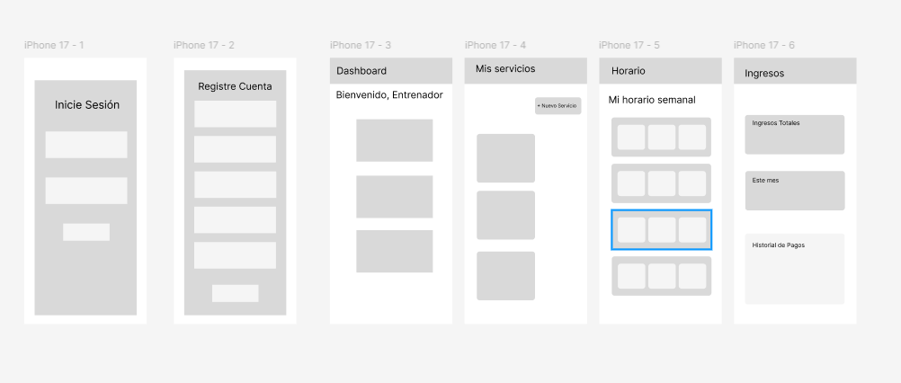

### 4.4.2. Mobile Applications Wireflow Diagrams.
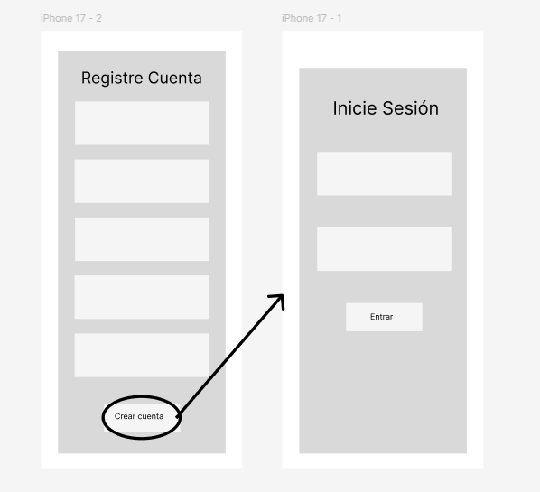
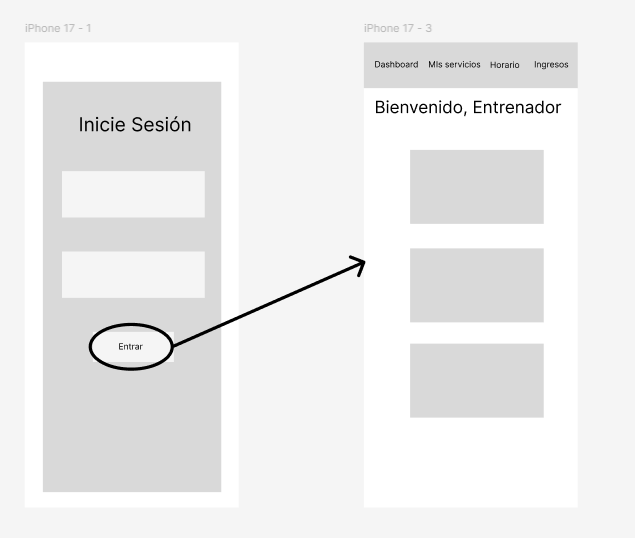
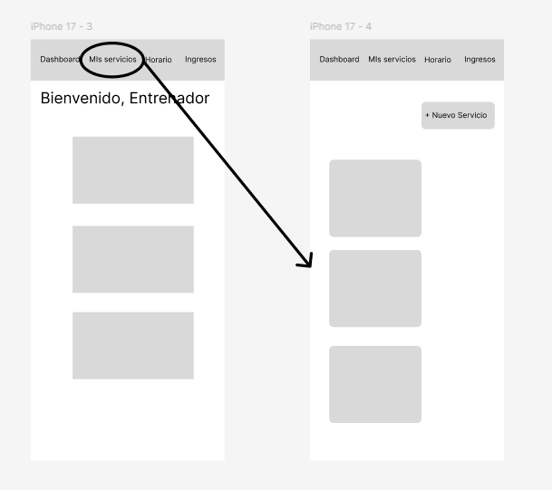
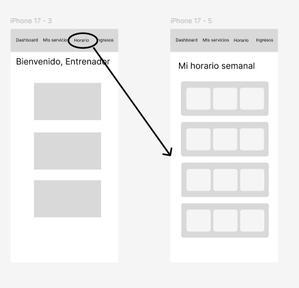
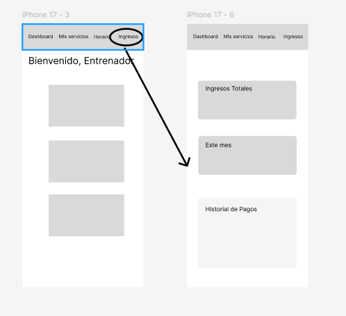

### 4.4.3. Mobile Applications Mock-ups.
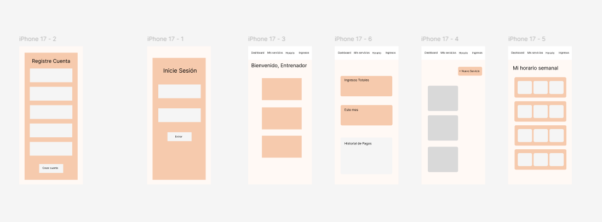

### 4.4.4. Mobile Applications User Flow Diagrams.
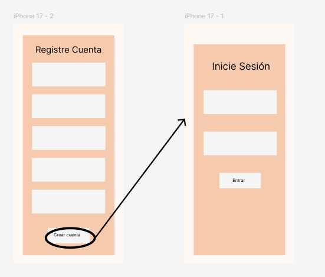
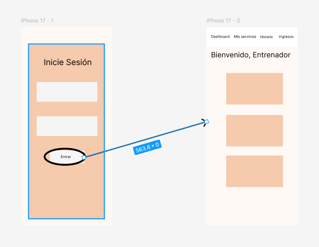
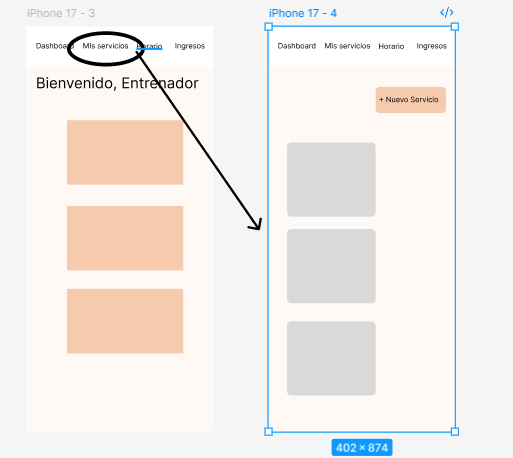
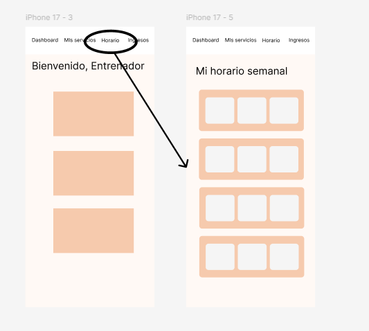
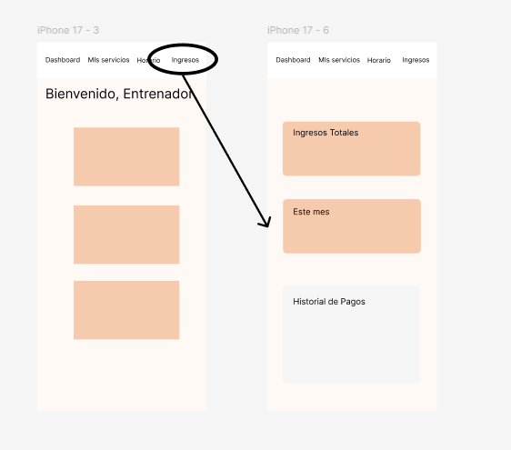

## 4.5. Mobile Applications Prototyping.

### 4.5.1. Android Mobile Applications Prototyping.
https://www.figma.com/design/UUr0y7GZTdAAU3xbkA5g31/MatchPoint?node-id=0-1&t=TQpIm5SmWsNhJTd8-1

### 4.5.2. iOS Mobile Applications Prototyping.
https://www.figma.com/design/UUr0y7GZTdAAU3xbkA5g31/MatchPoint?node-id=2007-46&t=TQpIm5SmWsNhJTd8-1

## 4.6. Web Applications UX/UI Design

### 4.6.1. Web Applications Wireframes


### 4.6.2. Web Applications Wireflow Diagrams


### 4.6.3. Web Applications Mock-ups


### 4.6.4. Web Applications User Flow Diagrams


## 4.7. Web Applications Prototyping
https://www.figma.com/design/UUr0y7GZTdAAU3xbkA5g31/MatchPoint?node-id=2007-46&t=TQpIm5SmWsNhJTd8-1

## 4.8. Domain-Driven Software Architecture
### 4.8.1. Software Architecture Context Diagram


### 4.8.2. Software Architecture Container Diagrams


### 4.8.3. Software Architecture Components Diagrams


## 4.9. Software Object-Oriented Design
### 4.9.1. Class Diagrams


### 4.9.2. Class Dictionary

#### 1. Clase: User
- Atributos:
  - userId: int → Identificador único del usuario
  - name: String → Nombre del usuario
  - email: String → Correo electrónico
  - password: String → Contraseña
  - rol: String → Rol asignado (ej. Sportsman, Coach, Admin)

- Métodos:
  - register() → Registra un nuevo usuario
  - login() → Autentica al usuario en el sistema
  - updateProfile() → Actualiza datos personales
 
#### 2. Clase: Pay
- Atributos:
  - payId: int → Identificador único del pago
  - amount: double → Monto pagado
  - date: Date → Fecha del pago
  - paymentMethod: String → Método de pago (tarjeta, efectivo, etc.)
  - state: String → Estado del pago (pendiente, confirmado, fallido)

- Métodos:
  - processPayment() → Procesa el pago
  - generateFixture() → Genera comprobante del pago
  - generateVoucher() → Genera voucher de confirmación
 
#### 3. Clase: Reserve
- Atributos:
  - reserveId: int → Identificador único de la reserva
  - userId: int → Usuario que realiza la reserva
  - rateId: int → Cancha reservada
  - coachId: int → Entrenador asignado
  - dateTime: DateTime → Fecha y hora de la reserva
  - state: String → Estado de la reserva (pendiente, confirmada, cancelada)
  - amount: double → Monto de la reserva
 
- Métodos:
  - confirm() → Confirma la reserva
  - cancel() → Cancela la reserva
  - pay() → Asocia la reserva a un pago
 
#### 4. Clase: Rate
- Atributos:
  - rateId: int → Identificador único de la cancha
  - typeSport: String → Tipo de deporte
  - location: String → Ubicación de la cancha
  - pricePerHour: double → Precio por hora
  - availability: boolean → Disponibilidad

- Métodos:
  - updateAvailability() → Actualiza disponibilidad de la cancha
  - showDetails() → Muestra información de la cancha
 
#### 5. Clase: Coach
- Atributos:
  - specialty: String → Especialidad deportiva
  - level: String → Nivel de experiencia
  - rate: double → Tarifa por hora
  - averageRating: double → Calificación promedio
 
- Métodos:
  - manageAvailability() → Gestiona disponibilidad del coach
  - acceptReservation() → Acepta una reserva de entrenamiento
  - seeStatistics() → Muestra estadísticas de desempeño
 
#### 6. Clase: PlanSubscription
- Atributos:
  - planId: int → Identificador del plan
  - namePlan: String → Nombre del plan
  - cost: double → Costo del plan
  - benefits: String → Beneficios incluidos
  - commission: double → Comisión asociada

- Métodos:
  - activate() → Activa el plan
  - updatePlan() → Actualiza beneficios o costo
  - cancel() → Cancela el plan
 
#### 7. Clase: Sportsman
- Atributos:
  - gameLevel: String → Nivel de juego del deportista
  - sportPreferences: String → Preferencias deportivas

- Métodos:
  - reserveField() → Reserva una cancha
  - reserveCoach() → Reserva un entrenador
  - joinTournament() → Inscripción en torneos

#### 8. Clase: Tournament
- Atributos:
  - tournamentId: int → Identificador del torneo
  - name: String → Nombre del torneo
  - typeSport: String → Tipo de deporte
  - dateTime: DateTime → Fecha de inicio
  - endDate: DateTime → Fecha de finalización
  - participants: List<User> → Participantes inscritos

- Métodos:
  - registerPlayer() → Inscribe a un jugador
  - generateFixture() → Genera el cronograma del torneo
  - publishResults() → Publica resultados finales
  
## 4.10. Database Design
### 4.10.1. Relational/Non-Relational Database Diagram


<div style="page-break-after:always;"></div>

# Capítulo V: Product Implementatio

## 5.1. Software Configuration Management.

### 5.1.1. Software Development Enviroment Configuration

#### Requirements Management

1. Canva: Es una herramienta de diseño utilizada para realizar los user persona, empathy mapping, Lean UX Canvas, As-is Scenario Mapping y otros elementos importantes más. Esta aplicación está basada en un sistema de diseño simple en el cual puedes mover y editar objetos para lograr el objetivo de diseñar nuestras piezas escenciales de análisis de mercado para nuestra aplicación. Ruta de referencia: https://www.canva.com/es_es/.

2. Figma: Plataforma de elaboración de prototipos y edición gráfica, que usamos principalmente para nuestra Landing Page y Web Application, tanto para los Wireframes y los MockUps, al igual que para nuestros Wireflows Diagrams. Ruta de referencia: https://www.figma.com/.

3. Vertabelo: Plataforma basada en creación, gestión y realización de gráficos para organizar las herencias y dependencias de nuestros programas y/o bases de datos. Como en nuestro caso fue implementada para realizar nuestros Class Diagrams y nuestra Database Diagrams. Ruta de referencia https://vertabelo.com/.

#### Software Devlopment

**Frontend Web**

1. JetBrains WebStorm: Es un entorno de desarrollo integrado (IDE) enfocado en el desarrollo web. Ofrece herramientas que facilitan la prueba del proyecto en diversos navegadores como Chrome, Microsoft Edge, Safari y Mozilla Firefox. El uso de WebStorm aporta un valor agregado al desarrollo, ya que permite visualizar cómo funciona la aplicación en múltiples plataformas y proporciona soporte avanzado para la edición de código en TypeScript y Angular. Ruta de Referencia: https://www.jetbrains.com/es-es/webstorm/.

2. Angular: Framework progresivo de código abierto para construir aplicaciones web dinámicas y escalables. Utilizamos Angular como framework principal para desarrollar el frontend web de PlayMatch, proporcionando componentes reutilizables, inyección de dependencias y reactividad con RxJS. Ruta de Referencia: https://angular.io/.

3. TypeScript: Lenguaje de programación superconjunto de JavaScript que añade tipado estático y características de programación orientada a objetos. Se utiliza como lenguaje base en Angular para mejorar la calidad del código, detectar errores en tiempo de compilación y facilitar el mantenimiento. Ruta de Referencia: https://www.typescriptlang.org/.

4. Node.js y npm: Entorno de ejecución de JavaScript y gestor de paquetes utilizado para instalar dependencias, compilar y ejecutar scripts de desarrollo. Esencial para el workflow de Angular, testing y build del proyecto web. Ruta de Referencia: https://nodejs.org/.

**Frontend Móvil (Android)**

5. Android Studio: Entorno de desarrollo integrado oficial para construir aplicaciones nativas Android. Proporciona emuladores, depurador, analizador de rendimiento y herramientas de layout para diseñar la interfaz de usuario de la app móvil. Ruta de Referencia: https://developer.android.com/studio.

6. Kotlin: Lenguaje de programación moderno, conciso y seguro que se ejecuta en la máquina virtual de Java (JVM) y es el lenguaje oficial para el desarrollo de Android. Se utiliza para implementar la lógica de negocio y componentes de UI en la aplicación móvil de PlayMatch. Ruta de Referencia: https://kotlinlang.org/.

7. Android SDK: Kit de desarrollo que incluye bibliotecas, emuladores, documentación y herramientas necesarias para compilar, probar y empaquetar aplicaciones Android. Proporciona acceso a APIs nativas del sistema operativo. Ruta de Referencia: https://developer.android.com/studio/releases/platforms.

8. Gradle: Herramienta de automatización de compilación utilizada por Android Studio para gestionar dependencias, configurar builds y ejecutar pruebas en proyectos Android. Ruta de Referencia: https://gradle.org/.

#### Software Deployment

1. Git: Es una herramienta de control de versiones diseñada para mejorar la eficiencia, confiabilidad y compatibilidad en la gestión de versiones de software. Su uso permite a los integrantes del equipo acceder y trabajar con el proyecto desde la línea de comandos, facilitando la colaboración y el seguimiento de cambios en el desarrollo. Ruta de Referencia: https://git-scm.com/.

#### Software Documentation and Project Management

1. GitHub: Es una plataforma que permite alojar proyectos y gestionarlos mediante el control de versiones de Git, utilizando repositorios. Facilita la colaboración en tiempo real entre los miembros del equipo, así como la revisión y seguimiento de los aportes individuales en el desarrollo del proyecto. Ruta de Referencia: https://github.com/.

### 5.1.2. Source Code Management

El proyecto sigue las convenciones del modelo GitFlow como flujo de trabajo para el control de versiones, utilizando GitHub como plataforma central. Dado que PlayMatch incluye múltiples componentes (landing page, web application, mobile application y backend), se mantienen repositorios separados por componente para mayor modularidad, claridad y facilidad de mantenimiento.

#### Estructura de Repositorios en GitHub:

Cada componente tiene su propio repositorio independiente con su ciclo de vida de desarrollo:

- **Reporte**: https://github.com/upc-202601-16879-Diseno-de-Experimentos/Report-Trabajo-Final.git

- **Landing Page**: https://github.com

- **Frontend Web (Angular)**: 
https://github.com/upc-202601-16879-Diseno-de-Experimentos/Frontend.git

- **Frontend Móvil (Android/Kotlin)**: https://github.com/upc-202601-16879-Diseno-de-Experimentos/Mobile.git
- **Backend**: 
https://github.com/upc-202601-16879-Diseno-de-Experimentos/Backend.git

Esta estructura permite que cada equipo trabaje de forma independiente, con sus propias ramas de feature, release y hotfix, facilitando la integración continua y evitando conflictos de merge.

### 5.1.3. Source Code Style Guide & Conventions

#### **TypeScript (Frontend Web con Angular)**

TypeScript es el lenguaje principal para el desarrollo del frontend web. Algunas convenciones clave incluyen:

- Usar tipado fuerte en todas las variables, parámetros de funciones y retornos para detectar errores en tiempo de compilación.
- Nombres de variables y funciones en camelCase, mientras que clases y interfaces en PascalCase.
- Usar interfaces para definir contratos de datos y evitar el uso de `any`.
- Implementar una estructura clara de carpetas: `components/`, `services/`, `models/`, `guards/`, `interceptors/`.
- Aplicar una indentación de 2 espacios para mantener legibilidad.
- Usar `const` y `let` en lugar de `var`; evitar variables globales.
- Documentar métodos públicos con comentarios JSDoc explicando parámetros y retornos.
- Utilizar RxJS Observables correctamente con operadores como `map`, `filter`, `switchMap` para manejo reactivo de flujos de datos.
- Validar formularios utilizando validadores reactivos de Angular.

#### **Kotlin (Frontend Móvil Android)**

Kotlin es el lenguaje oficial para desarrollo nativo de Android. Convenciones a seguir:

- Nombres de clases en PascalCase, variables y funciones en camelCase.
- Usar `val` para variables inmutables por defecto, `var` solo cuando sea necesario.
- Implementar null-safety usando tipos nullable (`?`) y el operador Elvis (`?:`).
- Estructura clara: `activities/`, `fragments/`, `viewmodels/`, `repositories/`, `models/`, `ui/`.
- Usar coroutines para operaciones asincrónicas en lugar de callbacks.
- Implementar ViewModel y LiveData para gestión de estado y ciclo de vida.
- Documentar funciones públicas con comentarios KDoc.
- Utilizar extension functions para reducir boilerplate.
- Mantener indentación de 4 espacios conforme a convenciones de Java.
- Seguir Material Design guidelines para UI.

#### **CSS (Cascading Style Sheets)**

CSS permite dar estilo y personalizar el diseño visual de los sitios web. Algunas convenciones importantes a seguir al escribir CSS son:

- Usar una nomenclatura coherente para nombres de clases, identificadores y selectores, facilitando la colaboración y el mantenimiento.
- Mantener una indentación uniforme y aplicar espacios en blanco adecuados para mejorar la claridad del código.
- Comentar el código para explicar la lógica detrás de bloques o secciones de estilo.
- Agrupar propiedades relacionadas por bloques para una mejor estructura.
- Evitar selectores excesivamente específicos que puedan generar conflictos en el futuro.
- Utilizar prefijos de proveedores (vendor prefixes) cuando sea necesario para asegurar compatibilidad con todos los navegadores.
- Optimizar el código evitando duplicidades y combinando reglas similares.
- Probar estilos en distintos navegadores y dispositivos para verificar su consistencia visual.
- Validar el código CSS usando herramientas como el validador de W3C para identificar errores.

#### **Gherkin**
Gherkin es un lenguaje de texto estructurado utilizado para definir pruebas de comportamiento de forma legible por cualquier miembro del equipo. Algunas pautas clave incluyen:

- Redactar los escenarios de forma clara y sencilla, pensando en la comprensión de todos los roles del equipo.
- Usar una estructura estandarizada en los archivos `.feature` con palabras clave como `Feature`, `Scenario`, `Given`, `When`, `Then` y `And`.
- Ser detallado al describir escenarios, especificando claramente el estado inicial, las acciones realizadas y los resultados esperados.
- Reutilizar pasos comunes con la palabra `And` para evitar repeticiones innecesarias.
- Mantener los escenarios enfocados y sin pasos redundantes o irrelevantes.
- Utilizar comentarios para agregar contexto o aclaraciones adicionales cuando sea necesario.
- Fomentar la colaboración revisando y afinando los escenarios con el equipo para asegurar que estén alineados con los requerimientos funcionales.

### 5.1.4. Software Deployment Configuration

### **Configuraciones de despliegue del proyecto**

PlayMatch utiliza diferentes plataformas de despliegue según el componente, asegurando que cada aplicación llegue a sus usuarios de forma eficiente y confiable.

#### **Landing Page y Frontend Web (Netlify)**

Para la puesta en línea del Landing Page y la aplicación web (Angular), utilizamos Netlify, una plataforma especializada en el alojamiento web y despliegue continuo de aplicaciones modernas. Su funcionamiento se basa en los siguientes puntos:

- **Integración con repositorios Git**: Netlify se enlaza fácilmente con GitHub. Cada vez que actualizamos el código y lo subimos a nuestro repositorio, Netlify detecta los cambios y comienza automáticamente el proceso de construcción del sitio.
- **Compilación automatizada**: Durante el proceso de build, Netlify ejecuta `ng build` en Angular, transformando el código fuente TypeScript, componentes y estilos en una versión optimizada y compilada.
- **Despliegue en red CDN**: Una vez que la construcción se completa con éxito, el sitio es desplegado a través de una red global de entrega de contenido (CDN), lo que garantiza tiempos de carga rápidos y disponibilidad en cualquier parte del mundo.
- **Vistas previas automáticas por rama**: Por cada rama de trabajo activa o pull request, Netlify genera automáticamente una versión previa del sitio. Esto permite revisar los cambios antes de integrarlos al proyecto principal.
- **Despliegues automáticos continuos**: Cada vez que se fusiona una rama o se realiza un nuevo commit en la rama principal, Netlify actualiza el sitio automáticamente.

#### **Aplicación Móvil Android (Google Play Store)**

Para la distribución de la aplicación móvil desarrollada en Kotlin, se implementa el siguiente flujo de despliegue:

- **Compilación y empaquetamiento**: Gradle compila el código Kotlin, ejecuta pruebas unitarias y genera un archivo APK (o AAB) firmado digitalmente con la clave de release.
- **Google Play Console**: Se utiliza Google Play Console para gestionar todas las fases del lanzamiento y distribución de la aplicación.
  - **Canales de distribución**: Implementamos canales internos para testing, beta para usuarios experimentados, y production para lanzamiento público.
  - **Gestión de versiones**: Se administran versionCode y versionName para controlar actualizaciones y rollouts progresivos.
  - **Monitoreo**: Se monitorean métricas de estabilidad, crashes, ANRs (Application Not Responding) y ratings de usuarios.
- **Certificación y seguridad**: La aplicación se somete a pruebas automáticas de seguridad de Google Play antes de ser disponible para usuarios.
- **Rollout gradual**: Las nuevas versiones se lanzan gradualmente (10% → 25% → 50% → 100%) para detectar problemas antes de alcanzar a todos los usuarios.
- **Actualizaciones automáticas**: Los usuarios reciben actualizaciones automáticas de la aplicación a través de Google Play.

#### **Backend**

El backend (API REST) sigue su propio flujo de despliegue, típicamente en plataformas como:
- Servidores dedicados o cloud providers (AWS, GCP, Azure)
- Contenedorización con Docker y orquestación con Kubernetes (opcional)
- Integración continua con pipelines de CI/CD (GitHub Actions, Jenkins, etc.)

## 5.2. Product Implementation & Deployment.

### 5.2.1. Sprint Backlogs.

En esta sección se presentan los Sprint Backlogs derivados del Product Backlog definido en la sección 3.3. Cada sprint agrupa las user stories priorizadas según la capacidad del equipo y los objetivos de cada entrega. La duración estándar de cada sprint es de **2 semanas**.

---

#### Sprint 1

**Duración:** 02 de abril de 2026 – 08 de mayo de 2026 (6 semanas para TP1)  
**Objetivo:** Completar la infraestructura base del proyecto, incluyendo el sistema de autenticación (registro e inicio de sesión), la base del backend con arquitectura DDD, y el frontend inicial con la landing page funcional.

| Sprint Backlog Item | User Story ID | Título | Story Points | Asignado a |
|---------------------|---------------|--------|--------------|------------|
| SB01 | US01 | Registrar cuenta de jugador | 5 | Sebastian |
| SB02 | US02 | Iniciar sesión como jugador | 3 | Sebastian |
| SB03 | US09 | Registrar cuenta de entrenador | 5 | Miguel |
| SB04 | US10 | Actualizar perfil profesional | 3 | Miguel |
| SB05 | TS01 | Implementar autenticación basada en JWT | 5 | Stephano |
| SB06 | TS02 | Validación de JWT en endpoints protegidos | 3 | Stephano |
| SB07 | TS03 | Manejo de expiración de tokens JWT | 3 | Stephano |
| SB08 | TS04 | Almacenamiento seguro de tokens | 2 | Stephano |
| SB09 | Landing Page | Implementación de landing page | 8 | Andy |
| SB10 | Frontend Base | Configuración de proyecto frontend (Vue.js) | 5 | Andy |
| SB11 | Backend Base | Configuración de proyecto backend (Spring Boot + DDD) | 8 | Ruben |
| SB12 | DB Setup | Configuración de base de datos y modelos de dominio | 5 | Ruben |

**Total Story Points Sprint 1:** 55

**Definition of Done:**
- [ ] Sistema de registro e inicio de sesión funcionando con JWT
- [ ] Landing page responsive y desplegada en Netlify
- [ ] Backend con arquitectura DDD levantado y accesible via Swagger
- [ ] Repositorios configurados con GitFlow
- [ ] Código documentado y con convenciones aplicadas

---

#### Sprint 2

**Duración:** 09 de mayo de 2026 – 01 de junio de 2026 (3 semanas para TB2)  
**Objetivo:** Implementar la funcionalidad core de búsqueda y reserva de canchas, incluyendo filtros, gestión de horarios y panel de administración.

| Sprint Backlog Item | User Story ID | Título | Story Points | Asignado a |
|---------------------|---------------|--------|--------------|------------|
| SB13 | US03 | Buscar canchas por ubicación | 5 | Sebastian |
| SB14 | US04 | Filtrar canchas por deporte | 3 | Sebastian |
| SB15 | US05 | Reservar cancha en línea | 8 | Miguel |
| SB16 | US06 | Pagar reserva con tarjeta | 5 | Miguel |
| SB17 | TS05 | Implementar API de búsqueda de canchas | 5 | Stephano |
| SB18 | TS06 | Sistema de reservas en tiempo real | 8 | Stephano |
| SB19 | TS07 | Integración con pasarela de pagos | 5 | Ruben |
| SB20 | TS08 | Generación de comprobantes digitales | 5 | Ruben |
| SB21 | Frontend Búsqueda | Vista de búsqueda y listado de canchas | 8 | Andy |
| SB22 | Frontend Reserva | Flujo de reserva de cancha | 8 | Andy |

**Total Story Points Sprint 2:** 60

**Definition of Done:**
- [ ] Búsqueda y filtrado de canchas funcionando
- [ ] Proceso de reserva completo con confirmación
- [ ] Pagos integrados y generando comprobantes
- [ ] Frontend responsive con todas las vistas implementadas
- [ ] Tests unitarios de los servicios core ejecutándose

---

#### Sprint 3

**Duración:** 02 de junio de 2026 – 15 de julio de 2026 (6 semanas para TF1)  
**Objetivo:** Completar la gestión de entrenadores, sistema de valoraciones, organización de partidos/torneos y funcionalidades restantes del producto.

| Sprint Backlog Item | User Story ID | Título | Story Points | Asignado a |
|---------------------|---------------|--------|--------------|------------|
| SB23 | US07 | Valorar cancha reservada | 3 | Sebastian |
| SB24 | US15 | Recibir reseñas de jugadores | 3 | Sebastian |
| SB25 | US11 | Publicar disponibilidad de horarios | 5 | Miguel |
| SB26 | US12 | Aceptar o rechazar reservas | 5 | Miguel |
| SB27 | US13 | Gestionar pagos recibidos | 5 | Stephano |
| SB28 | US14 | Ver estadísticas de rendimiento | 3 | Stephano |
| SB29 | US08 | Crear partido con amigos | 5 | Ruben |
| SB30 | US16 | Organizar torneos comunitarios | 8 | Ruben |
| SB31 | TS09 | API de gestión de entrenadores | 5 | Andy |
| SB32 | TS10 | Panel de administración de agenda | 5 | Andy |
| SB33 | TS11 | Notificaciones de reserva a entrenadores | 5 | Todos |
| SB34 | TS12 | Gestión de pagos para entrenadores | 3 | Todos |
| SB35 | TS13 | Sistema de valoraciones y reseñas | 5 | Todos |
| SB36 | TS14 | Moderación de comentarios | 3 | Todos |
| SB37 | TS15 | Organización de torneos | 8 | Todos |
| SB38 | TS16 | Estadísticas de participación y rendimiento | 5 | Todos |

**Total Story Points Sprint 3:** 76

**Definition of Done:**
- [ ] Gestión completa de entrenadores con agendas
- [ ] Sistema de valoraciones y reseñas funcionando
- [ ] Creación de partidos y torneos operativos
- [ ] Dashboard de estadísticas para entrenadores
- [ ] Notificaciones push/email implementadas
- [ ] Tests de integración y BDD completados
- [ ] Producto desplegado y funcionando en producción

---

#### Resumen de Sprints

| Sprint | Duración | Story Points | Objetivo Principal |
|--------|----------|-------------|-------------------|
| Sprint 1 | 02/04/26 – 08/05/26 | 55 | Infraestructura base y autenticación |
| Sprint 2 | 09/05/26 – 01/06/26 | 60 | Búsqueda y reserva de canchas |
| Sprint 3 | 02/06/26 – 15/07/26 | 76 | Gestión de entrenadores, reseñas y torneos |
### 5.2.2. Implemented Landing Page Evidence

### 5.2.3. Implemented Frontend-Web Application Evidence

A continuación se presentan las evidencias de la implementación de la aplicación web PlayMatch, mostrando las principales funcionalidades desarrolladas.

**Login**

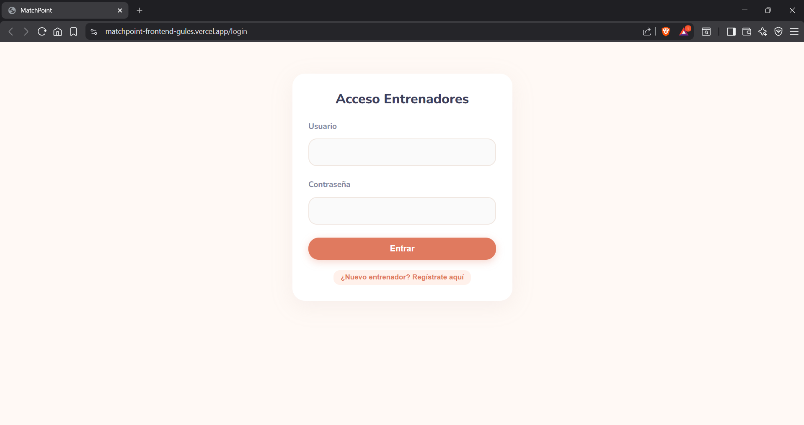

**Registro**

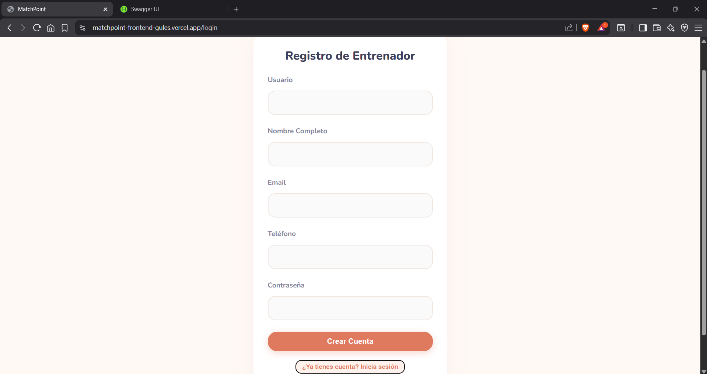

#### Dashboard

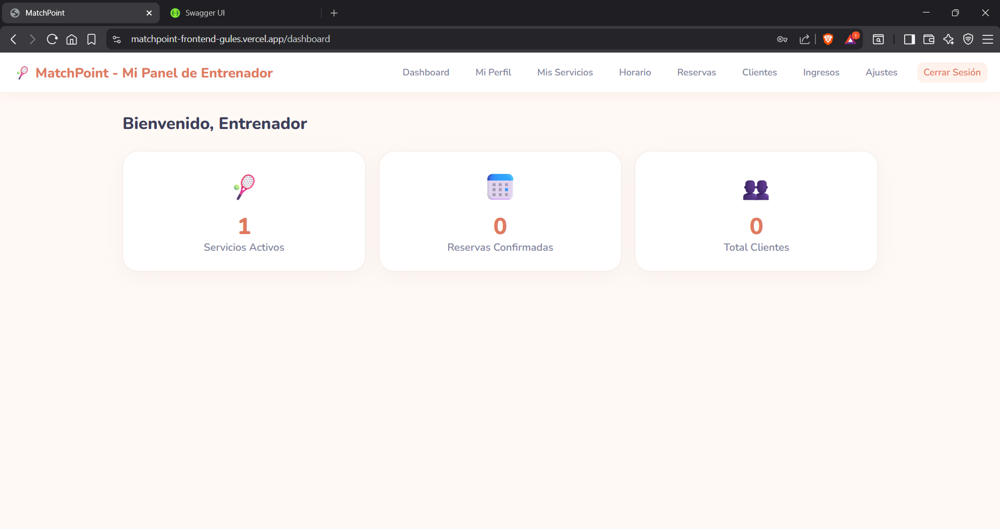

#### Perfil

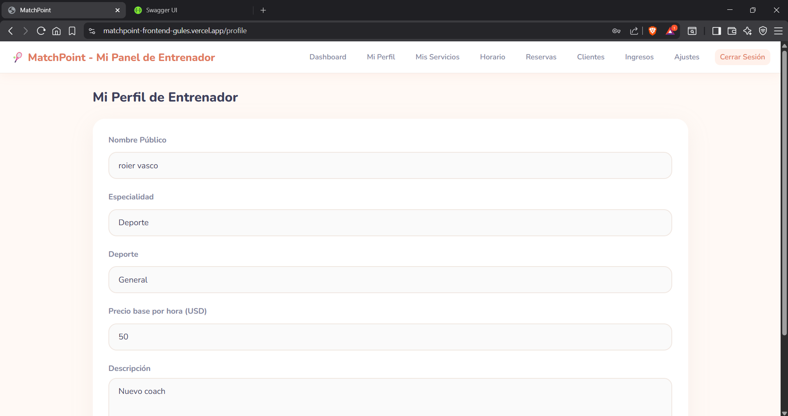

#### Servicios

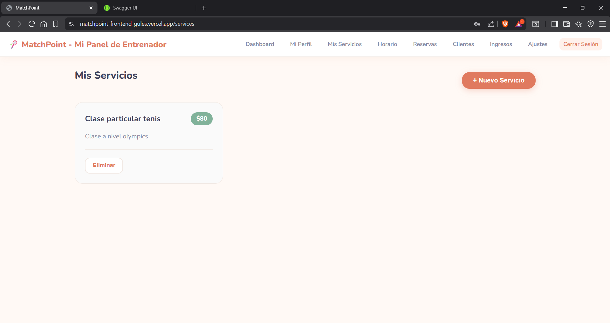

#### Horario

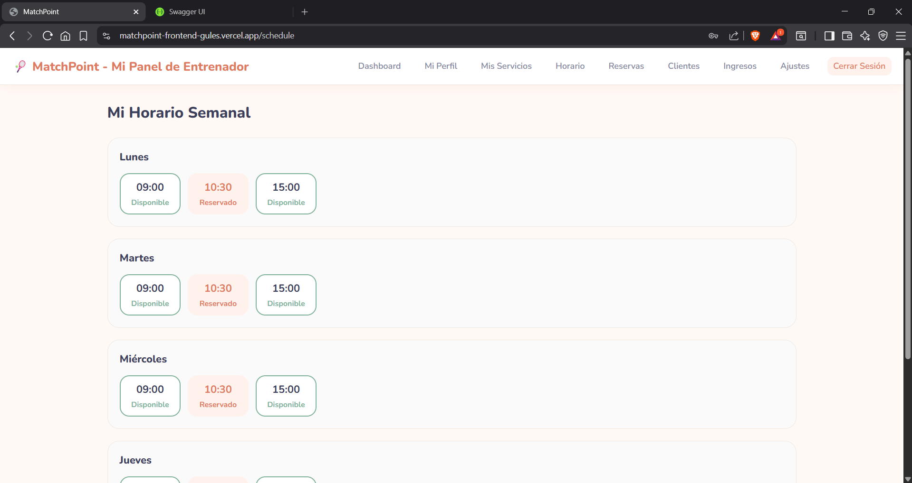

#### Reservas

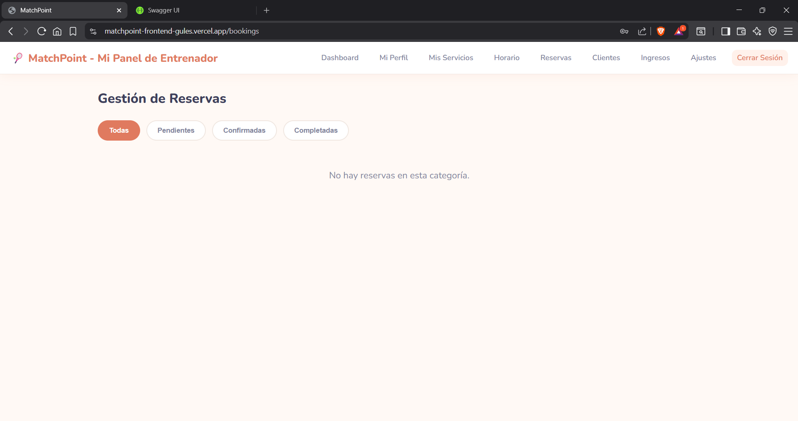

#### Clientes

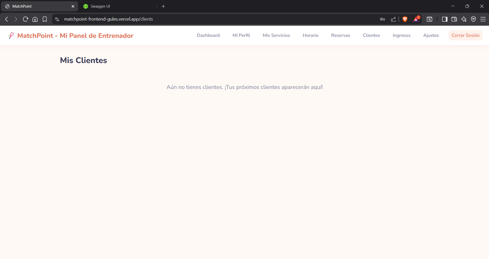

#### Ingresos

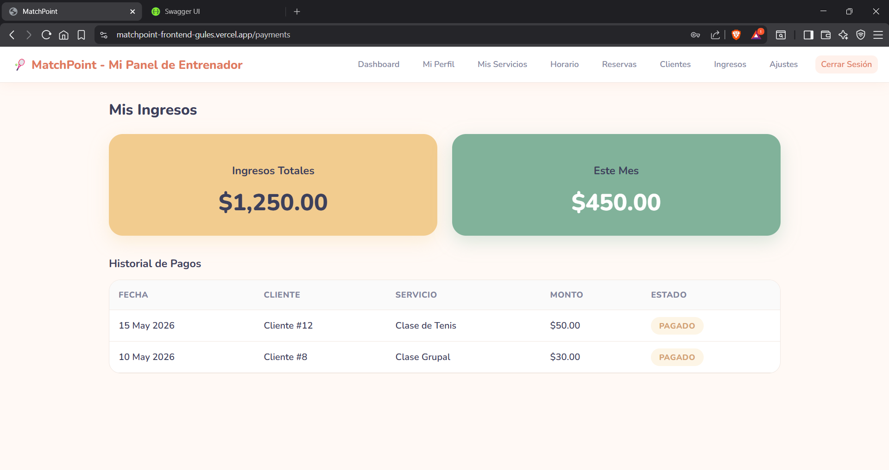

#### Ajustes

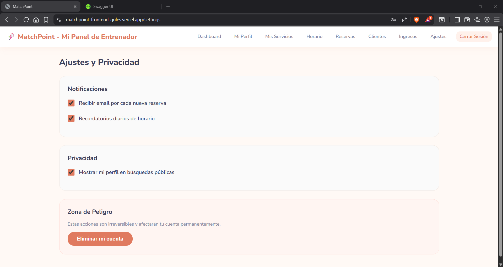

### 5.2.4. Acuerdo de Servicio - SaaS

El presente documento establece el acuerdo de nivel de servicio (SLA - Service Level Agreement) entre MatchPoint y los usuarios de la plataforma PlayMatch. Este acuerdo define los compromisos de disponibilidad, soporte, seguridad y mantenimiento del servicio tecnológico proporcionado.

#### 5.2.4.1. Descripción del Servicio

PlayMatch es una plataforma SaaS (Software as a Service) desarrollada por MatchPoint que permite a los usuarios:

- Buscar y reservar canchas deportivas en tiempo real
- Contratar servicios de entrenador
- Gestionar pagos de manera segura
- Organizar partidos y torneos
- Dejar valoraciones y reseñas

El servicio está disponible a través de:
- **Frontend Web:** https://matchpoint-frontend-hkfqnuy5y-stephanos-projects-199e78ac.vercel.app
- **Backend API:** https://matchpoint-backend-lj56.onrender.com/swagger-ui.html

#### 5.2.4.2. Disponibilidad del Servicio

| Métrica | Compromiso | Descripción |
|---------|------------|-------------|
| Uptime Mensual | 99.5% | Porcentaje de tiempo que el servicio está operativo |
| Tiempo de Respuesta | < 3 segundos | Tiempo promedio de carga de páginas |
| Disponibilidad API | 99.5% | Disponibilidad de los endpoints REST |
| Mantenimiento Programado | < 4 horas/mes | Tiempo máximo de mantenimiento planificado |

**Matriz de Disponibilidad:**

| Nivel de Servicio | Descripción | Disponibilidad |
|-------------------|-------------|-----------------|
| Crítico | Generación de reservas y pagos | 99.9% |
| Alto | Búsqueda de canchas y perfiles | 99.5% |
| Medio | Valoraciones y comentarios | 99.0% |
| Bajo | Estadísticas y reportes | 98.5% |

#### 5.2.4.3. Compromisos de Soporte Técnico

| Canal de Soporte | Disponibilidad | Tiempo de Respuesta |
|-----------------|----------------|-------------------|
| Email support@matchpoint.com | 24/7 | 24-48 horas |
|Centro de ayuda en línea | 24/7 | Inmediato |
| Chat en aplicación | 8am - 10pm (L-S) | < 15 minutos |

**Niveles de Severidad:**

| Severidad | Descripción | Tiempo de Resolución |
|----------|------------|------------------|
| Crítica | Sistema no disponible, pérdida de datos | < 4 horas |
| Alta | Funcionalidad principal afectada | < 24 horas |
| Media | Funcionalidad secundaria afectada | < 72 horas |
| Baja | Mejoras cosmeticías | < 7 días |

#### 5.2.4.4. Mantenimiento y Actualizaciones

**Mantenimiento Programado:**

- Las actualizaciones de seguridad se aplicarán dentro de las 72 horas posteriores a su liberación
- El mantenimiento planificado se realizará en horarios de baja actividad (madrugada, 2am-6am)
- Los usuarios serán notificados con 48 horas de anticipación

**Actualizaciones del Sistema:**

- Actualizaciones menores (patches): Mensuales
- Actualizaciones mayores: Trimestrales
- Nuevas funcionalidades: Según backlog del producto

#### 5.2.4.5. Seguridad y Protección de Datos

**Medidas de Seguridad:**

- Cifrado de datos en tránsito mediante TLS 1.3
- Almacenamiento cifrado de contraseñas con bcrypt
- Autenticación mediante JWT con rotación de tokens
- Protección contra CSRF y XSS
- Copias de seguridad diarias automatizadas

**Cumplimiento:**

- Los datos de usuarios son tratados según la legislación peruana de protección de datos personales
- Cumplimiento con OWASP Top 10 para seguridad web
- Políticas de retención de datos: 2 años inactivos

#### 5.2.4.6. Responsabilidades del Proveedor (MatchPoint)

MatchPoint se compromete a:

- Mantener la disponibilidad del servicio según los niveles establecidos
- Proteger la confidencialidad y seguridad de los datos de los usuarios
- Proveer soporte técnico según los tiempos comprometidos
- Comunicar cualquier interrupción del servicio con anticipación
- Mantener actualizar la documentación de la API

#### 5.2.4.7. Responsabilidades del Usuario

Los usuarios se comprometen a:

- Mantener sus credenciales de acceso de forma segura
- Reportar cualquier anomalía o incidente de seguridad
- No intentar acceder a sistemas terceros sin autorización
- Cumplir con los términos de uso de la plataforma
- Realizar pagos de las reservaciones a tiempo

#### 5.2.4.8. Limitaciones y Exclusiones

**El SLA no cubre:**

- Problemas de conectividad del usuario final
- Fallos de servicios de terceros ajenos a Render/Vercel
- Fuerza mayor (desastres naturales, cortes de energía)
- Mantenimiento de emergencia no planificado
- Uso indebido o violación de Términos de Uso

**Límites de Uso:**

- Máximo de 1000 solicitudes API por minuto por usuario
- Máximo de 100 reservas activas por usuário
- Almacenamiento de 50MB por perfil de usuario

#### 5.2.4.9. Terminación del Servicio

**Por parte del usuario:**

- El usuário puede cerrar su cuenta en cualquier momento
- Los datos serán eliminados dentro de 30 días de la solicitud

**Por parte de MatchPoint:**

- Notificación con 30 días de anticipación
- Reembolso proporcional en caso de suscripción anual

**En caso de Terminación:**

- Exportación de datos disponible por 30 días
- Eliminación segura de datos después de ese período

#### 5.2.4.10. Métricas de Monitoreo

MatchPoint utiliza herramientas de monitoreo para garantizar los niveles de servicio:

- **Uptime Monitoring:** Pingdom, UptimeRobot
- **Performance:** Vercel Analytics, Render Metrics
- **Logs:** Stackdriver, CloudWatch
- **Alerting:** PagerDuty, OpsGenie

**Dashboard público de disponibilidad:**

Los usuarios pueden consultar el estado del servicio en: status.matchpoint.com

---

**Versión del SLA:** 1.0  
**Fecha de vigencia:** Mayo 2026  
**Próxima revisión:** Julio 2026

### 5.2.5. Implemented Native-Mobile Application Evidence

A continuación se presentan las evidencias de la implementación de la aplicación móvil MatchPoint, mostrando las principales funcionalidades desarrolladas.

#### Registro

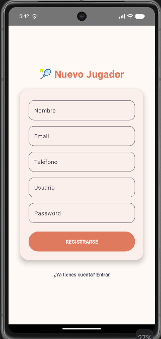

#### Login

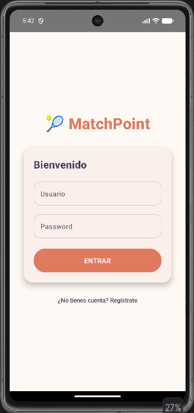

#### Coaches

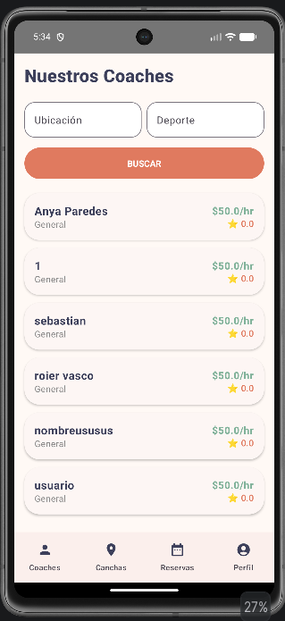

#### Servicios

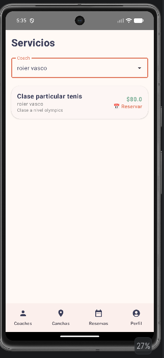

#### Reservas

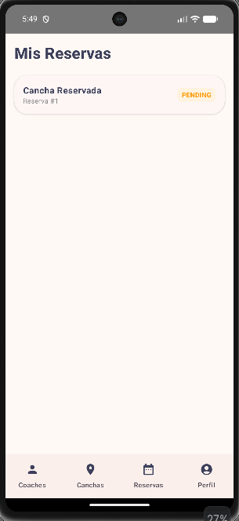

#### Perfil

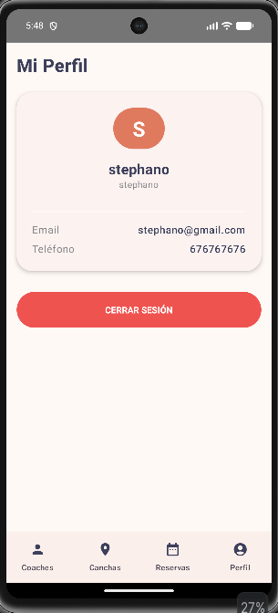

### 5.2.6. Implemented RESTful API and/or Serverless Backend Evidence

A continuación se presentan las evidencias de la implementación del backend, mostrando las bases de datos y tablas creadas.

#### Bookings

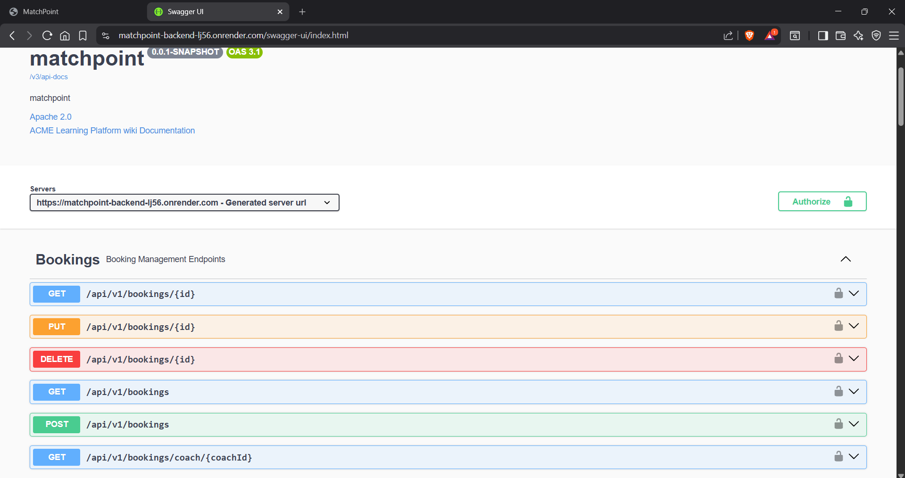

#### Coach Services and Reviews

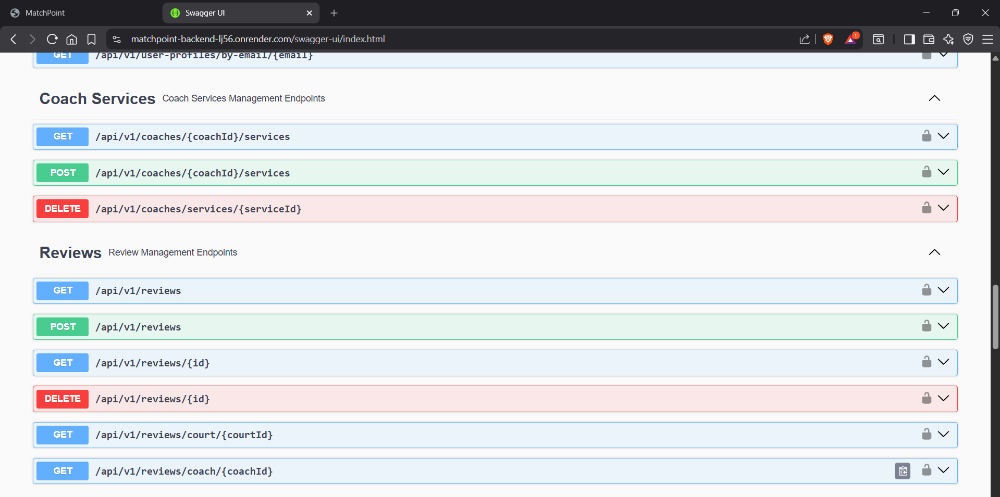

#### Coaches

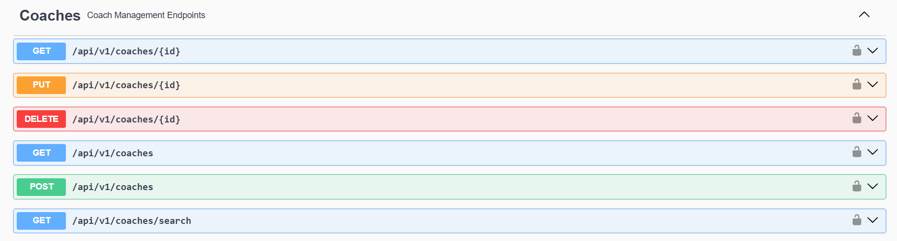

#### Client Relations

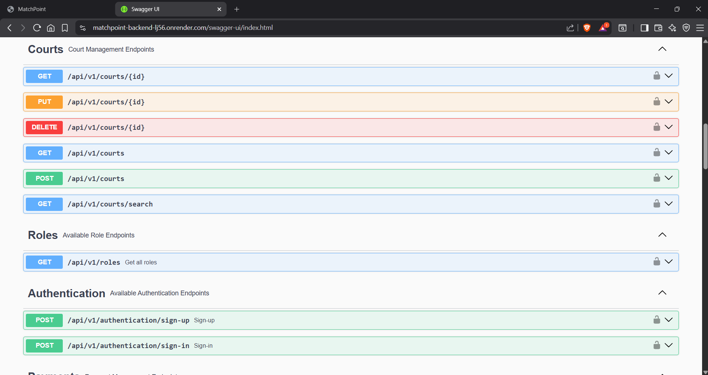

#### Payments and User Profiles

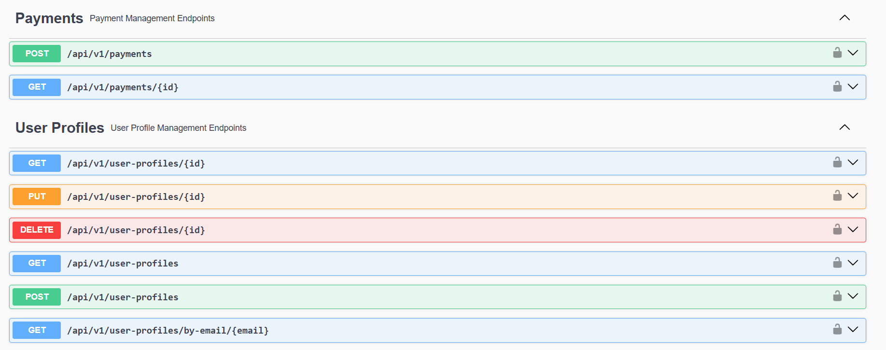

#### Users

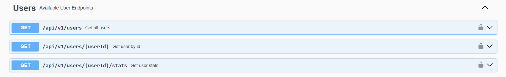

### 5.2.7. RESTful API documentation

#### Bound context

- IAM: Maneja la autenticación, autorización y gestión de usuarios y roles. 
- Booking: Gestiona las reservas de las canchas.
- Coaches: Información general de los entrenadores.
- Courts: Información general de las canchas.
- Payment: Gestiona los pagos de las reservas.
- Users: Información general de los usuarios.

#### API

Todos los endpoints están organizados siguiendo la convención RESTful bajo la ruta /api/v1/ y están documentados
según contexto.

### Documentacion IAM
AuthenticationController

| Tag   | HTTP Method | Endpoint | Description | Operation  |
| ----- | ----------- | -------- | ----------- | ---------- |
| IAM   | POST        | /api/v1/authentication/sign-in | iniciar sesión | SignIn |
| IAM   | POST        | /api/v1/authentication/sign-up | registrarse | SignUp |

UsersController

| Tag   | HTTP Method | Endpoint | Description | Operation  |
| ----- | ----------- | -------- | ----------- | ---------- |
| IAM   | GET         | /api/v1/users | obtener todos los usuarios | GetAllUsers |
| IAM   | GET         | /api/v1/users/{userId} | obtener usuario por ID | GetUserById |

RolesController

| Tag   | HTTP Method | Endpoint | Description | Operation  |
| ----- | ----------- | -------- | ----------- | ---------- |
| IAM   | GET         | /api/v1/roles | obtener todos los roles | GetAllRoles |

### Documentacion Users
UserProfilesController

| Tag   | HTTP Method | Endpoint | Description | Operation  |
| ----- | ----------- | -------- | ----------- | ---------- |
| Users | POST        | /api/v1/user-profiles | crear perfil de usuario | CreateUserProfile |
| Users | GET         | /api/v1/user-profiles | obtener todos los perfiles | GetAllUserProfiles |
| Users | GET         | /api/v1/user-profiles/{id} | obtener perfil por ID | GetUserProfileById |
| Users | PUT         | /api/v1/user-profiles/{id} | actualizar perfil | UpdateUserProfile |
| Users | DELETE      | /api/v1/user-profiles/{id} | eliminar perfil | DeleteUserProfile |

### Documentacion Payments
PaymentsController

| Tag     | HTTP Method | Endpoint | Description | Operation  |
| ------- | ----------- | -------- | ----------- | ---------- |
| Payment | POST        | /api/v1/payments | crear pago | CreatePayment |
| Payment | GET         | /api/v1/payments/{id} | obtener pago por ID | GetPaymentById |

### Documentacion Coaches
CoachesController

| Tag     | HTTP Method | Endpoint | Description | Operation  |
| ------- | ----------- | -------- | ----------- | ---------- |
| Coaches | POST        | /api/v1/coaches | crear entrenador | CreateCoach |
| Coaches | GET         | /api/v1/coaches | obtener todos los entrenadores | GetAllCoaches |
| Coaches | GET         | /api/v1/coaches/{id} | obtener entrenador por ID | GetCoachById |
| Coaches | PUT         | /api/v1/coaches/{id} | actualizar entrenador | UpdateCoach |
| Coaches | DELETE      | /api/v1/coaches/{id} | eliminar entrenador | DeleteCoach |

### Documentacion Courts
CourtsController

| Tag    | HTTP Method | Endpoint | Description | Operation  |
| ------ | ----------- | -------- | ----------- | ---------- |
| Courts | POST        | /api/v1/courts | crear cancha | CreateCourt |
| Courts | GET         | /api/v1/courts | obtener todas las canchas | GetAllCourts |
| Courts | GET         | /api/v1/courts/{id} | obtener cancha por ID | GetCourtById |
| Courts | PUT         | /api/v1/courts/{id} | actualizar cancha | UpdateCourt |
| Courts | DELETE      | /api/v1/courts/{id} | eliminar cancha | DeleteCourt |

### Documentacion Bookings
BookingsController

| Tag      | HTTP Method | Endpoint | Description | Operation  |
| -------- | ----------- | -------- | ----------- | ---------- |
| Bookings | POST        | /api/v1/bookings | crear reserva | CreateBooking |
| Bookings | GET         | /api/v1/bookings | obtener todas las reservas | GetAllBookings |
| Bookings | GET         | /api/v1/bookings/{id} | obtener reserva por ID | GetBookingById |
| Bookings | PUT         | /api/v1/bookings/{id} | actualizar reserva | UpdateBooking |
| Bookings | DELETE      | /api/v1/bookings/{id} | eliminar reserva | DeleteBooking |
### 5.2.8. Team Collaboration Insights
Durante el desarrollo del proyecto MatchPoint, se realizó un seguimiento continuo de la actividad de trabajo mediante las analíticas proporcionadas por GitHub. Estas métricas permitieron evaluar el nivel de contribución, frecuencia de commits y participación en los distintos repositorios del proyecto.

El ecosistema de MatchPoint fue dividido en cuatro repositorios principales: reporte académico, backend, frontend web y aplicación móvil. Esta separación permitió mantener una mejor organización del código, facilitar el trabajo colaborativo y distribuir adecuadamente las responsabilidades de desarrollo.

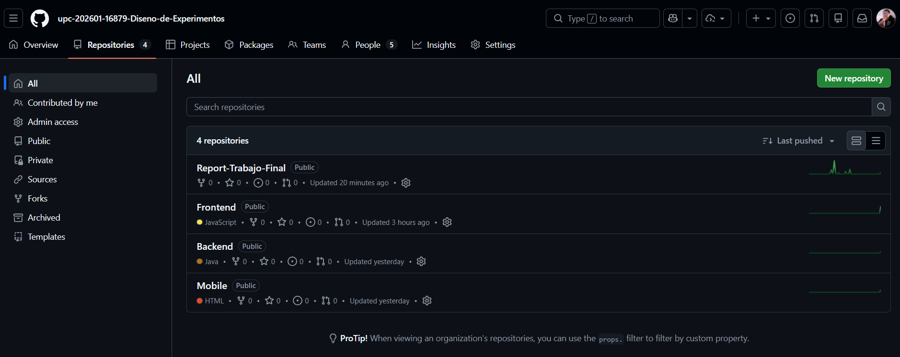

**Repositorio de Reporte**

El repositorio de reporte fue utilizado para gestionar la documentación académica y técnica del proyecto. Las analíticas muestran la evolución progresiva de la documentación, así como la actualización constante de diagramas, evidencias y apartados relacionados con el desarrollo de MatchPoint

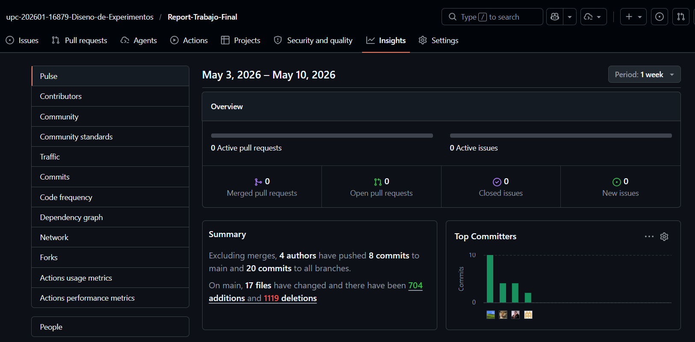

**Repositorio Backend**

El repositorio backend concentró el desarrollo de la lógica de negocio, endpoints REST, pruebas unitarias, pruebas integrales y documentación de la API. Las métricas reflejan una alta actividad relacionada con la implementación y validación de funcionalidades esenciales para el funcionamiento de la plataforma.

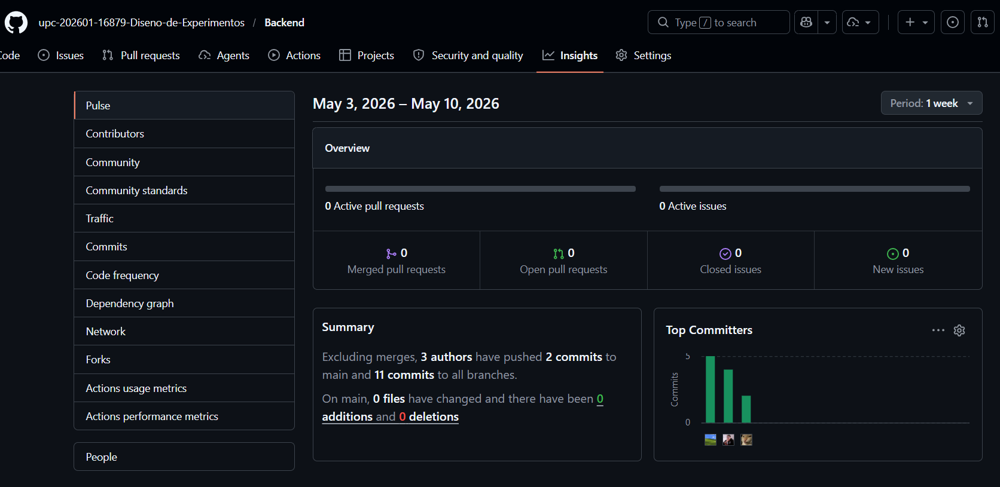

**Repositorio Frontend Web**

El repositorio frontend web se encargó de la interfaz de usuario, componentes visuales y experiencia del usuario. Las métricas reflejan una actividad constante en la implementación y mejora de la interfaz de usuario.

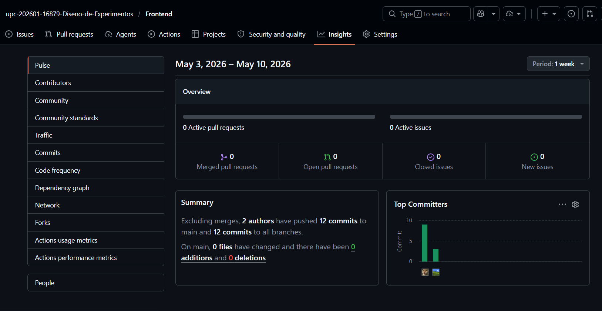

**Repositorio Mobile**

El repositorio mobile se encargó de la interfaz de usuario, componentes visuales y experiencia del usuario. Las métricas reflejan una actividad constante en la implementación y mejora de la interfaz de usuario.

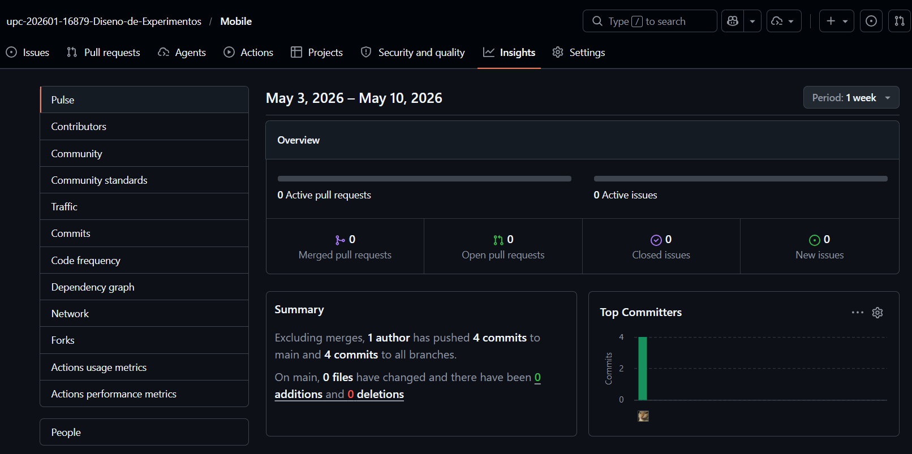

**Análisis temporal de commits**

Adicionalmente, se analizaron las métricas temporales de actividad del proyecto. Las gráficas obtenidas muestran que la mayor cantidad de commits se concentró durante el mes de mayo, periodo en el cual se inició oficialmente el desarrollo de MatchPoint.

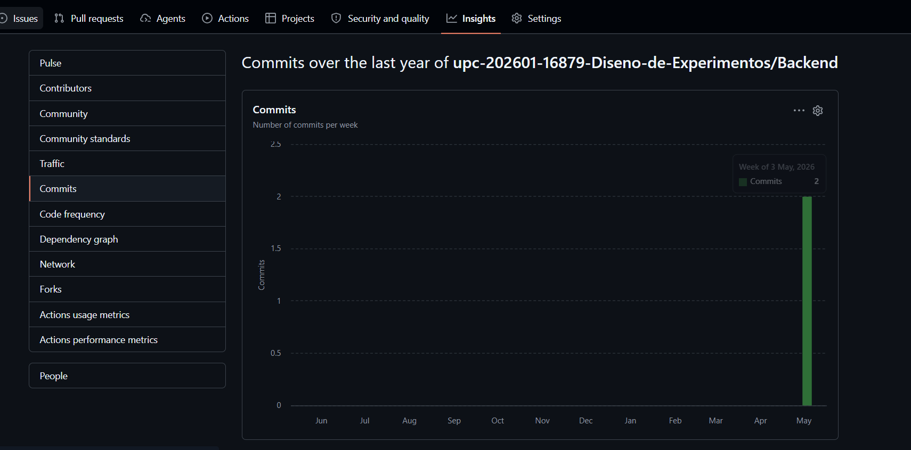

## 5.3. Video About-the-Product


link: https://drive.google.com/drive/folders/1MyKL9n-xxVZmLDKc7TqeWE0-Bz4VgN54?usp=sharing 

# Part II: Verification, Validation & Pipeline 
# Capítulo VI: Product Verification & Validation
## 6.1. Testing Suites & Validation
### 6.1.1. Core Entities Unit Tests.
### Estrategia de Pruebas Unitarias - MatchPoint

Este documento describe las pruebas unitarias implementadas para el backend de MatchPoint, las tecnologías utilizadas y la justificación de cada caso de prueba basada en el contexto del negocio.

### Definición de Prueba Unitaria en MatchPoint

En este proyecto, una **Prueba Unitaria** se define como la verificación de una unidad de lógica de negocio (usualmente un método en un `CommandServiceImpl`) en total aislamiento. 
- **Aislamiento**: Se utiliza **Mockito** para simular (mockear) todas las dependencias externas (repositorios, servicios externos).
- **Sin Base de Datos**: No se realizan llamadas a bases de datos reales ni en memoria (H2).
- **Rapidez**: Se ejecutan en milisegundos al no cargar el contexto de Spring.

### Tecnologías Utilizadas

- **JUnit 5**: Framework principal para la ejecución de pruebas.
- **Mockito**: Biblioteca para la creación de objetos simulados (mocks) y verificación de comportamientos.
- **AssertJ**: Biblioteca para realizar aserciones de forma fluida y legible.

### Pruebas de IAM (Identity and Access Management)

El contexto de IAM es fundamental para la seguridad de la plataforma. Asegura que solo los usuarios autorizados (deportistas y entrenadores) puedan acceder a sus respectivas funcionalidades.

### Casos de Prueba en `UserCommandServiceImplTest`

1.  **Registro Exitoso (Sign Up Success)**
    - **Descripción**: Verifica que un nuevo usuario pueda registrarse correctamente si el nombre de usuario no existe.
    - **Idea/Origen**: `UserCommandServiceImpl.handle(SignUpCommand command)` - Valida la lógica de verificar existencia de usuario y encriptación de contraseña.
    - **Necesidad en MatchPoint**: Es vital para el crecimiento de la comunidad deportiva. Sin un registro confiable, los nuevos deportistas y entrenadores no podrían unirse a la plataforma.
2.  **Fallo por Usuario Duplicado (Sign Up Failure - Duplicate Username)**
    - **Descripción**: Asegura que el sistema lance una excepción si se intenta registrar un nombre de usuario que ya existe.
    - **Idea/Origen**: `UserCommandServiceImpl.handle(SignUpCommand command)` - Valida el flujo alternativo cuando `userRepository.existsByUsername` es true.
    - **Necesidad en MatchPoint**: Evita conflictos de identidad y asegura que cada perfil (especialmente el de los entrenadores) sea único y confiable para los alumnos.
3.  **Inicio de Sesión Exitoso (Sign In Success)**
    - **Descripción**: Verifica que se genere un token válido cuando las credenciales son correctas.
    - **Idea/Origen**: `UserCommandServiceImpl.handle(SignInCommand command)` - Valida la integración con `TokenService` y `HashingService`.
    - **Necesidad en MatchPoint**: Permite que los usuarios accedan a sus herramientas de gestión de horarios, pagos y estadísticas de forma segura.
4.  **Fallo por Contraseña Inválida (Sign In Failure - Invalid Password)**
    - **Descripción**: Asegura que el sistema rechace el acceso si la contraseña es incorrecta.
    - **Idea/Origen**: `UserCommandServiceImpl.handle(SignInCommand command)` - Valida que se lance una excepción si `hashingService.matches` retorna false.
    - **Necesidad en MatchPoint**: Protege la información sensible de los usuarios, como datos de pagos y registros de entrenamientos.


### Pruebas de Bookings (Reservas)

El sistema de reservas es el núcleo del valor de MatchPoint. Su correcto funcionamiento garantiza que los deportistas puedan asegurar su espacio de práctica sin errores.

### Casos de Prueba en `BookingCommandServiceImplTest`

1.  **Creación de Reserva Exitosa (Create Booking Success)**
    - **Descripción**: Verifica que una reserva se guarde correctamente cuando el usuario y la cancha existen.
    - **Idea/Origen**: `BookingCommandServiceImpl.handle(CreateBookingCommand command)` - Verifica la orquestación entre `UserProfileRepository`, `CourtRepository` y `BookingRepository`.
    - **Necesidad en MatchPoint**: Es la funcionalidad principal. Garantiza que la "solución integral que simplifica la reserva" funcione como se espera.
2.  **Fallo por Usuario Inexistente (Create Booking Failure - User Not Found)**
    - **Descripción**: Asegura que no se puedan crear reservas para usuarios que no están registrados en el sistema.
    - **Idea/Origen**: `BookingCommandServiceImpl.handle(CreateBookingCommand command)` - Valida el manejo de errores cuando un agregado relacionado no existe.
    - **Necesidad en MatchPoint**: Mantiene la integridad de los datos y asegura que cada reserva esté vinculada a una persona real responsable.
3.  **Eliminación de Reserva Exitosa (Delete Booking Success)**
    - **Descripción**: Verifica que una reserva se pueda eliminar si el ID existe.
    - **Idea/Origen**: `BookingCommandServiceImpl.handle(DeleteBookingCommand command)` - Valida la lógica de pre-verificación de existencia antes de borrar.
    - **Necesidad en MatchPoint**: Permite la flexibilidad necesaria para deportistas y administradores de canchas ante cambios de planes o cancelaciones.


### Pruebas de Coaches (Entrenadores)

Los entrenadores son un pilar de la plataforma. Su correcta gestión asegura que los deportistas puedan encontrarlos y mejorar su rendimiento.

### Casos de Prueba en `CoachCommandServiceImplTest`

1.  **Creación de Entrenador Exitosa**
    - **Descripción**: Verifica que un entrenador se guarde correctamente si su nombre no está registrado.
    - **Idea/Origen**: `CoachCommandServiceImpl.handle(CreateCoachCommand command)` - Valida el flujo básico de creación.
    - **Necesidad en MatchPoint**: Permite expandir la oferta de servicios profesionales en la plataforma.
2.  **Fallo por Nombre Duplicado**
    - **Descripción**: Evita que se registren dos entrenadores con el mismo nombre.
    - **Idea/Origen**: `CoachCommandServiceImpl.handle(CreateCoachCommand command)` - Valida la restricción de nombre único en el dominio de entrenadores.
    - **Necesidad en MatchPoint**: Garantiza la unicidad y claridad en la búsqueda de profesionales por parte de los alumnos.
3.  **Eliminación de Entrenador Exitosa**
    - **Descripción**: Asegura que un perfil de entrenador pueda ser removido del sistema.
    - **Idea/Origen**: `CoachCommandServiceImpl.handle(DeleteCoachCommand command)`.
    - **Necesidad en MatchPoint**: Permite mantener actualizada la lista de profesionales activos.


### Pruebas de Courts (Canchas)

La información precisa de las canchas es esencial para que la reserva sea efectiva y los deportistas lleguen al lugar correcto.

### Casos de Prueba en `CourtCommandServiceImplTest`

1.  **Creación de Cancha Exitosa**
    - **Descripción**: Verifica el registro correcto de una nueva cancha deportiva.
    - **Idea/Origen**: `CourtCommandServiceImpl.handle(CreateCourtCommand command)`.
    - **Necesidad en MatchPoint**: Es fundamental para aumentar las opciones disponibles de reserva para los usuarios.
2.  **Fallo por Nombre de Cancha Duplicado**
    - **Descripción**: Asegura que no existan dos registros para la misma cancha.
    - **Idea/Origen**: `CourtCommandServiceImpl.handle(CreateCourtCommand command)`.
    - **Necesidad en MatchPoint**: Evita confusiones logísticas y errores en la gestión de turnos por sede.
3.  **Eliminación de Cancha Exitosa**
    - **Descripción**: Permite dar de baja canchas que ya no estén disponibles.
    - **Idea/Origen**: `CourtCommandServiceImpl.handle(DeleteCourtCommand command)`.
    - **Necesidad en MatchPoint**: Asegura que el catálogo de canchas sea veraz y actual.


### Pruebas de Payments (Pagos)

La gestión de pagos es crítica para la viabilidad de la plataforma y la confianza de los proveedores (entrenadores y dueños de canchas).

### Casos de Prueba en `PaymentCommandServiceImplTest`

1.  **Registro de Pago Exitoso**
    - **Descripción**: Verifica que un pago se vincule correctamente a un usuario existente.
    - **Idea/Origen**: `PaymentCommandServiceImpl.handle(CreatePaymentCommand command)`.
    - **Necesidad en MatchPoint**: Asegura que las transacciones financieras sean rastreables y correctas.
2.  **Fallo por Usuario Inexistente**
    - **Descripción**: Impide que se procesen pagos vinculados a IDs de usuario no válidos.
    - **Idea/Origen**: `PaymentCommandServiceImpl.handle(CreatePaymentCommand command)`.
    - **Necesidad en MatchPoint**: Protege la integridad financiera y evita errores en la conciliación de pagos.


### Pruebas de Users (Perfiles de Usuario)

Los perfiles de usuario contienen la información de contacto esencial para la coordinación de partidos y entrenamientos.

### Casos de Prueba en `UserProfileCommandServiceImplTest`

1.  **Creación de Perfil Exitosa**
    - **Descripción**: Valida el registro de un perfil con un email único.
    - **Idea/Origen**: `UserProfileCommandServiceImpl.handle(CreateUserProfileCommand command)`.
    - **Necesidad en MatchPoint**: Permite que deportistas y entrenadores tengan su información centralizada para ser contactados.
2.  **Fallo por Email Duplicado**
    - **Descripción**: Asegura que no existan dos perfiles con el mismo correo electrónico.
    - **Idea/Origen**: `UserProfileCommandServiceImpl.handle(CreateUserProfileCommand command)`.
    - **Necesidad en MatchPoint**: Evita conflictos de cuenta y asegura una comunicación fluida.
3.  **Eliminación de Perfil Exitosa**
    - **Descripción**: Permite a los usuarios ejercer su derecho de eliminar su información personal.
    - **Idea/Origen**: `UserProfileCommandServiceImpl.handle(DeleteUserProfileCommand command)`.
    - **Necesidad en MatchPoint**: Cumple con la gestión de privacidad y limpieza de datos.

#### Pruebas de unit test

##### IAM
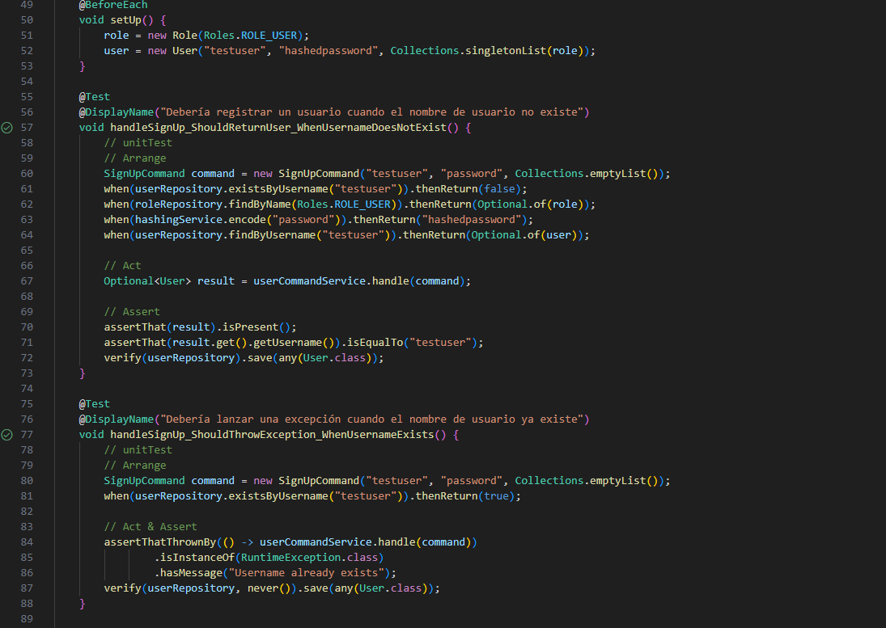
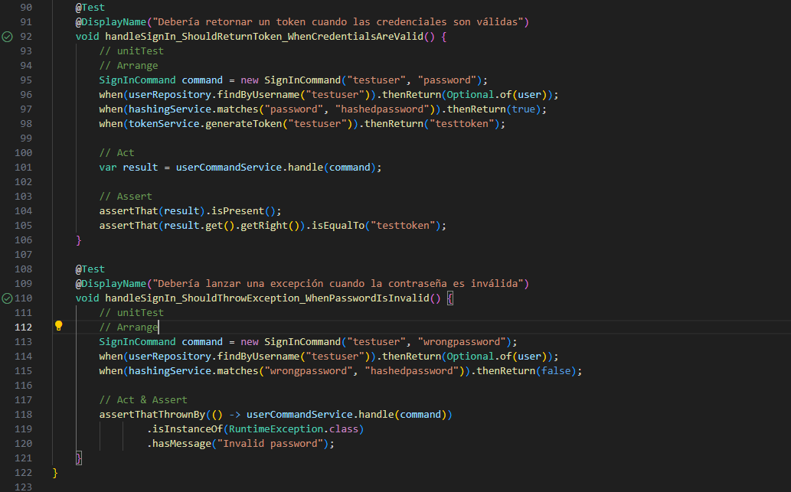
##### Bookings
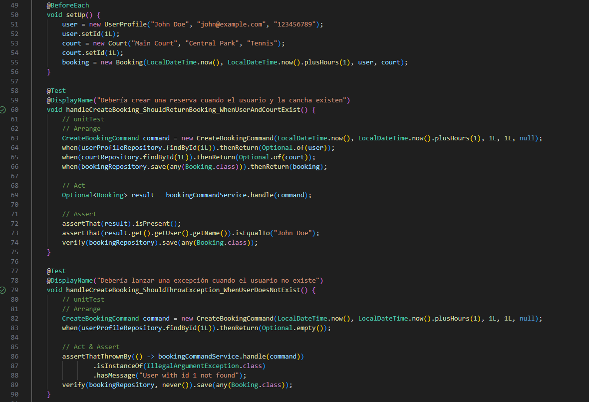
##### Coach
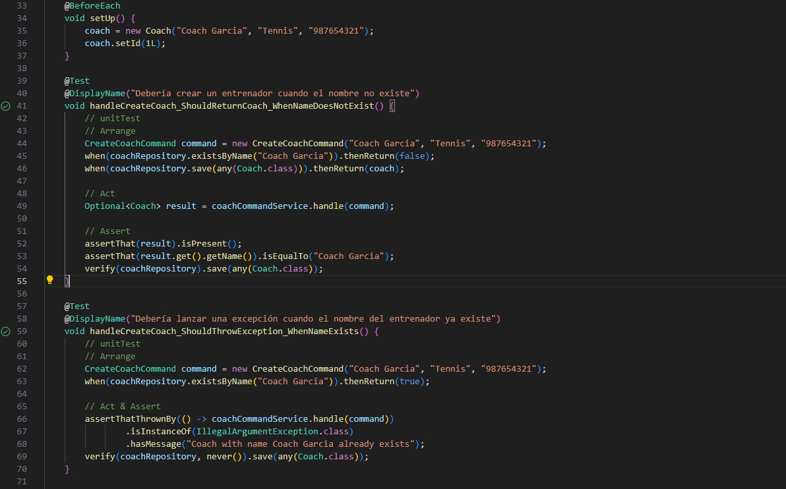
##### Courts
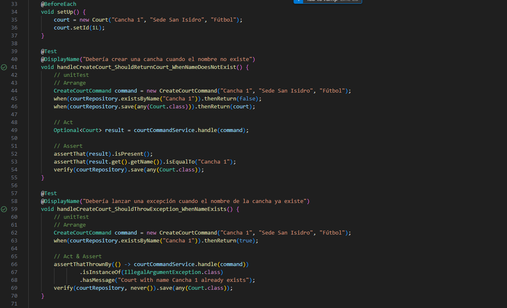
##### Payment
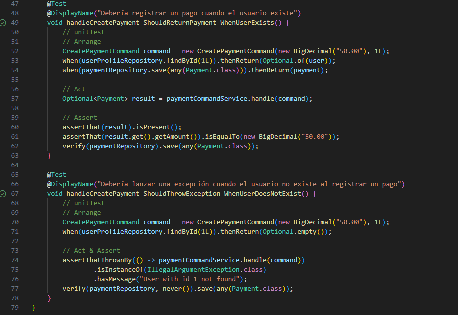
##### User 
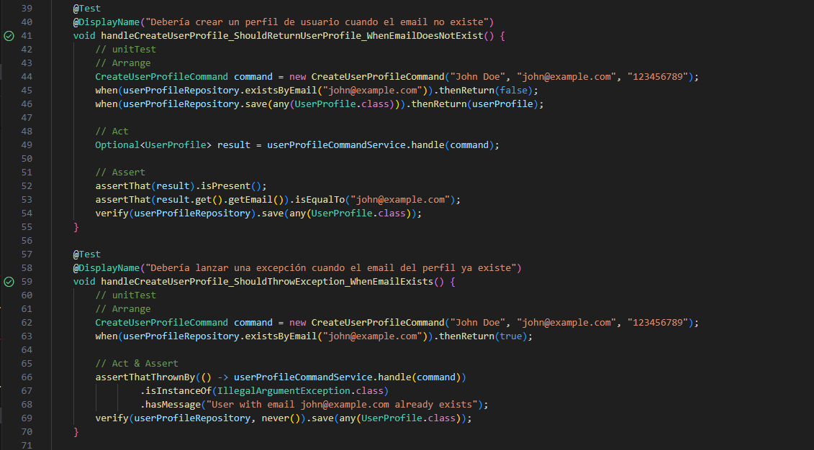

### 6.1.2. Core Integration Tests.
### Estrategia de Pruebas de Integración - MatchPoint

Este documento describe las pruebas de integración implementadas para asegurar que los componentes del sistema funcionen correctamente en conjunto.

### Definición de Prueba de Integración en MatchPoint

Una **Prueba de Integración** verifica la interacción entre múltiples capas de la aplicación, incluyendo:
- El contexto de Spring Boot.
- La capa de persistencia (Base de Datos).
- La integración entre diferentes Bounded Contexts.

Difieren de las pruebas unitarias en que **no se mockean los repositorios** (usualmente se usa una base de datos en memoria como H2 o Testcontainers) y se carga parte o todo el ecosistema de Spring.

### Tecnologías Utilizadas

- **Spring Boot Test**: Para levantar el contexto de la aplicación.
- **H2 Database**: Base de datos en memoria para pruebas de persistencia (si aplica).
- **JUnit 5**: Framework de ejecución.

### Pruebas de Contexto y Carga

### Casos de Prueba en `MatchpointApplicationTests`

1.  **Carga del Contexto (Context Loads)**
    - **Descripción**: Verifica que la aplicación Spring Boot pueda iniciar correctamente sin errores de configuración de beans o dependencias circulares.
    - **Idea/Origen**: Estándar de Spring Boot para validar la salud de la configuración.
    - **Necesidad en MatchPoint**: Asegura que cualquier cambio en la configuración (inyectar nuevos servicios, cambiar perfiles de base de datos) no rompa el inicio de la plataforma.

---

### Pruebas de Flujo de Negocio (End-to-End)

Estas pruebas validan el recorrido completo de una petición desde el API hasta la base de datos persistente.

### Casos de Prueba en `BookingIntegrationTest`

1.  **Creación de Reserva vía API**
    - **Descripción**: Realiza una petición POST al endpoint de reservas y verifica que los datos se persistan correctamente en la base de datos.
    - **Arquitectura de la Prueba**: 
        - **MockMvc**: Simula las peticiones HTTP al controlador.
        - **H2 Database**: Proporciona un entorno de persistencia real pero volátil para la prueba.
        - **Transactional**: Asegura que cada prueba sea independiente y se limpie la base de datos al finalizar.
    - [x] **Idea/Origen**: `BookingsController.createBooking(CreateBookingResource resource)` - Valida la integración de validaciones, transformadores, servicios y repositorios.
    - [x] **Necesidad en MatchPoint**: Es el flujo más crítico del sistema. Un test unitario no es suficiente para asegurar que los mapeos de base de datos y los controladores REST estén correctamente configurados.

### Casos de Prueba en `CoachBookingIntegrationTest`

1.  **Validación de Reservas por Entrenador**
    - **Descripción**: Verifica que el sistema permita asignar un entrenador a una reserva y recuperarla mediante un filtro específico.
    - **Arquitectura de la Prueba**: 
        - **Escenario Completo**: Se crean las entidades base (Usuario, Cancha, Entrenador) y se vinculan mediante el API.
        - **Verificación de Respuesta**: Asegura que el JSON retornado contenga los IDs correctos de usuario y cancha.
    - **Idea/Origen**: `BookingsController.getBookingsByCoachId(Long coachId)` - Valida la nueva relación entre los contextos de `Bookings` y `Coaches`.
    - **Necesidad en MatchPoint**: Permite cumplir con el requerimiento de "gestionar visibilidad y estadísticas" para los entrenadores, asegurando que solo vean sus propias reservas asignadas.

### Pruebas de Integration test

#### Pruebas de Bookings
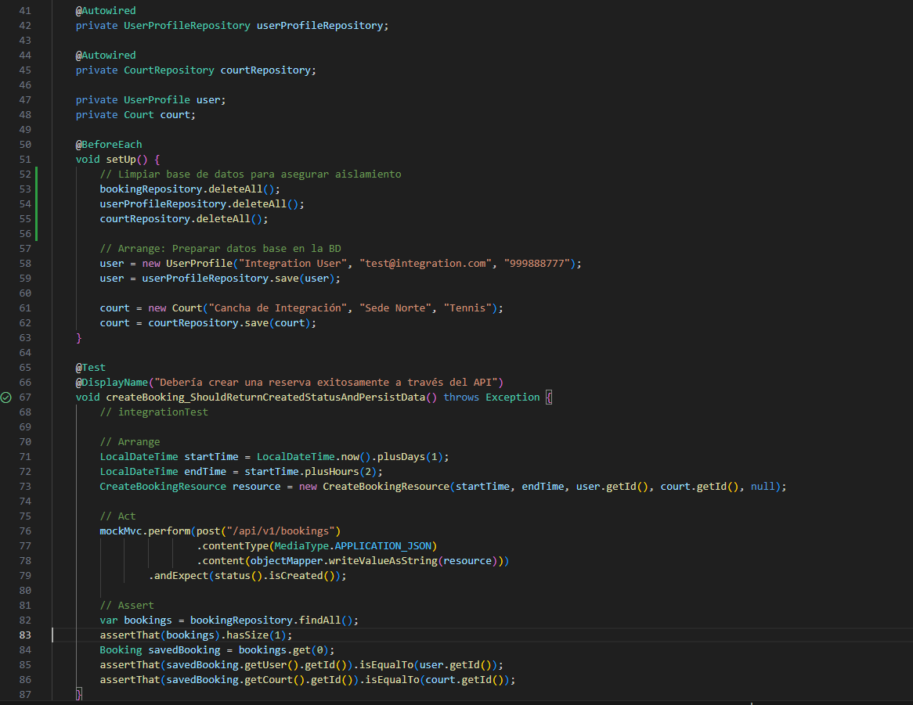
#### Pruebas de Coach Bookings
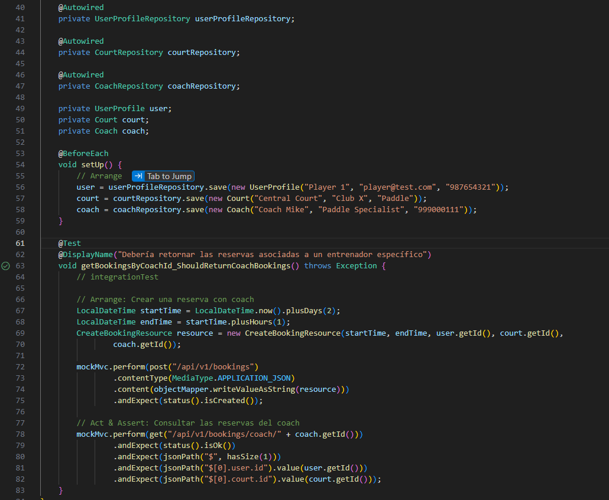

### 6.1.3. Core Behavior-Driven Development
# Documentación de Pruebas BDD (Behavior-Driven Development)

Este documento detalla la estrategia de pruebas orientadas al comportamiento implementada en MatchPoint utilizando **Cucumber** y la sintaxis **Gherkin**.

#### ¿Qué es BDD en este proyecto?

En MatchPoint, BDD se utiliza para cerrar la brecha entre los requerimientos de negocio y el código técnico. Cada "Característica" (`.feature`) describe una funcionalidad desde el punto de vista del usuario (Deportista o Entrenador).

#### Herramientas utilizadas:
- **Gherkin**: Lenguaje natural para definir escenarios (Dado/Cuando/Entonces).
- **Cucumber**: Framework para ejecutar escenarios Gherkin en Java.
- **JUnit 5**: Motor de ejecución de las pruebas.

#### Escenarios.
##### Escenario 1: 
```
language: en

Feature: Gestión de Reservas
  Como usuario deportista
  Quiero realizar una reserva de cancha
  Para asegurar mi espacio de práctica deportiva

  Scenario: Realizar una reserva exitosa
    Given que existe un usuario registrado con email "deportista@test.com"
    And existe una cancha deportiva llamada "Cancha Central"
    When el usuario solicita una reserva para mañana de 10:00 a 12:00
    Then la respuesta del sistema debe indicar que la reserva fue creada
    And la reserva debe estar guardada en la base de datos
```

##### Escenario 2: 
```
language: en

Feature: Gestión de Sesiones de Entrenamiento
  Como entrenador independiente
  Quiero visualizar las reservas que tengo asignadas
  Para organizar mi agenda de clases

  Scenario: Entrenador consulta sus reservas asignadas
    Given existe un entrenador llamado "Coach Pro" con especialidad "Tenis"
    And el entrenador tiene 2 reservas asignadas en el sistema
    When el entrenador consulta su lista de reservas
    Then el sistema debe retornar exactamente 2 reservas
    And todas las reservas deben pertenecer al entrenador "Coach Pro"
```
#### Ejecución de Pruebas.
mvn test -Dtest=CucumberTestRunner
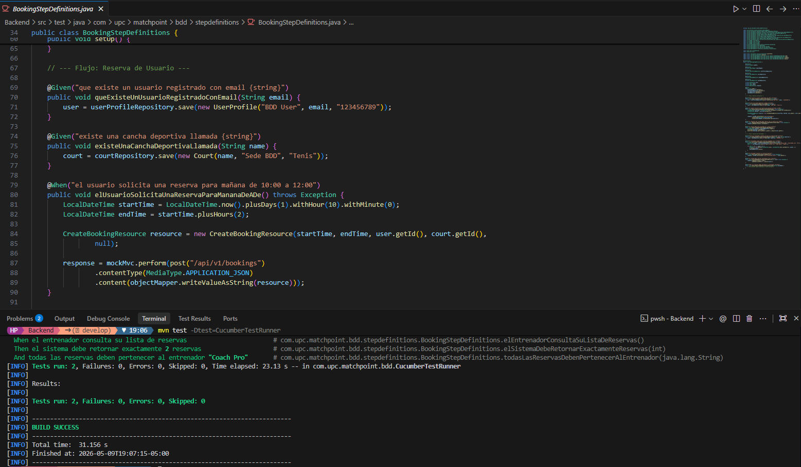
### 6.1.4. Core System Tests.

Para evaluar el rendimiento general y la optimización del sistema desde la perspectiva del usuario final, se realizaron pruebas utilizando Google PageSpeed Insights sobre la aplicación web desplegada (frontend). Estas pruebas permitieron medir métricas clave de desempeño como Performance, Accessibility, Best Practices y SEO, verificando así la eficiencia del tiempo de carga, la usabilidad y la correcta implementación de estándares web.

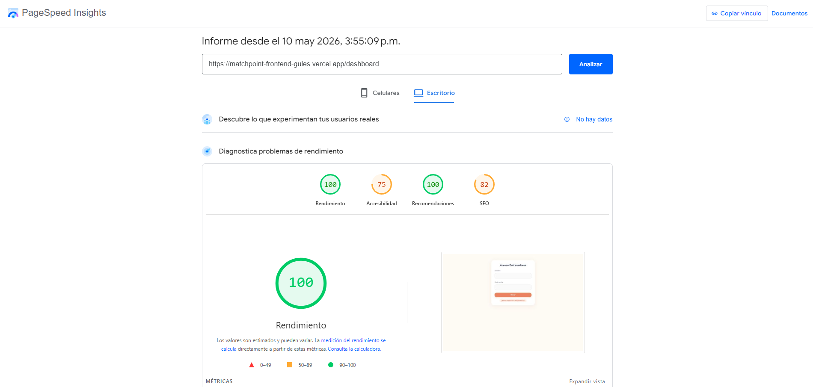
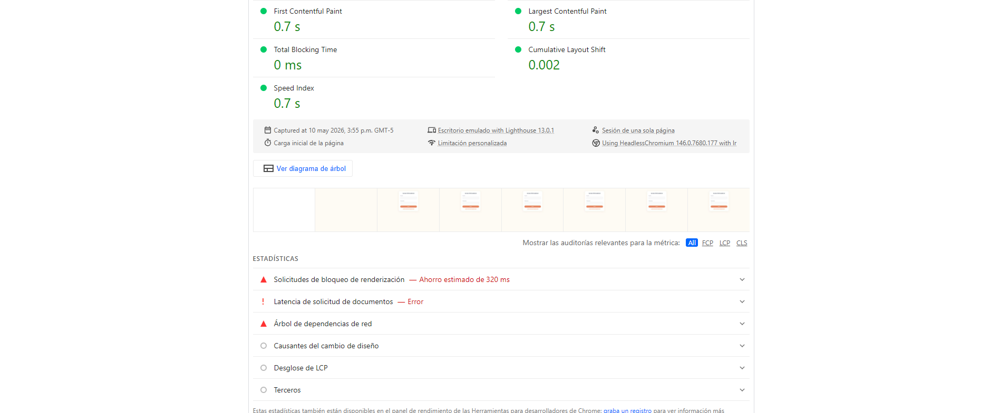
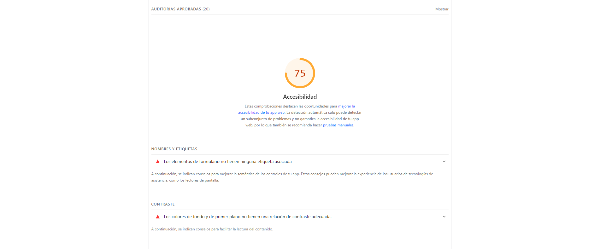
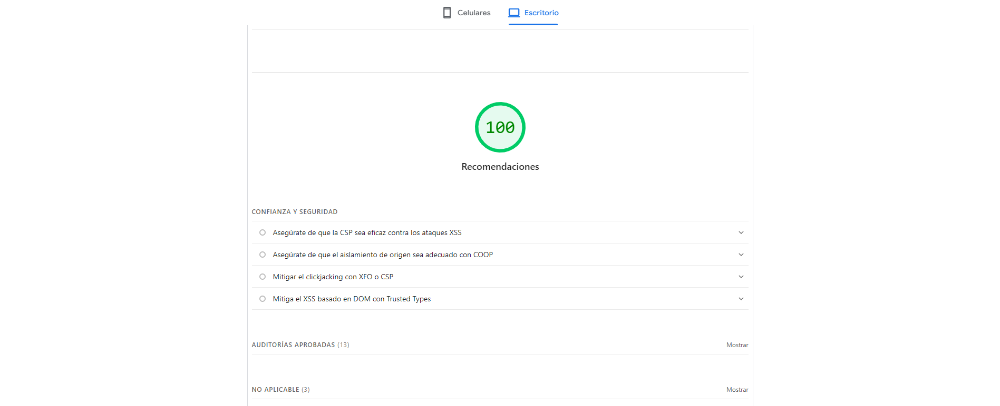
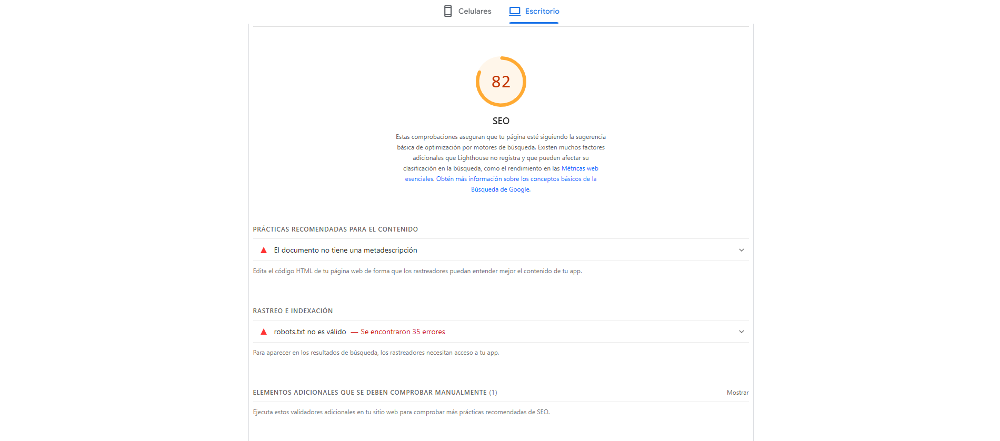

## 6.2. Static testing & Verification
### 6.2.1. Static Code Analysis
#### 6.2.1.1. Coding standard & Code conventions.
#### 6.2.1.2. Code Quality & Code Security.
### 6.2.2. Reviews
## 6.3. Validation Interviews.
### 6.3.1. Diseño de Entrevistas.
### 6.3.2. Registro de Entrevistas.
### 6.3.3. Evaluaciones según heurísticas.
## 6.4. Auditoría de Experiencias de Usuario
### 6.4.1. Auditoría realizada.
#### 6.4.1.1. Información del grupo auditado.
#### 6.4.1.2. Cronograma de auditoría realizada.
#### 6.4.1.3. Contenido de auditoría realizada.
### 6.4.2. Auditoría recibida.
#### 6.4.2.1. Información del grupo auditor.
#### 6.4.2.2. Cronograma de auditoría recibida.
#### 6.4.2.3. Contenido de auditoría recibida.
#### 6.4.2.4. Resumen de modificaciones para subsanar hallazgos.
# Capítulo VII: DevOps Practices
## 7.1. Continuous Integration
### 7.1.1. Tools and Practices.

#### Herramientas Seleccionadas

| Servicio | Herramienta CI | Justificación |
|----------|----------------|---------------|
| Backend (Java Spring) | GitHub Actions | Soporte nativo para Maven/Gradle, JUnit |
| Frontend (Vue) | GitHub Actions | Compatible con npm/vite |

#### Prácticas de Integración Continua

**Políticas de Merge:**
- Todos los commits deben pasar build y tests antes de merge
- Branch protection en `main`/`develop`
- Revisión de código obligatoria (mínimo 1 approval)

### 7.1.2. Build & Test Suite Pipeline Components.

#### 7.1.2.1 Backend (Java Spring Boot + JUnit)

**Pipeline Components:**

| Componente | Descripción | Herramienta |
|------------|-------------|-------------|
| Unit Tests | Pruebas unitarias | JUnit 5 + Mockito |
| Integration Tests | Pruebas de integración | Spring Boot Test + `@Transactional` |
| Build | Compilación y empaquetado | Maven |

**Workflow - Backend CI:**

```yaml
# .github/workflows/maven.yml
name: Java CI with Maven

on:
  push:
    branches: [ "main", "develop" ]
  pull_request:
    branches: [ "main" ]

jobs:
  test:
    runs-on: ubuntu-latest

    services:
      database:
        image: postgres:latest
        ports:
          - 5432:5432
        env:
          POSTGRES_DB: "spring"
          POSTGRES_USER: "root"
          POSTGRES_PASSWORD: "password"

    env:
      SPRING_PROFILES_ACTIVE: test
      DB_HOST: localhost
      DB_PORT: 5432

    steps:
      - name: Checkout code
        uses: actions/checkout@v6

      - name: Set up JDK 21
        uses: actions/setup-java@v5
        with:
          java-version: '21'
          distribution: 'temurin'
          cache: maven

      - name: Build with Maven
        run: mvn clean install

      - name: Run tests
        run: mvn test
```

**Estructura de Tests - JUnit:**

```
Backend/src/test/
├── java/com/matchpoint/
│   ├── bookings/
│   │   ├── application/internal/commandservices/
│   │   │   └── BookingCommandServiceImplTest.java      # Unit tests (Mockito)
│   │   └── interfaces/rest/
│   │       ├── BookingIntegrationTest.java              # Integration tests (BD real)
│   │       └── CoachBookingIntegrationTest.java        # Integration tests (BD real)
│   ├── users/
│   │   └── application/internal/commandservices/
│   │       └── UserProfileCommandServiceImplTest.java # Unit tests (Mockito)
│   ├── payments/
│   ├── coaches/
│   └── courts/
└── resources/
    └── application-test.properties                     # Config para PostgreSQL en CI
```

**Resultados de Tests - Backend:**

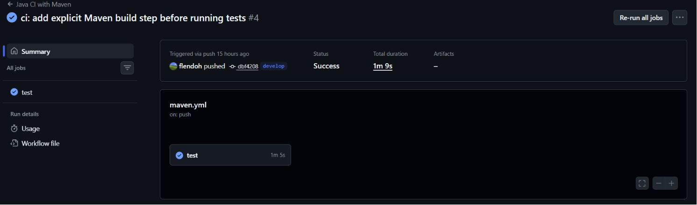
> Backend CI - Workflow en GitHub Actions

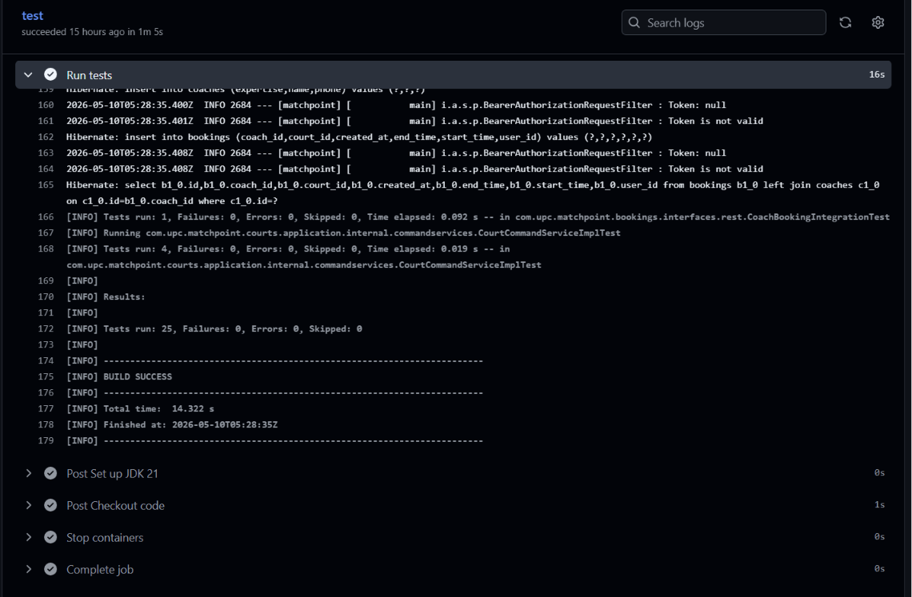
> Backend CI - Resultados de tests

**Tipos de Tests:**

| Tipo | Anotación | BD | Uso |
|------|-----------|-----|-----|
| Unit Test | `@ExtendWith(MockitoExtension.class)` | Mock | Validar lógica de negocio |
| Integration Test | `@SpringBootTest` + `@Transactional` | PostgreSQL real | Validar queries y persistencia |

#### 7.1.2.2 Frontend (Vue + Vite + Vitest)

**Pipeline Components:**

| Componente | Descripción | Herramienta |
|------------|-------------|-------------|
| Unit Tests | Pruebas unitarias de composables y componentes | Vitest + Vue Test Utils |
| Component Tests | Pruebas de comportamiento de componentes | Vue Test Utils |
| Build | Compilación para producción | Vite |

**Workflow - Frontend CI:**

```yaml
# .github/workflows/frontend-ci.yml
name: Frontend CI

on:
  push:
    branches: [ "main", "develop" ]
  pull_request:
    branches: [ "main" ]

jobs:
  test:
    runs-on: ubuntu-latest

    steps:
      - name: Checkout code
        uses: actions/checkout@v6

      - name: Set up Node.js 20
        uses: actions/setup-node@v6
        with:
          node-version: '20'
          cache: 'npm'
          cache-dependency-path: package-lock.json

      - name: Install dependencies
        run: npm install

      - name: Run tests
        run: npm run test:unit
```

**Resultados de Tests - Frontend:**

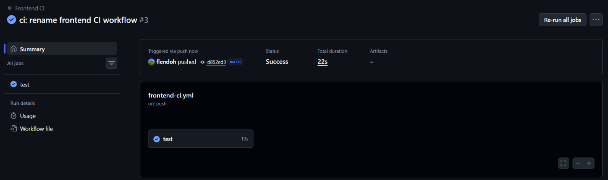
> Frontend CI - Workflow en GitHub Actions

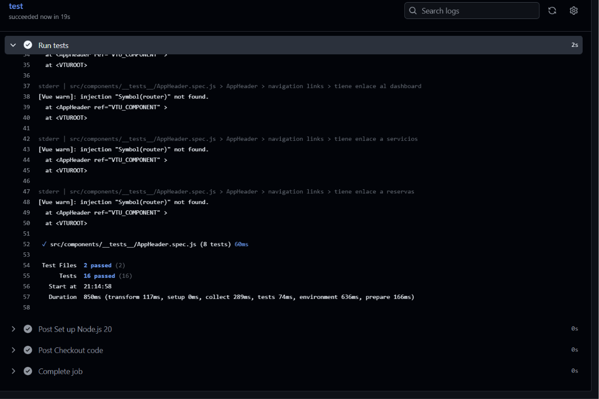
> Frontend CI - Resultados de tests

**package.json - Scripts:**

```json
{
  "scripts": {
    "dev": "vite",
    "build": "vite build",
    "preview": "vite preview",
    "test": "vitest",
    "test:unit": "vitest run"
  }
}
```

**Tipos de Tests:**

| Tipo | Herramienta | Descripción |
|------|-------------|-------------|
| Unit Test | Vitest | Validar lógica de composables y helpers |
| Component Test | Vue Test Utils + happy-dom | Validar renderizado e interacciones de componentes |

## 7.2. Continuous Delivery
### 7.2.1. Tools and Practices.

#### Herramientas Seleccionadas

| Servicio | Herramienta CD | Justificación |
|----------|----------------|---------------|
| Backend (Java Spring) | Render | Soporte para aplicaciones Java |
| Frontend (Vue) | Vercel | Despliegue automático con CDN global |

#### Estrategias de Despliegue

#### Environments

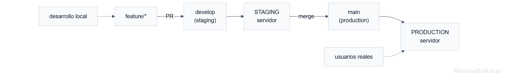

### 7.2.2. Stages Deployment Pipeline Components.

#### Diagrama de Stages - CD Pipeline


##### Backend (Java Spring) - Stages

| Stage | Trigger | Descripción |
|-------|---------|-------------|
| Build | Push a cualquier branch | Compilación Maven |
| Test | Automatic | Unit + Integration tests |
| Staging | Merge a develop | Despliegue automático a staging |
| Production | Merge a main | Despliegue automático a producción |

##### Frontend (Vue) - Stages

| Stage | Trigger | Descripción |
|-------|---------|-------------|
| Build | Push a cualquier branch | Build con environment de dev |
| Preview | PR abierta | URL de preview automática |
| Staging | Merge a develop | Despliegue automático a staging |
| Production | Merge a main | Despliegue automático a producción |

## 7.3. Continuous deployment
### 7.3.1. Tools and Practices.

#### Herramientas Seleccionadas

| Servicio | Herramienta CD | Justificación |
|----------|----------------|---------------|
| Backend (Java Spring) | Render + GitHub Actions | Despliegue automático desde main a producción |
| Frontend Web (Vue) | Vercel + GitHub Actions | Despliegue automático con zero-downtime |
| App Móvil (Android/Kotlin) | Google Play Console + GitHub Actions | Despliegue automático a Play Store (canales gradualmente) |

#### Estrategias de Despliegue Automático a Producción

**Políticas de Despliegue Continuo:**

- Todos los commits a `main` se despliegan automáticamente a producción sin intervención manual
- Rollbacks automáticos si los health checks fallan
- Canales graduals para app móvil: 10% → 25% → 50% → 100%
- Monitoreo en tiempo real post-despliegue
- Alertas inmediatas si se detectan errores críticos

#### Diferencia CD (Delivery) vs CD (Deployment)

| Aspecto | Continuous Delivery | Continuous Deployment |
|--------|-------------------|----------------------|
| **Aprobación** | Manual antes de producción | Automática a producción |
| **Riesgo** | Menor (requiere validación) | Mayor (requiere monitoreo robusto) |
| **Frecuencia** | Cuando se aprueba | Cada commit a main |
| **PlayMatch** | Usado en Staging | Usado en Production |

### 7.3.2. Production Deployment Pipeline Components.

#### Diagrama General - CD (Deployment) Pipeline

```
┌─────────────────────────────────────────────────────────────────┐
│                    CONTINUOUS DEPLOYMENT FLOW                   │
├─────────────────────────────────────────────────────────────────┤
│                                                                   │
│  Developer Push to main                                          │
│         ↓                                                         │
│  GitHub Actions Trigger                                          │
│         ↓                                                         │
│  ┌──────────────────────────────────────────────────────────┐   │
│  │  1. BACKEND (Java Spring)                                │   │
│  │     - Build & Test (Maven)                              │   │
│  │     - Deploy to Render (Production)                     │   │
│  │     - Run smoke tests                                   │   │
│  │     - Alert on failure                                  │   │
│  └──────────────────────────────────────────────────────────┘   │
│         ↓                                                         │
│  ┌──────────────────────────────────────────────────────────┐   │
│  │  2. FRONTEND WEB (Vue)                                   │   │
│  │     - Build (Vite) with PROD environment               │   │
│  │     - Deploy to Vercel (Production)                     │   │
│  │     - Invalidate CDN cache                              │   │
│  │     - Run E2E tests                                     │   │
│  └──────────────────────────────────────────────────────────┘   │
│         ↓                                                         │
│  ┌──────────────────────────────────────────────────────────┐   │
│  │  3. MOBILE APP (Android/Kotlin)                          │   │
│  │     - Build signed APK/AAB (Gradle)                     │   │
│  │     - Deploy to Google Play Console                      │   │
│  │     - Gradual rollout (10% initial)                     │   │
│  │     - Monitor crash rates & ANRs                        │   │
│  │     - Auto-expand % if stable                           │   │
│  └──────────────────────────────────────────────────────────┘   │
│         ↓                                                         │
│  Health Checks & Monitoring                                      │
│         ↓                                                         │
│  Deployment Complete / Rollback if Failed                        │
│                                                                   │
└─────────────────────────────────────────────────────────────────┘
```

#### Backend (Java Spring) - Production Deployment

| Componente | Herramienta | Acción |
|------------|------------|--------|
| **Code** | GitHub | Merge a main dispara workflow |
| **Build** | Maven | `mvn clean package -DskipTests` |
| **Deploy** | Render | Push a contenedor; Render redeploy automático |
| **Database** | PostgreSQL | Migraciones automáticas (Flyway) |
| **Health Check** | Spring Boot Actuator | GET `/actuator/health` (timeout 30s) |
| **Monitoring** | New Relic / Datadog | Monitoreo de performance y errores |
| **Rollback** | Render | Automático si health check falla |

**Workflow - Backend Production Deployment:**

```yaml
# .github/workflows/backend-deploy-prod.yml
name: Backend Deploy to Production

on:
  push:
    branches: [ "main" ]
    paths:
      - 'backend/**'

jobs:
  deploy:
    runs-on: ubuntu-latest

    steps:
      - name: Checkout code
        uses: actions/checkout@v6

      - name: Set up JDK 21
        uses: actions/setup-java@v5
        with:
          java-version: '21'
          distribution: 'temurin'
          cache: maven

      - name: Build with Maven
        run: mvn clean package -DskipTests

      - name: Deploy to Render
        env:
          RENDER_DEPLOY_HOOK: ${{ secrets.RENDER_PRODUCTION_DEPLOY_HOOK }}
        run: |
          curl -X POST "$RENDER_DEPLOY_HOOK"

      - name: Health Check
        run: |
          for i in {1..30}; do
            if curl -f https://api.playmatch.com/actuator/health; then
              echo " API is healthy"
              exit 0
            fi
            echo " Waiting for API... ($i/30)"
            sleep 2
          done
          echo " Health check failed"
          exit 1

      - name: Notify Slack
        if: always()
        uses: slackapi/slack-github-action@v1
        with:
          webhook-url: ${{ secrets.SLACK_WEBHOOK }}
          payload: |
            {
              "text": "Backend Production Deployment: ${{ job.status }}"
            }
```

#### Frontend Web (Vue) - Production Deployment

| Componente | Herramienta | Acción |
|------------|------------|--------|
| **Code** | GitHub | Merge a main dispara workflow |
| **Build** | Vite | `npm run build` (producción optimizada) |
| **Deploy** | Vercel | Detecta cambios en git; deploya automático |
| **CDN** | Vercel Edge Network | Distribuye a nivel global |
| **SSL** | Vercel Managed SSL | Certificado automático |
| **Monitoring** | Vercel Analytics | Métricas de performance |
| **E2E Tests** | Playwright | Valida flujos críticos post-deploy |

**Workflow - Frontend Production Deployment:**

```yaml
# .github/workflows/frontend-deploy-prod.yml
name: Frontend Deploy to Production

on:
  push:
    branches: [ "main" ]
    paths:
      - 'frontend/**'

jobs:
  deploy:
    runs-on: ubuntu-latest

    steps:
      - name: Checkout code
        uses: actions/checkout@v6

      - name: Set up Node.js 20
        uses: actions/setup-node@v6
        with:
          node-version: '20'
          cache: 'npm'

      - name: Install dependencies
        run: npm install

      - name: Run tests
        run: npm run test:unit

      - name: Build for production
        env:
          VITE_API_URL: https://api.playmatch.com
        run: npm run build

      - name: Deploy to Vercel
        uses: vercel/action@master
        with:
          vercel-token: ${{ secrets.VERCEL_TOKEN }}
          vercel-org-id: ${{ secrets.VERCEL_ORG_ID }}
          vercel-project-id: ${{ secrets.VERCEL_PROJECT_ID }}
          production: true

      - name: E2E Tests (Production)
        run: npm run test:e2e:prod
```

#### Mobile App (Android/Kotlin) - Production Deployment

| Componente | Herramienta | Acción |
|------------|------------|--------|
| **Code** | GitHub | Merge a main dispara workflow |
| **Build** | Gradle | `./gradlew bundleRelease` (genera AAB) |
| **Sign** | Keystore | Firma con clave de producción |
| **Deploy** | Google Play Console | Carga AAB a Play Store |
| **Rollout** | Play Console | Inicia con 10%, escala gradualmente |
| **Monitoring** | Play Console Dashboard | Crash rates, ANRs, reviews |
| **Rollback** | Play Console | Manual si se detectan fallos críticos |

**Workflow - Mobile App Production Deployment:**

```yaml
# .github/workflows/mobile-deploy-prod.yml
name: Mobile App Deploy to Production

on:
  push:
    branches: [ "main" ]
    paths:
      - 'mobile/**'
      - '.github/workflows/mobile-deploy-prod.yml'

jobs:
  deploy:
    runs-on: ubuntu-latest

    steps:
      - name: Checkout code
        uses: actions/checkout@v6

      - name: Set up JDK 17
        uses: actions/setup-java@v5
        with:
          java-version: '17'
          distribution: 'temurin'

      - name: Setup Android SDK
        uses: android-actions/setup-android@v2

      - name: Build Release Bundle
        run: |
          cd mobile
          ./gradlew bundleRelease

      - name: Sign Bundle
        env:
          KEYSTORE_FILE: ${{ secrets.ANDROID_KEYSTORE }}
          KEYSTORE_PASSWORD: ${{ secrets.ANDROID_KEYSTORE_PASSWORD }}
          KEY_ALIAS: ${{ secrets.ANDROID_KEY_ALIAS }}
          KEY_PASSWORD: ${{ secrets.ANDROID_KEY_PASSWORD }}
        run: |
          echo "$KEYSTORE_FILE" | base64 -d > keystore.jks
          # Gradle ya gestiona la firma automáticamente con gradle.properties

      - name: Upload to Google Play Console
        uses: r0adkll/upload-google-play@v1
        with:
          serviceAccountJsonPlainText: ${{ secrets.PLAY_CONSOLE_SERVICE_ACCOUNT }}
          packageName: com.matchpoint.app
          releaseFiles: 'mobile/app/build/outputs/bundle/release/*.aab'
          track: production
          inAppUpdatePriority: 5
          rolloutPercentage: 10

      - name: Monitor Rollout
        run: |
          echo " Initial rollout: 10%"
          echo " Monitoring crash rates for 24 hours..."
          echo " If stable, gradual expansion: 10% → 25% → 50% → 100%"

      - name: Notify Team
        uses: slackapi/slack-github-action@v1
        with:
          webhook-url: ${{ secrets.SLACK_WEBHOOK }}
          payload: |
            {
              "text": " Mobile App v${{ github.ref }} deployed to Play Store (10% rollout)"
            }
```

#### Monitoreo Post-Deployment

| Servicio | Métrica Crítica | Umbral de Alerta |
|----------|-----------------|------------------|
| **Backend** | Latencia API | > 500ms |
| **Backend** | Error Rate | > 1% |
| **Backend** | CPU / Memoria | > 80% |
| **Frontend** | Largest Contentful Paint (LCP) | > 2.5s |
| **Frontend** | First Input Delay (FID) | > 100ms |
| **Mobile** | Crash Rate | > 0.1% |
| **Mobile** | ANR Rate | > 0.05% |
| **Mobile** | Rating (Play Store) | < 3.5 estrellas |

#### Estrategia de Rollback

**Trigger de Rollback Automático:**

```
IF health_check_failed OR error_rate > 5% OR crash_rate > 1%
  THEN rollback_to_previous_version
  SEND alert_to_oncall_engineer
END
```

**Rollback Manual:**

- Backend: Render permite revert a versión anterior en 1 click
- Frontend: Vercel revert a último deployment funcional
- Mobile: Google Play manual rollback (limita a 2 versiones anteriores)

## Conclusiones
### Conclusiones y recomendaciones.
### Video App Validation
### Video About-the-Team.

# Bibliografía

- Crockford, D. (2008). *JavaScript: The good parts*. O’Reilly Media. [https://www.oreilly.com/library/view/javascript-the-good/9780596517748/](https://www.oreilly.com/library/view/javascript-the-good/9780596517748/)

- Duckett, J. (2011). *HTML and CSS: Design and build websites*. Wiley. [https://www.wiley.com/en-us/HTML+and+CSS%3A+Design+and+Build+Websites-p-9781118008188](https://www.wiley.com/en-us/HTML+and+CSS%3A+Design+and+Build+Websites-p-9781118008188)

- Flanagan, D. (2020). *JavaScript: The definitive guide* (7th ed.). O’Reilly Media. [https://www.oreilly.com/library/view/javascript-the-definitive/9781491952016/](https://www.oreilly.com/library/view/javascript-the-definitive/9781491952016/)

- Freeman, E., & Robson, E. (2014). *Head first JavaScript programming*. O’Reilly Media. [https://www.oreilly.com/library/view/head-first-javascript/9781449343989/](https://www.oreilly.com/library/view/head-first-javascript/9781449343989/)

- Keith, J. (2010). *HTML5 for web designers*. A Book Apart. [https://abookapart.com/products/html5-for-web-designers](https://abookapart.com/products/html5-for-web-designers)

- Meyer, E. A. (2006). *CSS: The definitive guide* (3rd ed.). O’Reilly Media. [https://www.oreilly.com/library/view/css-the-definitive/0596527330/](https://www.oreilly.com/library/view/css-the-definitive/0596527330/)

- Mozilla Developer Network. (2025). *MDN Web Docs: HTML, CSS, and JavaScript*. Mozilla Foundation. [https://developer.mozilla.org/](https://developer.mozilla.org/)

- Pilgrim, M. (2010). *HTML5: Up and running*. O’Reilly Media. [https://www.oreilly.com/library/view/html5-up-and/9781449393908/](https://www.oreilly.com/library/view/html5-up-and/9781449393908/)

- Resig, J., & Bibeault, B. (2013). *Secrets of the JavaScript Ninja* (2nd ed.). Manning Publications. [https://www.manning.com/books/secrets-of-the-javascript-ninja-second-edition](https://www.manning.com/books/secrets-of-the-javascript-ninja-second-edition)

- Robbins, J. N. (2018). *Learning web design: A beginner’s guide to HTML, CSS, JavaScript, and web graphics* (5th ed.). O’Reilly Media. [https://www.oreilly.com/library/view/learning-web-design/9781491960196/](https://www.oreilly.com/library/view/learning-web-design/9781491960196/)

<div style="page-break-after:always;"></div>

# Anexos

Link del repositorio del Informe: 
Link del repositorio de la Landing Page: 
Link de la Landing Page desplegada por GitHub Pages:
